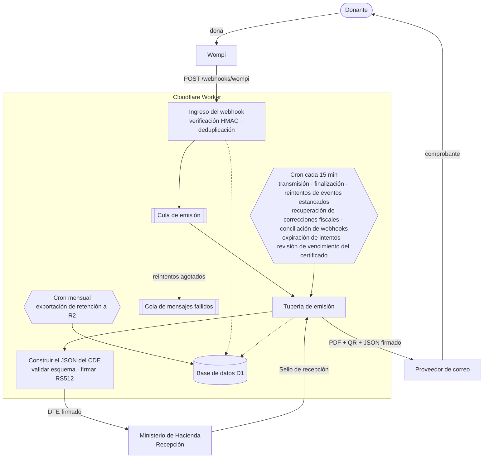
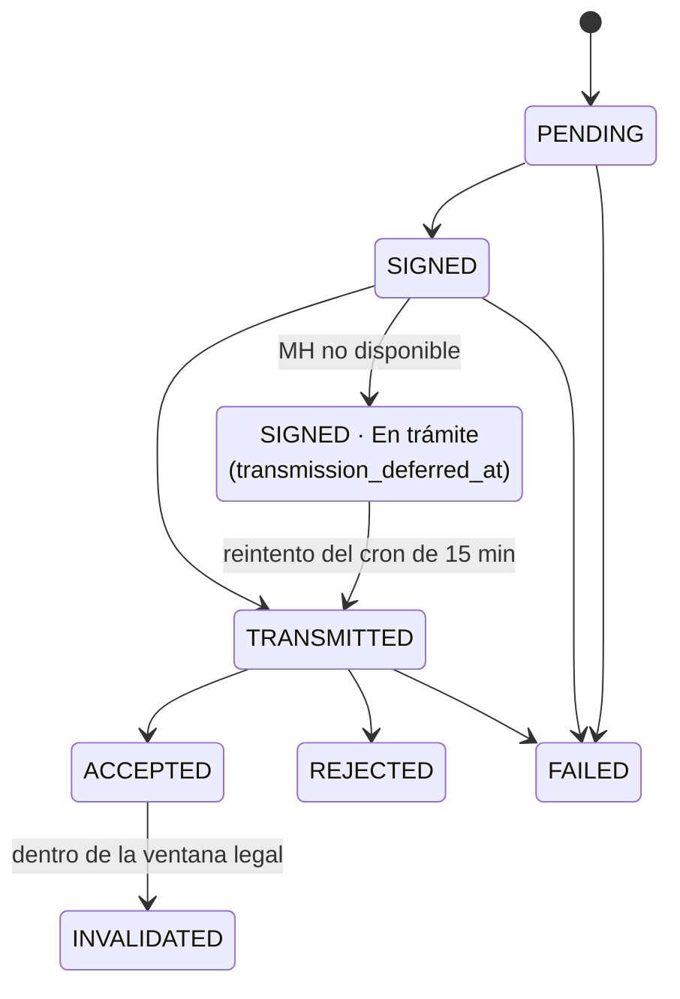
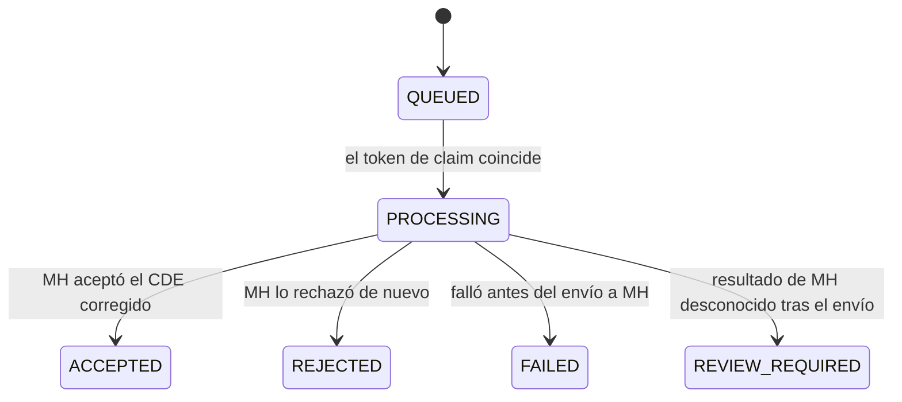

<div align="center">

# 🇸🇻 DiezmosSV

### Comprobantes de donación electrónicos para iglesias salvadoreñas — en el edge, por centavos.

Aplicación open source sobre Cloudflare Workers que convierte las donaciones aprobadas de **Wompi**
en **Comprobantes de Donación Electrónicos** legalmente válidos (CDE — DTE `tipoDte=15`), los firma
de forma nativa, los transmite al **Ministerio de Hacienda** y envía al donante su comprobante en PDF
por correo — todo desde un solo Worker.

<br/>

[](./LICENSE)
[](https://workers.cloudflare.com/)
[](https://nodejs.org/)
[](https://react.dev/)
[](https://www.typescriptlang.org/)
[](#-estado-del-proyecto)

<br/>

[English](README.md) · **Español**

</div>

---

> [!WARNING]
> **Esto no es asesoría legal ni tributaria.** Antes de cualquier uso en producción, valide su
> configuración, sus credenciales de MH, el mapeo de documentos y sus procedimientos operativos con
> su contador, su representante legal y el proceso de habilitación del Ministerio de Hacienda.

> [!NOTE]
> **DiezmosSV es un proyecto open source independiente.** No está afiliado, avalado, patrocinado ni
> soportado oficialmente por Wompi ni por Cloudflare. Esos nombres aparecen únicamente porque la
> aplicación se integra con sus servicios públicos.

---

## 📑 Índice

- [Por qué DiezmosSV](#-por-qué-diezmossv)
- [Cómo funciona](#-cómo-funciona)
- [Arquitectura en Cloudflare](#-arquitectura-en-cloudflare)
- [Stack técnico](#-stack-técnico)
- [Estructura del proyecto](#-estructura-del-proyecto)
- [Inicio rápido (local)](#-inicio-rápido-local)
- [Validación](#-validación)
- [Despliegue en Cloudflare](#-despliegue-en-cloudflare)
- [Referencia de configuración](#-referencia-de-configuración)
- [Seguridad](#-seguridad)
- [Webhook de Wompi](#-webhook-de-wompi)
- [Donaciones en línea (/donar)](#-donaciones-en-línea-donar)
- [Panel de administración y roles](#-panel-de-administración-y-roles)
- [Ciclo de vida del documento](#-ciclo-de-vida-del-documento)
  - [Correcciones fiscales](#correcciones-fiscales)
- [Modelo de datos](#-modelo-de-datos)
- [Notas de cumplimiento](#-notas-de-cumplimiento)
- [¿Por qué sin firmador JVM?](#-por-qué-sin-firmador-jvm)
- [Estado del proyecto](#-estado-del-proyecto)
- [Cómo contribuir](#-cómo-contribuir)
- [Licencia](#-licencia)

---

## 💡 Por qué DiezmosSV

Emitir DTE de tipo CDE normalmente implica levantar un firmador JVM, una base de datos, una cola y un
servidor encendido 24/7. Para una iglesia que recibe unas pocas donaciones al día, eso es demasiado
gasto y demasiada carga operativa. DiezmosSV concentra toda la tubería en **un solo Cloudflare Worker** —
facturado por invocación, auditable y barato de operar.

| | |
|---|---|
| 🔐 **Ingreso verificado** | Valida el HMAC `wompi_hash` sobre el cuerpo crudo y deduplica por **dos** llaves antes de hacer cualquier otra cosa: el `IdTransaccion` de Wompi y —para los enlaces dinámicos de `/donar`— el id numérico del enlace de pago, que es la llave de idempotencia fiscal estable porque un enlace de un solo uso admite exactamente una transacción exitosa. Por eso, una misma aportación que llegue dos veces bajo dos identificadores de transacción distintos sigue produciendo exactamente un CDE. |
| 🧾 **Mapeo correcto del CDE** | Convierte las donaciones aprobadas en el JSON de CDE de MH (`tipoDte=15`) y lo valida contra el esquema JSON de MH incluido en el repositorio. |
| ✍️ **Firma nativa** | Firma el JSON del DTE dentro del Worker con WebCrypto como un **JWS compacto RS512** — sin necesidad de un firmador JVM externo. |
| 🏛️ **Transmisión a MH** | Se autentica ante MH, cachea el token en D1, transmite a *Recepción* y registra el **Sello de recepción**. |
| 📄 **Comprobante al donante** | Genera un PDF de *representación gráfica* con código QR y lo envía por correo (junto con el JSON firmado) a través de un proveedor configurable. |
| 🌩️ **Resiliente por diseño** | Ante una caída de MH el CDE se firma con normalidad, el donante recibe de inmediato un comprobante **transitorio** y un cron de 15 minutos reintenta la transmisión hasta que MH lo sella (transmisión diferida — el evento de contingencia excluye el tipo 15 según el Anexo, campo 35). Una cola de mensajes fallidos más un barrido de eventos estancados sanan por sí solos los mensajes de emisión que agotan sus reintentos. |
| 📡 **Conciliación de webhooks no recibidos** | Un webhook que Wompi nunca entregó no es una donación perdida. Cada 15 minutos el Worker vuelve a leer hasta 25 intentos de `/donar` sin resolver de los últimos 7 días directamente contra la API de enlaces de pago de Wompi y, cuando el enlace muestra una transacción completada, la reproduce por la *misma* ruta de ingreso verificada que recorre un webhook real — auditada como `WOMPI_RECONCILED`. La correlación se mantiene estricta (un payload que no calce con el intento almacenado y con el id del enlace se rechaza y se audita como `WOMPI_RECONCILIATION_REJECTED`), y una caída de Wompi deja el intento elegible para el siguiente ciclo en vez de consumirlo. |
| 🧷 **Un solo envío legal, siempre** | Toda transmisión o invalidación dirigida a MH adquiere primero un **claim de operación fiscal** durable. Un resultado ambiguo (timeout, isolate interrumpido) congela el documento para que un operador lo concilie, en lugar de arriesgar un segundo envío legal — cada ruta de reintento falla cerrada mientras el claim siga tomado. |
| ⚖️ **Invalidación legal** | Soporta eventos de invalidación firmados con la verificación de la ventana legal del CDE incorporada, y envía al donante un aviso con la marca de la organización cuando MH acepta la invalidación. |
| 🩹 **Correcciones fiscales** | Un CDE que MH rechazó por campos del `receptor` —o una transacción de Wompi cuyos datos de donante nunca llegaron a producir un CDE— se repara desde el panel y no a mano. El operador edita únicamente los 14 campos del receptor (todo lo demás se rechaza como `protected_field`), y el Worker reconstruye, vuelve a firmar y retransmite bajo un **`codigoGeneracion` y un `numeroControl` nuevos** reservados por un trigger de base de datos. Idempotente por UUID de solicitud y digest del payload, de dueño único por token de claim, y nunca reintentado a ciegas una vez que el envío a MH comenzó. |
| 🖥️ **Panel de administración** | SPA de React para documentos, donantes, fallos (de CDE **y** previos al CDE), historial de contingencia (solo lectura), bitácora de auditoría, analítica, usuarios, exportaciones, respaldos, reenvío, reintento, corrección fiscal, reemisión e invalidación — ninguna operación queda solo en CLI. |
| 📊 **Analítica de donaciones** | La vista **Analítica** grafica las tendencias de entrega del carril de Wompi — montos, conteos y mezcla diezmo/ofrenda — agrupadas en hora de El Salvador y con consultas acotadas por capacidad. |
| 🎁 **Cuidado del donante incluido** | **Constancia anual** de donaciones en un clic, por donante o en lote, más una exportación de contactos de donantes lista para CRM. |
| 🔎 **Explorador de donantes** | La vista **Donantes** resuelve los CDE aceptados en un registro de donantes — identidad, contacto, ubicación, cantidad de aportaciones, total histórico y última aportación — con llave en el documento fiscal, con respaldo en el correo y luego en el documento mismo. Filtre por tipo/número de documento, nombre, correo, rango de monto, diezmo/ofrenda y origen en línea/manual; exporte el conjunto filtrado como CSV. ADMIN en adelante; los números de documento se enmascaran en la tabla y solo se revelan en el panel de detalle. |
| 🏷️ **Marca blanca** | Personalice el panel, las páginas del donante, el correo al donante, **el PDF del comprobante y la constancia anual** con el nombre visible de su iglesia, su color de acento, su dirección de soporte y sus logos (guardados en R2) desde la configuración de **Marca** — sin necesidad de un fork. Un logo cargado se ajusta a la misma banda de tinta reservada que trae el logo por defecto, de modo que el diseño alrededor sigue siendo válido. |
| 🛡️ **Acceso seguro** | Hash de contraseñas con PBKDF2, sesiones por token bearer, control de acceso basado en roles, restablecimiento de contraseña autogestionado y limitación de tasa respaldada en D1 sobre el inicio de sesión, el restablecimiento de contraseña y los endpoints públicos de donación — con procedencia auditada por cada claim. |
| 📬 **Correo con marca** | Todo el correo al donante (comprobante, aviso de invalidación, constancia anual, restablecimiento de contraseña) se envía como HTML con la marca de la organización y plantillas configurables. |
| 🚨 **Alertas operativas** | Alerta a una dirección de correo configurable ante fallos de emisión, fallos de entrega del comprobante, indisponibilidad de MH, eventos estancados, fallos de retención y vencimiento del certificado de firma de MH. Cada incidente emite además un evento `operational_alert` en Workers Logs, libre de datos personales, para alertar de forma independiente desde Cloudflare Observability y entregar por Notifications. |
| 🗃️ **Retención legal** | Un cron mensual exporta a R2 una instantánea inmutable y verificada por hash de todos los registros legales, para retención tributaria de varios años con independencia de D1. El panel **Respaldos mensuales** permite explorar, verificar y descargar cada mes como ZIP. |

> 💸 **Ejecútelo antes de tener credenciales.** La configuración por defecto (local) de `wrangler.toml`
> fija `MOCK_EXTERNAL_SERVICES = "true"`, lo que simula MH y el proveedor de correo — puede recorrer
> todo el panel de administración y la tubería de emisión con secretos de relleno. El modo simulado es
> **explícitamente opcional**: solo se activa cuando `MOCK_EXTERNAL_SERVICES` vale exactamente
> `"true"`, así que staging y producción (donde vale `"false"`) siempre llegan a los servicios reales
> de MH y de correo.
>
> 📖 **¿Va a operar el panel día a día?** Los operadores no técnicos deben leer el
> [manual del operador](./docs/runbook-operador.md), que está en español.

---

## 🔄 Cómo funciona

Una donación fluye desde Wompi hasta un comprobante firmado y sellado por MH en la bandeja del
donante, sin que ningún servidor quede ocioso entre un evento y otro:



Solo se emiten los eventos con `ResultadoTransaccion = ExitosaAprobada`. Todo lo que toca a MH, a
Wompi o al donante queda registrado en D1 y en la bitácora de auditoría.

La página pública `/donar` abre con una portada de dos puertas: **El Salvador y el mundo** dirige al
formulario fiscal SV (Wompi + CDE), y **EE. UU.** dirige a Stripe Embedded Checkout en español y dentro de la misma página sobre la
cuenta 501(c)(3) estadounidense para entregas únicas o mensuales (`?ruta=sv` / `?ruta=eeuu` enlaza directo a una puerta). Toda la
interfaz web (páginas del donante y panel de administración) usa **Gotham**, autoalojada como woff2
del subconjunto latino en `src/client/fonts/` — los OTF licenciados nunca se versionan; solo se
versionan los subconjuntos woff2 generados.

---

## ☁ Arquitectura en Cloudflare

| Recurso | Binding | Rol |
|---|---|---|
| **Worker** | `main = src/worker/index.ts` | API, ingreso de webhooks, tubería de emisión, cliente de MH, firmador y orquestación de PDF/correo. |
| **D1** | `DB` | Eventos de Wompi, documentos DTE, eventos firmados, tokens, usuarios, sesiones, bitácora de auditoría, periodos de contingencia y configuración de la aplicación. |
| **Queues** | `ISSUANCE_QUEUE` → `diezmossv-local-issuance-example` (+ `-dlq`) | Emisión asíncrona (lotes ≤ 10, hasta 3 reintentos) para tres tipos de mensaje: un webhook aprobado de Wompi, un CDE avanzado emitido a mano y una corrección fiscal — cada uno identificado por su propio token de propiedad, y un mensaje que no lleve ninguno se rechaza de plano. Los mensajes que agotan los reintentos caen en una cola de mensajes fallidos que audita y alerta por cada uno. |
| **R2** | `ARCHIVE` → `diezmossv-<env>-archive-example` | Bucket de la exportación mensual de retención legal (instantáneas NDJSON + manifiesto SHA-256), más los objetos del logo de marca (`branding/logo`, `branding/donor-logo`). |
| **Cron Triggers** | `*/15 * * * *` · `0 9 1 * *` | Cada 15 min, diez barridos protegidos de forma independiente: limpieza de claims vencidos de login/límite de tasa, reintento de transmisión diferida, reintento de finalización posterior a la aceptación, reintento de finalización de Wompi aceptado, barrido de eventos previos al CDE estancados, recuperación de correcciones fiscales estancadas, conciliación de webhooks no recibidos contra la API de enlaces de pago de Wompi, expiración de intentos de donación + desactivación del enlace de Wompi, y la revisión de vencimiento del certificado del firmador. Un barrido que falle nunca aborta el ciclo. Mensual (09:00 UTC del día 1): exportación de retención a R2. |
| **Activos estáticos** | `ASSETS` → `./dist/client` | Panel de administración de React servido desde el Worker con fallback de SPA. |

`compatibility_date = 2026-06-02` con `nodejs_compat` habilitado para las operaciones de criptografía.
`APP_ORIGIN` se define por ambiente para construir enlaces absolutos (por ejemplo, las URL de
restablecimiento de contraseña).

Cada barrido de 15 minutos se envuelve por separado: un barrido que lanza una excepción se registra
como evento de error en Workers Logs y el ciclo continúa con el siguiente, de modo que una dependencia
degradada (MH, Wompi, R2) nunca deja sin ejecución a las demás. El trabajo por ciclo está acotado —el
barrido de expiración de intentos toma una instantánea de a lo sumo 100 filas y la conciliación de
webhooks de a lo sumo 25—, así que el tráfico público no puede volver ilimitada una invocación del
cron.

La observabilidad está habilitada en todos los ambientes con `head_sampling_rate = 1`, con los logs y
trazas de invocación apagados — el Worker emite sus propios eventos estructurados (en especial el
`operational_alert`, libre de datos personales) en vez de depender del registro por solicitud, lo que
mantiene el tráfico de los donantes fuera del flujo de logs sin perder la capacidad de alertar sobre
incidentes.

---

## 🧰 Stack técnico

**Frontend** · React 19 · Vite 8 · TypeScript 7 · íconos `lucide-react` · CSS plano
**Worker** · Cloudflare Workers · D1 (SQLite) · Queues · Cron Triggers · WebCrypto
**Criptografía y documentos** · JWS `RS512` con WebCrypto · `pdf-lib` · `qrcode`
**Validación** · `ajv` + `ajv-formats` contra los esquemas JSON de MH incluidos
**Herramientas** · Wrangler 4 · Vitest 4 · Playwright 1.62 (e2e contra un Worker real) · `tsconfig` separado para cliente y worker

---

## 📁 Estructura del proyecto

```text
DiezmosSV/
├── src/
│   ├── worker/                 # Cloudflare Worker (backend)
│   │   ├── index.ts            # Entrada: fetch() · queue() · scheduled()
│   │   ├── config.ts           # Lectura del entorno y validación del emisor
│   │   ├── domain/             # wompi · dteBuilder · signer · schema
│   │   ├── routes/             # router.ts — tabla de rutas declarativa + despacho RBAC
│   │   ├── services/           # pipeline · mhClient · email(+Html/Sender/Templates) · pdf
│   │   │                       # auth · credentials · alerts · observability · retention
│   │   │                       # analytics · certificate · contacts · backups · f960
│   │   │                       # branding · orgLogo · donations · donorExport · wompiApi
│   │   │                       # wompiNotifications · fiscalCorrection · environmentPolicy
│   │   ├── storage/            # repository.ts + repository/ (13 módulos) — D1 crudo, sin ORM
│   │   └── utils/              # ids · dates · encoding · http · guards · zip
│   ├── client/                 # Panel React + Vite, /donar, fuentes, recursos
│   └── shared/                 # Catálogos · DUI · NIT · ventanas legales · política de contraseñas
│                               # correcciones fiscales · entrega · montos · correo
├── migrations/                 # Esquema D1 (incremental, solo se agrega, 0001…0038)
├── DTE/svfe-json-schemas/      # Esquemas JSON de MH para validación
├── docs/                       # Despliegue/UAT · manual del operador · restauración de retención
│                               # cutover/conciliación de claims fiscales · recuperación previa al CDE
│                               # frontera de artefactos locales · plans/ · superpowers/
├── scripts/                    # Envoltura de wrangler con config privada, guardas de despliegue, preflight de D1
├── examples/                   # wompi-webhook.sample.json (payload de prueba seguro)
├── test/                       # Vitest: cliente · worker · migraciones · scripts
├── e2e/                        # Specs de Playwright (donar, admin, seguridad, smoke)
└── wrangler.toml               # Bindings, vars, colas, crons, observabilidad
```

---

## 🚀 Inicio rápido (local)

**Requisitos:** Node.js 22.16+, npm, una cuenta de Cloudflare, una cuenta de Wompi con acceso a
webhooks y credenciales de la API DTE de MH para el ambiente que piense usar. Wrangler se instala con
el proyecto.

```bash
# 1 — Instalar dependencias
npm install

# 2 — Crear un archivo de entorno privado fuera del árbol del repositorio y completarlo
PRIVATE_ROOT="$HOME/Library/Application Support/DiezmosSV/private"
install -d -m 700 "$PRIVATE_ROOT/env"
install -m 600 .dev.vars.example "$PRIVATE_ROOT/env/local-operator.env"

# 3 — Crear el esquema local de D1
npx wrangler d1 migrations apply diezmossv-local-db-example --local

# 4 — Levantar el Worker y la interfaz de administración (dos terminales)
npm run dev:worker   # Worker en http://127.0.0.1:8787
npm run dev          # Interfaz de Vite; hace proxy de /api y /webhooks al Worker
```

Abra la URL de Vite y use **`Crear owner`** en la primera ejecución para crear la cuenta de
administración inicial. El formulario de configuración exige el valor de `BOOTSTRAP_OWNER_TOKEN` de su
archivo de entorno privado de operador local. Genere un token nuevo de 32 bytes en base64url; el
Worker solo acepta el prefijo `bt_` seguido de los 43 caracteres codificados:

```bash
printf 'bt_%s\n' "$(openssl rand -base64 32 | tr '+/' '-_' | tr -d '=\n')"
```

Un archivo de entorno de operador inicial se ve así. La ejecución local está fijada a MH TEST
(`ambiente=00`), así que no coloque credenciales de la API de producción en el archivo local:

```bash
WOMPI_API_SECRET="..."
BOOTSTRAP_OWNER_TOKEN="bt_<valor-base64url-de-43-caracteres>"
CLOUDFLARE_ACCOUNT_ID="..."
CLOUDFLARE_API_TOKEN="..."
MH_CERT_PASSWORD="..."
MH_CERT_XML="<CertificadoMH>...</CertificadoMH>"
# Los despliegues remotos en Cloudflare pueden usar MH_CERT_XML_PART_1 y MH_CERT_XML_PART_2
# cuando el XML del certificado supera el límite de 5 KB por variable del Worker.

MH_USER_TEST="..."
MH_PASSWORD_TEST="..."
# Alternativa opcional, propiedad del despliegue, seleccionada antes del envío cuando Cloudflare no puede
# entregar a destinatarios arbitrarios. Debe ser una URL HTTPS absoluta sin credenciales incrustadas;
# nunca la configure desde el panel de credenciales.
# EMAIL_PROVIDER_URL="https://email-provider.example/send"
# EMAIL_API_KEY="..."
EMAIL_FROM="dte@example.org"

EMISOR_CONFIG_JSON="{...}"
```

> 🔒 **Nunca coloque credenciales reales ni artefactos de donantes dentro de la copia de trabajo del
> repositorio, aunque estén en `.gitignore`.** `npm run dev:worker` lee
> `~/Library/Application Support/DiezmosSV/private/env/local-operator.env`. Puede sobrescribir esa
> ruta con `DIEZMOSSV_ENV_FILE=/ruta/aprobada`. Ejecute
> `npm run security:check-private-boundary` antes de compartir su copia de trabajo. Vea
> [el manual de artefactos locales](docs/local-private-artifacts.md).

---

## ✅ Validación

```bash
npm test                        # Pruebas unitarias de Vitest (cliente · worker · migraciones · scripts)
npm run typecheck               # Verificación de tipos de cliente + worker
npm run types:check             # Verifica que los tipos generados de los bindings de Cloudflare estén al día
npm run migrations:check-immutability   # Las migraciones aplicadas nunca deben editarse
npm run build                   # Build de Vite + verificación de tipos del worker
npm run security:check-private-boundary

# Playwright maneja un Worker local real en :8787, no Vite. PW_PERSIST_TO mantiene el
# D1 de la suite aislado de la base local de su copia de trabajo.
DIEZMOSSV_ENV_FILE=.dev.vars.ci PW_PERSIST_TO=/tmp/diezmossv-e2e npx playwright test
```

Las pruebas unitarias cubren, entre otras áreas:

- Verificación del HMAC de Wompi
- Generación del esquema del CDE
- Firma y verificación nativas RS512, más el análisis del vencimiento del certificado
- Cálculo de la ventana legal de invalidación del CDE
- Limitación de tasa de autenticación, restablecimiento de contraseña y plantillas de correo con marca
- Propiedad del claim de corrección fiscal, reserva del número de control y recuperación
- Agrupación, filtros y límites de exportación CSV del explorador de donantes
- Scripts de guarda del despliegue (`assert-fiscal-cutover`, configuración privada de release/marca,
  configuración privada de wrangler, preflight de migraciones de D1)

CI (`.github/workflows/ci.yml`) ejecuta dos jobs en los push a `main` y `codex/**`, y en los pull
requests hacia `main`.

**test-and-build** instala `poppler-utils` (las pruebas de PDF inspeccionan la salida renderizada con
`pdftotext`/`pdftoppm`) y luego ejecuta `security:check-private-boundary` →
`migrations:check-immutability` → `types:check` → `typecheck` → `vitest run` → `build`. La
verificación de frontera lee un secreto opcional del repositorio,
`PRIVATE_BOUNDARY_FORBIDDEN_HOSTS`; sin él las verificaciones genéricas se ejecutan igual y el script
advierte que las verificaciones de host están inactivas — nunca nombra a una organización en el árbol
público.

**e2e** ejecuta la suite de Playwright contra el entorno simulado sin secretos versionado en
`.dev.vars.ci`: instala el navegador Chromium, aplica las migraciones locales de D1 sobre un runner
limpio (ejercitando de forma natural la ruta de bootstrap) y ejecuta `npx playwright test`.
`playwright.config.ts` es dueño del servidor web — compila el cliente, vuelve a aplicar las
migraciones y arranca un `wrangler dev` real en el puerto 8787, de modo que la suite maneja el Worker
de verdad y no Vite. El reporte HTML se sube como artefacto cuando hay fallos.

---

## 📦 Despliegue en Cloudflare

<details>
<summary><strong>Despliegue en TEST/Staging</strong></summary>

<br/>

El `wrangler.toml` versionado es una configuración inerte de ejemplo para uso local. Antes de
cualquier comando remoto, seleccione una configuración privada que sea una ruta absoluta fuera de este
repositorio, propiedad del usuario actual y con permisos exclusivos de dueño `0600`:

```bash
export DIEZMOSSV_WRANGLER_CONFIG="/ruta/absoluta/fuera/de/este/repositorio/wrangler.toml"
install -d -m 700 "$(dirname "$DIEZMOSSV_WRANGLER_CONFIG")"
install -m 600 wrangler.toml "$DIEZMOSSV_WRANGLER_CONFIG"

# Edite únicamente el archivo privado seleccionado y luego autentíquese a través de su copia validada.
node scripts/run-private-wrangler.mjs login
npm run cf:whoami
```

La envoltura rechaza un archivo relativo, dentro del repositorio, enlazado simbólicamente, sin permisos
`0600` o de otro dueño. Coloque los IDs reales de D1, las rutas, los orígenes, los nombres de
Worker/recursos, los nombres de cola y los nombres de bucket de R2 únicamente en la configuración
privada seleccionada; deje sin cambios el ejemplo público y sus IDs en cero. La raíz, staging y
producción deben contener cada una exactamente un binding `send_email` llamado `EMAIL`, sin
`allowed_sender_addresses`.

Los builds de release usan un archivo de despliegue vinculado al ambiente y un raster para donantes
separados. Mantenga ambos como archivos regulares, propiedad del usuario actual, con permisos `0600`,
fuera de este repositorio y sin enlaces simbólicos:

```dotenv
# /ruta/privada/absoluta/staging.env
DIEZMOSSV_DEPLOY_TARGET=staging
DIEZMOSSV_APP_ORIGIN=https://staging.example.invalid
DIEZMOSSV_DONOR_LOGO_FILE=/ruta/privada/absoluta/logo.png
```

Selecciónelo con `export DIEZMOSSV_DEPLOY_CONFIG=/ruta/privada/absoluta/staging.env`. El ambiente
seleccionado debe coincidir con `--env`; el PNG/JPEG debe ser decodificable por la misma ruta de
`pdf-lib` que usan los comprobantes. Antes de un despliegue remoto, el preflight de marca valida ese
raster localmente, exige que `/api/health` reporte `appEnv=staging` y compara exactamente el raster
remoto anunciado. `cf:deploy:staging` ejecuta automáticamente el preflight y el build privado vinculado
al ambiente; los mismos pasos pueden ejecutarse por separado sin desplegar:

```bash
npm run cf:branding:check -- --env staging
npm run build:private -- --env staging
```

Cree los recursos remotos mediante un flujo de Cloudflare controlado por el dueño, registre los
nombres e IDs devueltos únicamente en la configuración privada seleccionada y luego verifique esa
configuración a través de la envoltura:

```bash
node scripts/run-private-wrangler.mjs d1 list
node scripts/run-private-wrangler.mjs queues list
node scripts/run-private-wrangler.mjs r2 bucket list

# Defina los secretos de TEST/staging con la misma configuración seleccionada.
node scripts/run-private-wrangler.mjs secret put WOMPI_API_SECRET --env staging
node scripts/run-private-wrangler.mjs secret put BOOTSTRAP_OWNER_TOKEN --env staging
node scripts/run-private-wrangler.mjs secret put CLOUDFLARE_ACCOUNT_ID --env staging
node scripts/run-private-wrangler.mjs secret put CLOUDFLARE_API_TOKEN --env staging
node scripts/run-private-wrangler.mjs secret put MH_CERT_PASSWORD --env staging
node scripts/run-private-wrangler.mjs secret put MH_CERT_XML_PART_1 --env staging
node scripts/run-private-wrangler.mjs secret put MH_CERT_XML_PART_2 --env staging
node scripts/run-private-wrangler.mjs secret put MH_USER_TEST --env staging
node scripts/run-private-wrangler.mjs secret put MH_PASSWORD_TEST --env staging
node scripts/run-private-wrangler.mjs secret put EMAIL_PROVIDER_URL --env staging   # alternativa opcional del despliegue
node scripts/run-private-wrangler.mjs secret put EMAIL_API_KEY --env staging   # token opcional del proveedor alternativo
node scripts/run-private-wrangler.mjs secret put EMAIL_FROM --env staging
node scripts/run-private-wrangler.mjs secret put EMISOR_CONFIG_JSON --env staging
node scripts/run-private-wrangler.mjs secret put STRIPE_RESTRICTED_KEY --env staging
node scripts/run-private-wrangler.mjs secret put STRIPE_PUBLISHABLE_KEY --env staging
node scripts/run-private-wrangler.mjs secret put STRIPE_WEBHOOK_SECRET --env staging
node scripts/run-private-wrangler.mjs secret put STRIPE_PAYMENT_METHOD_CONFIGURATION_ID --env staging
node scripts/run-private-wrangler.mjs secret put STRIPE_BILLING_PORTAL_CONFIGURATION_ID --env staging
node scripts/run-private-wrangler.mjs secret put STRIPE_US_LEGAL_NAME --env staging
node scripts/run-private-wrangler.mjs secret put STRIPE_US_EIN --env staging
node scripts/run-private-wrangler.mjs secret put STRIPE_US_PHONE --env staging
node scripts/run-private-wrangler.mjs secret put STRIPE_US_WEBSITE --env staging
node scripts/run-private-wrangler.mjs secret put STRIPE_US_MAILING_ADDRESS --env staging
node scripts/run-private-wrangler.mjs secret put STRIPE_US_SIGNER_NAME --env staging
node scripts/run-private-wrangler.mjs secret put STRIPE_US_SIGNER_TITLE --env staging

# Migre y despliegue con los scripts de npm, que usan la misma envoltura privada.
npm run cf:migrate:staging
npm run cf:deploy:staging

# O, para una ventana de cutover de claims fiscales con tráfico detenido, un solo comando que
# valida el reconocimiento, migra y despliega:
FISCAL_CUTOVER_QUIESCED=1 npm run cf:cutover:staging

# Ejecute la prueba de humo contra el edge desplegado.
DIEZMOSSV_ENV_FILE="$HOME/Library/Application Support/DiezmosSV/private/env/staging-smoke.env" npm run smoke:staging
```

Cada comando `cf:migrate:*` ejecuta primero un preflight de solo lectura sobre D1 en busca de enlaces
`dte_documents.wompi_event_id` duplicados y no nulos. Cualquier duplicado bloquea la migración para
revisión manual del registro legal; el preflight nunca borra, reenlaza ni elige un documento. La
migración en sí corre a través de `scripts/d1-schema-compatibility.mjs`, que reconcilia el libro de
migraciones aplicadas antes de entregar el control a Wrangler.

Dos guardas de despliegue hacen fallar el comando en vez de publicar un despliegue roto:

| Guarda | Se ejecuta en | Bloquea salvo que |
|---|---|---|
| `scripts/assert-fiscal-cutover.mjs` | `cf:migrate:prod`, `cf:deploy:prod`, `cf:cutover:staging` | `FISCAL_CUTOVER_QUIESCED=1` esté definido. Las migraciones 0020/0021 y el Worker con soporte de claims deben entrar en **una sola ventana de mantenimiento con tráfico detenido**: drene las solicitudes del Worker anterior, pause colas/cron y el tráfico que muta datos, y luego reconozca la ventana. |
| `scripts/run-private-build.mjs` | `build:private`, y a través de él `cf:deploy:staging` y `cf:deploy:prod` | El archivo de despliegue vinculado al ambiente y exclusivo del dueño, el origen y el raster del donante pasan validación. Los valores de Stripe son solo de runtime y nunca se inyectan en Vite. |

Guarde los parámetros de la prueba de humo en ese archivo `0600` fuera del árbol del repositorio. El
runner usa esa ruta aprobada por defecto, así que `npm run smoke:staging` basta salvo que
intencionalmente seleccione otro archivo. No coloque credenciales, secretos de Wompi, tokens de
bootstrap ni valores de identidad de donantes en línea dentro del comando de shell.

Staging corre con `MOCK_EXTERNAL_SERVICES = "false"` y está estructuralmente fijado al ambiente `00`
de MH: usuario/contraseña de prueba de la API de MH, el certificado XML del firmador con su contraseña
correspondiente y un secreto de prueba de Wompi. Vea `docs/cloudflare-staging-uat.md` para la prueba
de humo contra el edge y la lista de aprobación.

</details>

<details>
<summary><strong>Cutover a producción</strong></summary>

<br/>

Producción es deliberadamente un ambiente de Wrangler aparte y debe usarse solo después de aprobar la
UAT en staging. Sus valores en vivo también quedan únicamente en la configuración privada seleccionada
que se describió arriba. Seleccione un archivo de despliegue distinto y exclusivo del dueño que
contenga `DIEZMOSSV_DEPLOY_TARGET=production`, el origen de producción, la campaña y un PNG/JPEG
privado embebible. Un archivo vinculado a staging o un origen cuyo `/api/health` no reporte
`appEnv=production` se rechaza antes de autenticar la marca o subir archivos.

```bash
export DIEZMOSSV_DEPLOY_CONFIG="/ruta/privada/absoluta/production.env"

# Verifique los destinos privados de producción sin imprimir sus valores dentro de este repositorio.
node scripts/run-private-wrangler.mjs d1 list
node scripts/run-private-wrangler.mjs queues list
node scripts/run-private-wrangler.mjs r2 bucket list

# Defina los secretos de producción con la configuración privada seleccionada.
node scripts/run-private-wrangler.mjs secret put WOMPI_API_SECRET --env production
node scripts/run-private-wrangler.mjs secret put BOOTSTRAP_OWNER_TOKEN --env production
node scripts/run-private-wrangler.mjs secret put CLOUDFLARE_ACCOUNT_ID --env production
node scripts/run-private-wrangler.mjs secret put CLOUDFLARE_API_TOKEN --env production
node scripts/run-private-wrangler.mjs secret put MH_CERT_PASSWORD --env production
node scripts/run-private-wrangler.mjs secret put MH_CERT_XML_PART_1 --env production
node scripts/run-private-wrangler.mjs secret put MH_CERT_XML_PART_2 --env production
node scripts/run-private-wrangler.mjs secret put MH_USER_PROD --env production
node scripts/run-private-wrangler.mjs secret put MH_PASSWORD_PROD --env production
node scripts/run-private-wrangler.mjs secret put EMAIL_PROVIDER_URL --env production   # alternativa opcional del despliegue
node scripts/run-private-wrangler.mjs secret put EMAIL_API_KEY --env production   # token opcional del proveedor alternativo
node scripts/run-private-wrangler.mjs secret put EMAIL_FROM --env production
node scripts/run-private-wrangler.mjs secret put EMISOR_CONFIG_JSON --env production

# Verifique la marca primero: es de solo lectura, así que una regresión falla la ventana
# antes de que la migración haya escrito nada. Ambos pasos remotos se niegan a correr fuera
# de una ventana detenida y reconocida, y el despliegue valida el slug de campaña del
# archivo seleccionado y vinculado al ambiente.
npm run cf:branding:check -- --env production
npm run build:private -- --env production
FISCAL_CUTOVER_QUIESCED=1 npm run cf:migrate:prod
FISCAL_CUTOVER_QUIESCED=1 npm run cf:deploy:prod

# Libere la selección, o el siguiente comando de staging fallará su verificación de ambiente.
unset DIEZMOSSV_DEPLOY_CONFIG
```

La verificación explícita de marca y el build privado anterior son preflights útiles para el operador;
el comando protegido `cf:deploy:prod` repite ambos antes de su despliegue privado con Wrangler.

**Solo para el primer despliegue de producción.** La guarda de marca compara el logo del donante
del despliegue *en ejecución*, así que no puede pasar antes de que exista un despliegue de
producción. Arranque una sola vez, en este orden, y use `cf:deploy:prod` para cada publicación
posterior:

```bash
node scripts/run-private-wrangler.mjs deploy --env production --keep-vars
npm run cf:branding:migrate -- --env production --apply
```

Es un camino documentado de una sola vez, no una vía de escape: nada en las herramientas omite la
guarda, y solo aplica cuando el Worker de producción nunca ha sido desplegado.

El ejemplo versionado incluye `DONATION_INTAKE_DISABLED = "true"` en `[env.production.vars]`. Déjelo
tal cual hasta que el carril de producción esté aprobado; luego elimínelo (o póngale cualquier otro
valor) en la configuración privada seleccionada y vuelva a desplegar. Solo cierra la recepción
pública: el webhook, la cola, los barridos del cron y el panel de administración siguen atendiendo las
donaciones que ya están en curso.

Haga una emisión de producción controlada y de bajo monto, con monitoreo en vivo, antes de habilitar
el volumen normal.

</details>

---

## ⚙ Referencia de configuración

**Secretos** - se definen de forma remota con `scripts/run-private-wrangler.mjs secret put` y la
configuración seleccionada por `DIEZMOSSV_WRANGLER_CONFIG`, o localmente en el archivo fuera del árbol
del repositorio seleccionado por `DIEZMOSSV_ENV_FILE`:

| Variable | Propósito |
|---|---|
| `WOMPI_API_SECRET` | Secreto HMAC usado para verificar el `wompi_hash` de los webhooks entrantes. |
| `WOMPI_CLIENT_ID` / `WOMPI_CLIENT_SECRET` | Credenciales de cliente OAuth usadas para generar los enlaces de pago de Wompi de un solo uso y solo con tarjeta que están detrás de `/donar`, y para releer un enlace durante la conciliación de webhooks no recibidos. Obténgalas en el panel de comercios de Wompi bajo **Datos del negocio**. El flujo heredado de enlace de pago estático no las necesita. |
| `BOOTSTRAP_OWNER_TOKEN` | Secreto de configuración de un solo uso exigido por `/api/auth/bootstrap-owner` antes de que exista el primer owner. Debe generarse a partir de 32 bytes aleatorios y tener el formato `bt_` más 43 caracteres base64url. Rótelo o elimínelo una vez que la cuenta owner exista. |
| `CLOUDFLARE_ACCOUNT_ID` | Cuenta de Cloudflare destino que usa la interfaz de credenciales exclusiva de OWNER al guardar secretos del Worker. |
| `CLOUDFLARE_API_TOKEN` | Token de API de Cloudflare con alcance acotado que usa la interfaz de credenciales exclusiva de OWNER para llamar al endpoint de actualización masiva de secretos del Worker. |
| `CLOUDFLARE_API_BASE_URL` | Sobrescritura opcional del host de la API de Cloudflare al que llama la interfaz de credenciales exclusiva de OWNER. Déjelo sin definir para la API pública; defínalo solo cuando un despliegue deba enrutar por otro endpoint. |
| `MH_CERT_XML` | XML del certificado de MH (contiene el material de llave RSA usado para firmar). Funciona local y remotamente solo cuando cabe en el límite de 5 KB por variable del Worker de Cloudflare. |
| `MH_CERT_XML_PART_1` / `MH_CERT_XML_PART_2` | Forma dividida del mismo XML del certificado para Cloudflare Workers cuando `MH_CERT_XML` supera el límite por variable. |
| `MH_CERT_PASSWORD` | Contraseña de la llave privada del firmador. |
| `MH_USER_TEST` / `MH_PASSWORD_TEST` | Credenciales de la API de MH para **pruebas** (`ambiente=00`). |
| `MH_USER_PROD` / `MH_PASSWORD_PROD` | Credenciales de la API de MH para **producción** (`ambiente=01`). |
| `EMAIL_PROVIDER_URL` / `EMAIL_API_KEY` | Proveedor transaccional alternativo opcional, seleccionado antes del envío cuando la entrega a destinatarios arbitrarios de Cloudflare no está habilitada. La URL, propiedad del despliegue, debe ser HTTPS absoluta y sin credenciales incrustadas; el proveedor recibe un cuerpo JSON por `POST` con un encabezado `Authorization: Bearer`. |
| `EMAIL_FROM` | **Obligatorio para envíos reales.** Dirección remitente usada por Cloudflare Email Service o por el proveedor HTTP seleccionado. El dominio remitente debe estar habilitado en Cloudflare Email Sending. La configuración privada seleccionada debe mantener el binding `EMAIL` libre de `allowed_sender_addresses` para que una actualización del OWNER no entre en conflicto con la configuración del despliegue. |
| `EMISOR_CONFIG_JSON` | Configuración del emisor de la iglesia/contribuyente real. Trátelo como secreto en despliegues reales. |

> El certificado del firmador y las credenciales de la API de MH son **asuntos distintos**.
> `MH_CERT_*` sirve para firmar; `MH_USER_*` / `MH_PASSWORD_*` sirve para la API. No use credenciales
> de producción para donaciones de prueba — una transacción de prueba enrutada a `ambiente=00` con
> credenciales exclusivas de producción fallará la autenticación.

**Vars** - el `wrangler.toml` versionado contiene ejemplos inertes; los valores remotos pertenecen a la
configuración privada seleccionada y se duplican por ambiente de Wrangler:

| Variable | Propósito |
|---|---|
| `APP_ENV` | Frontera de seguridad: `local`/`staging` permiten solo `00`; `production` permite solo `01`; un valor ausente o desconocido no permite ninguna emisión. |
| `APP_ORIGIN` | URL base pública del despliegue, usada para construir enlaces absolutos como las URL de restablecimiento de contraseña. |
| `MOCK_EXTERNAL_SERVICES` | El modo simulado es **explícitamente opcional**: MH y el correo se simulan solo cuando este valor es exactamente `"true"`. El `wrangler.toml` local lo fija en `"true"`; staging y producción lo fijan en `"false"`. |
| `CLOUDFLARE_SCRIPT_NAME` | Nombre del script del Worker al que apunta la interfaz de credenciales exclusiva de OWNER. |
| `EMAIL` (binding) | Binding `send_email` de Cloudflare usado para enviar los correos del comprobante con los adjuntos PDF/JSON. Los bindings remotos de raíz, staging y producción se declaran únicamente en la configuración privada seleccionada. |
| `ARCHIVE` (binding) | Binding del bucket de R2 para la exportación mensual de retención legal y los objetos del logo de marca blanca. La configuración de ejemplo versionada nombra `diezmossv-local-archive-example`, `diezmossv-staging-archive-example` y `diezmossv-production-archive-example`; los nombres reales de bucket pertenecen únicamente a la configuración privada seleccionada. |
| `EMAIL_ARBITRARY_RECIPIENTS` | Marcador opcional `"true"` que se define después de confirmar que Cloudflare Email Sending puede alcanzar direcciones externas de donantes. El ejemplo versionado ya lo define para `staging`; local y producción lo dejan sin definir. |
| `DONATION_INTAKE_DISABLED` | Interruptor de emergencia para nueva recepción pública. Cuando vale exactamente `"true"`, las mutaciones de intentos Wompi y `POST /api/donations/stripe/checkout` responden `503 donation_intake_disabled`; `/`, `/donar` y `/donar/gracias` sirven un documento vacío y cerrado. La página de resultado de Stripe, lecturas de estado, webhook, recibos y Billing Portal siguen disponibles para no dejar varado a un donante existente o mensual. El webhook de Wompi, la tubería de emisión y el panel de administración también siguen funcionando. El ejemplo versionado lo fija en `"true"` para `production`; sin definir o con cualquier otro valor, la recepción queda abierta. |
| `MH_AUTH_URL_*` · `MH_RECEPCION_URL_*` · `MH_ANULACION_URL_*` | Endpoints de MH disponibles solo para el carril de credenciales del despliegue. `MH_AUTH_URL_TEST_FALLBACK` es el respaldo acotado de autenticación central para cuentas TEST tras el código 106 de MH; no es una capacidad de transmisión en PROD. |
| `MH_USER_AGENT` | Encabezado User-Agent enviado a MH. |
| `EMISOR_CONFIG_JSON` | La configuración del emisor de demostración/local vive en el archivo de entorno privado seleccionado; el valor remoto real se define como secreto de Cloudflare. |
| `STRIPE_RESTRICTED_KEY` | Clave de servidor `rk_test_…` (staging) o `rk_live_…` (producción), con privilegios mínimos para Checkout Sessions y Billing Portal. Se rechazan las claves amplias `sk_…`. |
| `STRIPE_PUBLISHABLE_KEY` | Clave segura para el navegador `pk_test_…` (staging) o `pk_live_…` (producción), devuelta por el Worker solo con una sesión de Embedded Checkout creada; debe coincidir con el ambiente de la clave restringida. |
| `STRIPE_WEBHOOK_SECRET` | `whsec_…` propio del ambiente, usado para verificar el cuerpo crudo exacto recibido en `/webhooks/stripe`. |
| `STRIPE_WEBHOOK_SECRET_NEXT` | `whsec_…` preparado y de solo escritura para una rotación dual; se acepta junto al activo hasta que un OWNER lo promueva o cancele explícitamente. |
| `STRIPE_PAYMENT_METHOD_CONFIGURATION_ID` | `pmc_…` activo del carril de EE. UU. Habilita métodos elegibles dinámicos y excluye todo BNPL/financiamiento sin publicar código. |
| `STRIPE_BILLING_PORTAL_CONFIGURATION_ID` | `bpc_…` para la ruta en español de administración de la entrega mensual. |
| `STRIPE_US_LEGAL_NAME` · `STRIPE_US_EIN` | Identidad legal exacta de la 501(c)(3) estadounidense que aparece en el recibo en español. |
| `STRIPE_US_TIME_ZONE` | Zona IANA que define el año calendario y las fechas de aportación de la constancia anual estadounidense; solo es visible/editable para OWNER. |
| `STRIPE_US_PHONE` · `STRIPE_US_WEBSITE` · `STRIPE_US_MAILING_ADDRESS` | Bloque de contacto de la organización estadounidense que aparece en el recibo individual y la constancia anual. Separe los renglones de la dirección postal con saltos de línea. |
| `STRIPE_US_SIGNER_NAME` · `STRIPE_US_SIGNER_TITLE` | Representante autorizado que aparece en cada recibo caritativo inmediato de EE. UU. |
| `STRIPE_MOCK_MODE` | Transporte determinista solo para local/staging cuando vale `"1"`; producción lo rechaza. Nunca lo coloque en una configuración de producción. |
| `STRIPE_API_PROXY_URL` | Puente HTTP opcional y exclusivo de loopback para entornos locales de `workerd` sin HTTPS saliente. Ejecute `npm run dev:stripe-api-proxy`; staging, producción, hosts que no sean loopback, credenciales y rutas URL se rechazan. |

**Frontera de tiempo de build.** La envoltura vinculada al ambiente
`npm run build:private -- --env staging|production` valida el archivo externo de release/marca, pero
no inyecta ningún valor de proveedor en Vite. Las claves, IDs de configuración, identidad legal y
política BNPL de Stripe son configuración de runtime del Worker. Solo la clave publicable se devuelve
al navegador, junto con una sesión de Embedded Checkout creada; la clave restringida y el secreto del webhook
nunca salen del Worker. Colocar cualquiera en un valor `VITE_*` está prohibido porque fijaría el ambiente
de la cuenta en el bundle público. Vea el handoff completo de sandbox/live en
[`docs/stripe-us-giving.md`](docs/stripe-us-giving.md).

La entrega de correo remota en staging/producción selecciona exactamente un proveedor antes del envío.
Cuando ambos están configurados, defina `EMAIL_ARBITRARY_RECIPIENTS=true` solo después de que el
binding `send_email` de Cloudflare pueda alcanzar direcciones arbitrarias de donantes; eso selecciona
a Cloudflare, mientras que un marcador sin definir selecciona el proveedor HTTP configurado. Si
Cloudflare es el único proveedor configurado, sigue siendo la única ruta de envío, pero el estado de
las credenciales no declara lista la entrega a destinatarios arbitrarios hasta que el marcador esté
definido. El Worker nunca reintenta el mismo comprobante por un segundo proveedor después de un
intento de envío, porque un error puede llegar después de que el primer proveedor ya lo aceptó.

El proveedor HTTP alternativo debe devolver JSON con un contrato de aceptación explícito. Un envío
exitoso solo se reconoce con HTTP `200` o `202` y
`{"status":"accepted","id":"<provider-id>"}` (o `messageId` en lugar de `id`). Un rechazo previo a la
aceptación solo es seguro de reintentar con una respuesta JSON HTTP `4xx` con la forma
`{"status":"rejected","accepted":false,"code":"<STABLE_CODE>"}`. Las respuestas vacías, malformadas,
sobredimensionadas, no JSON, `4xx` genéricas, `2xx` no reconocidas, con timeout, de red y `5xx` se
consideran de resultado desconocido y requieren revisión manual; el Worker no las reintenta
automáticamente. Una respuesta exitosa del proveedor debe incluir un ID de entrega no vacío, pero el
Worker nunca persiste ese valor crudo. De inmediato guarda únicamente un digest `sha256:` de longitud
fija, de modo que futuros formatos de ID del proveedor no puedan ser rechazados después de un envío
aceptado y que una URL, dirección o credencial devuelta por el proveedor no pueda entrar en la
evidencia durable.

Los destinatarios del correo de alertas operativas usan claims de envío durables asociados al
incidente y al destinatario normalizado. La incertidumbre posterior al envío nunca se reclama de forma
automática, y la alerta por correo está completa solo cuando cada destinatario configurado quedó
confirmado como enviado. Las filas de auditoría son historia secundaria para el operador, no la
barrera contra envíos duplicados. Por eso un mismo incidente se suprime tras un envío confirmado,
mientras que un incidente posterior sobre el mismo CDE sí puede volver a alertar. De forma
independiente, todo incidente no vacío emite un evento `operational_alert` libre de datos personales a
Workers Logs; configure una alerta de Cloudflare Workers Observability y una política de Cloudflare
Notifications para enrutar esa señal.

`EMAIL_PROVIDER_URL` es propiedad del despliegue. Defínala con Wrangler o con la configuración de
despliegue de Cloudflare, no desde el panel de credenciales de la aplicación. Después de desplegar la
versión y verificar el nuevo binding, elimine de cada despliegue el secreto del endpoint de correo
sustituido que dejaron versiones anteriores. Este cambio en el repositorio no modifica la
configuración de staging ni de producción.

La interfaz de administración incluye un espacio de trabajo **Configuración** exclusivo de OWNER para
actualizar las credenciales de la API de MH de prueba/producción, el certificado y la contraseña del
firmador, el JSON de configuración del emisor, el HMAC de Wompi y el remitente de Email Service o el
token del proveedor alternativo — además del ambiente de emisión, las plantillas de correo, la marca
(Marca) y la dirección de alertas. Muestra el destino alternativo propiedad del despliegue como estado
de solo lectura. Los secretos del Worker de Cloudflare son de solo escritura: la pantalla solo muestra
el estado configurado/pendiente, nunca los valores. Los campos en blanco preservan el secreto
existente y las actualizaciones exitosas se auditan únicamente por nombre del secreto. Si faltan
`CLOUDFLARE_ACCOUNT_ID`, `CLOUDFLARE_SCRIPT_NAME` o `CLOUDFLARE_API_TOKEN`, la pantalla queda en solo
lectura y le indica al owner que el escritor de Cloudflare no está configurado.

---

## 🪝 Webhook de Wompi

Configure Wompi para que envíe los eventos de transacción aprobada a:

```text
https://SU_DOMINIO_DEL_WORKER/webhooks/wompi
```

El Worker solo procesa los eventos donde:

```text
ResultadoTransaccion = ExitosaAprobada
```

**Enrutamiento por ambiente** — elija credenciales de MH que correspondan al ambiente destino:

| Campo de Wompi | `ambiente` de MH |
|---|---|
| `EsProductiva=false` | `00` (pruebas) |
| `EsProductiva=true` | `01` (producción) |

La bandera firmada se guarda como evidencia, pero no puede ampliar lo que un despliegue emite: un
evento incompatible se audita y se pone en cuarentena, sin marcarlo como recibido ni encolarlo.

Cada fila de webhook aceptado lleva además un **ciclo de vida de emisión previo al CDE**
(`PROCESSING → DOCUMENT_CREATED / FAILED / RETRY_QUEUED / DEAD_LETTERED / IGNORED`) con números de
control reservados, conteo de intentos y evidencia del error — así una donación que falla antes de que
exista un CDE queda visible y recuperable desde la vista **Fallos**, en vez de desaparecer en el
historial de la cola.

**Cuando el webhook nunca llega.** La entrega no se da por sentada. Cada 15 minutos el Worker
concilia los intentos de `/donar` sin resolver contra la API de enlaces de pago de Wompi (hasta 25 por
ciclo, intentos creados en los últimos 7 días, revisados como máximo cada 10 minutos) y reproduce toda
transacción completada por el mismo ingreso, la misma correlación equivalente al HMAC y la misma
deduplicación que atraviesa un webhook real — registrado como `WOMPI_RECONCILED` con
`source: payment_link_api`. Como el id numérico del enlace de pago es una llave de deduplicación
única, un webhook que llegue *después* de la conciliación no puede producir un segundo CDE. El barrido
se desactiva con `MOCK_EXTERNAL_SERVICES = "true"`.

---

## 💳 Donaciones en línea (`/donar`)

Además del enlace de pago estático heredado de Wompi, la aplicación sirve una página pública
**`/donar`**. Los datos del donante quedan **repartidos** entre el formulario y la hoja alojada de
Wompi:

- **Formulario `/donar`** → el **documento** fiscal y la **dirección** del donante (departamento,
  municipio y distrito codificados por catálogo + complemento), más un teléfono opcional y el monto.
- **Hoja de Wompi** → el **nombre** y el **correo** del donante, que la hoja alojada de Wompi exige y
  hoy pide en exclusiva (no se pueden precargar ni deshabilitar por API).

**Tipos de documento aceptados** (CAT-022): cada tipo tiene su propia validación, aplicada en el
formulario y de nuevo en el servidor. Las empresas donan con NIT y razón social — pero el select de
/donar etiqueta el tipo `36` como **"Empresa"** y no como "NIT": muchas personas naturales aún
conservan NIT personales heredados y una opción literal "NIT" las llevaría a la exigencia de razón
social (tras la reforma, el documento de una persona natural es el DUI). Es solo etiquetado de cara al
donante — el código almacenado sigue siendo `36` y el formulario de CDE rápido del panel conserva las
etiquetas crudas de CAT-022. El select se ordena así: DUI, Empresa, Otro, Pasaporte, Carnet de
Residente.

| Tipo (etiqueta en /donar) | Código | Regla | Se guarda como |
|---|---|---|---|
| DUI | `13` | Validado con dígito verificador | `XXXXXXXX-X` |
| Empresa (NIT) | `36` | **NIT de la empresa**: 14 dígitos, **solo formato** (sin dígito verificador: MH valida los NIT del lado del servidor, y una suma de verificación casera rechazaría NIT válidos). Exige la **razón social** (1–200 caracteres), guardada en el `donor_name` del intento para que el comprobante nombre a la empresa y no al tarjetahabiente de Wompi. | `XXXX-XXXXXX-XXX-X` |
| Otro | `37` | Texto libre, ≤50 caracteres | Tal como se ingresó |
| Pasaporte | `03` | Texto libre, 5–30 caracteres | En mayúsculas |
| Carnet de Residente | `02` | Texto libre, 5–30 caracteres | En mayúsculas |

**Donantes en el extranjero** — una casilla "Resido en el extranjero" reemplaza los tres selects de
geografía por un select de **País** (CAT-020, con `SV` excluido) más la dirección en texto libre. El
intento guarda los códigos `00/00/00` de "Otro (Para extranjeros)" (CAT-008/012/013) y el país en
`donor_pais`; el CDE emitido marca al receptor con `codDomiciliado: 2` y el `codPais` del intento, y
el PDF imprime el complemento + el nombre del país en lugar de las etiquetas de relleno del catálogo.

**Donantes de EE. UU. → Stripe (sin CDE — a propósito).** Cuando el donante elige la puerta
**EE. UU.**, o marca "Resido en el extranjero" y selecciona Estados Unidos (`US`), desaparecen los
campos fiscales salvadoreños. El donante elige explícitamente **Tipo de entrega** (**Diezmo** u
**Ofrenda**) y **Frecuencia** (**Única** o **Mensual**), revisa el monto y continúa al formulario Stripe
Embedded Checkout en español dentro de la cuenta 501(c)(3) estadounidense conectada. El Worker crea una
Checkout Session idempotente para esa selección y la verifica de nuevo mediante webhooks firmados; la página
de resultado lee el estado durable de D1, no el regreso del navegador. Un contribuyente estadounidense
necesita un acuse de EE. UU., no un CDE salvadoreño, por lo que este carril **nunca toca Wompi,
`donation_intents` ni la tubería del CDE**.

El asistente SV no crea un enlace Wompi en el Paso 1, cuando todavía se desconoce la residencia del
donante. Si después el donante de la ruta SV selecciona Estados Unidos, la ruta de seguridad conserva el
monto y la elección Diezmo/Ofrenda que siguen siendo veraces, restablece la frecuencia a Única y regresa al
Paso 1 explícito de EE. UU. No existe ninguna Checkout Session de Stripe hasta que el donante revise y
confirme ese paso estadounidense; por eso la corrección no puede dejar activos a la vez un carril Wompi
utilizable y uno Stripe para la misma entrega.

El Worker crea una Embedded Checkout Session idempotente con un `payment_method_configuration` dedicado; el
código del navegador nunca envía `payment_method_types`. Stripe muestra así todos los métodos
habilitados que sean elegibles para el donante, dispositivo, monto USD y flujo único/mensual, mientras
la configuración de la cuenta excluye BNPL y otros métodos de financiamiento. Stripe firma el cuerpo
crudo del webhook; el Worker valida ambiente, versión de API, monto, moneda, metadatos del carril, tipo de
entrega, frecuencia e identificadores antes de guardar en D1 el historial durable de sesiones y entregas. La
página de resultado en español consulta ese estado durable en vez de confiar en la redirección del navegador.
Una factura mensual produce una sola entrega únicamente cuando `invoice.paid` y un InvoicePayment pagado
de Stripe demuestran una liquidación respaldada por PaymentIntent; ambos órdenes de eventos convergen una
sola vez. Billing Portal ofrece la ruta de administración recurrente. La aplicación envía un acuse inmediato 501(c)(3) en español con nombre legal, EIN, firmante autorizado, bloque de contacto, tipo,
frecuencia, fecha, monto y declaración de bienes/servicios a través de su cerca durable de correo. La dirección de facturación y el teléfono recogidos por Stripe se conservan como evidencia inmutable del donante para el recibo y la constancia anual correspondientes. La
**Constancia anual de donaciones — EE. UU.** es un estado separado, sobre entregas Stripe liquidadas,
netas de reembolsos y dentro de `STRIPE_US_TIME_ZONE`; nunca es un CDE ni un dossier anual salvadoreño.

El cargador puro de Stripe.js se invoca únicamente cuando una Session estadounidense real, no simulada,
llega al formulario embebido. El selector inicial, la ruta SV/Wompi, la simulación local, la página de
resultado y el panel administrativo no solicitan `js.stripe.com`.

La configuración de test y live es exclusiva del dueño y solo de runtime. Ningún secreto o ID de
Stripe se incrusta en el cliente; solo se devuelve la clave publicable del ambiente con una sesión creada.
La configuración dinámica/BNPL, permisos mínimos de clave, eventos
exactos del webhook, gates de sandbox, rollback y handoff live están documentados en
[`docs/stripe-us-giving.md`](docs/stripe-us-giving.md).

**Configuración OWNER y frontera live.** **Configuración → Stripe EE. UU.** muestra solo presencia para
`STRIPE_RESTRICTED_KEY`, `STRIPE_PUBLISHABLE_KEY`, `STRIPE_WEBHOOK_SECRET`,
`STRIPE_WEBHOOK_SECRET_NEXT`, `STRIPE_PAYMENT_METHOD_CONFIGURATION_ID`,
`STRIPE_BILLING_PORTAL_CONFIGURATION_ID`, `STRIPE_US_LEGAL_NAME`, `STRIPE_US_EIN`,
`STRIPE_US_PHONE`, `STRIPE_US_WEBSITE`, `STRIPE_US_MAILING_ADDRESS`, `STRIPE_US_SIGNER_NAME` y
`STRIPE_US_SIGNER_TITLE`; solo expone la
no-secreta `STRIPE_US_TIME_ZONE`. «Configurado» no significa verificado por el proveedor: configuración de
métodos, Billing Portal y propiedad de cuenta siguen sin verificar por la aplicación. La dirección derivada
`/webhooks/stripe` y la salud resumida del último evento son de solo lectura; únicamente un evento
procesado con `livemode` compatible muestra «Verificado por último evento procesado». El secreto preparado
se escribe y luego se promueve mediante un intercambio atómico (el preparado pasa a activo y el activo previo
queda preparado para rollback), o se cancela. Después de una mutación remota exitosa cuya actualización de
estado falle, el panel bloquea otra rotación hasta que una actualización exitosa concilie el estado mostrado.
Las pruebas locales deterministas y este código no modifican una cuenta
Stripe live. Registrar el webhook live, Payment Method Configuration, Billing Portal y la exclusión BNPL sigue
siendo un cutover del propietario después de UAT sandbox.

Ambas puertas financian a la **misma** iglesia madre en El Salvador — la 501(c)(3) estadounidense es
solo el vehículo de donación en EE. UU., nunca un beneficiario distinto; el texto se basa en la
residencia, no en el destino. En la ruta SV el donante primero indica si su aportación es un **diezmo**
o una **ofrenda** (un selector de chips obligatorio); esa elección da nombre a la hoja de Wompi y viaja
en el apéndice del CDE como una línea informativa `TipoAportacion`, mientras que la `descripcion` legal
se mantiene en **`DONACIÓN`**.

El Worker valida los datos del formulario, persiste un **intento de donación** (identidad + dirección
únicamente; el nombre y el correo se guardan nulos, salvo la razón social de la empresa) y genera un
**enlace de pago de Wompi de un solo uso y solo con tarjeta** mediante la API de Wompi (tarjeta de
crédito/débito únicamente — puntoAgricola, cuotas, Bitcoin, QuickPay y Nequi quedan deshabilitados; a
Wompi también se le indica **no** escribirle al donante, ya que la aplicación envía el CDE por su
cuenta). Cuando llega el webhook de la transacción, el `receptor` del CDE **combina** las dos fuentes:
`tipoDocumento` / `numDocumento` / `direccion` vienen del intento (códigos canónicos de catálogo y un
documento limpio), mientras que `correo` viene del webhook (lo que el donante escribió en la hoja de
Wompi); `nombre` prefiere la razón social del intento (donantes empresa) y recurre al nombre del
webhook; el teléfono prefiere el del intento y recurre al `Celular` del webhook.

**Se requieren dos secretos nuevos** para llamar a la API de Wompi y generar el enlace de un solo uso
(el flujo heredado de enlace estático no los necesita). Obtenga `client_id` / `client_secret` en el
panel de comercios de Wompi bajo **Datos del negocio**, y luego defínalos por ambiente a través de la
envoltura privada tras seleccionar la configuración absoluta de dueño exclusivo con
`DIEZMOSSV_WRANGLER_CONFIG`:

```bash
node scripts/run-private-wrangler.mjs secret put WOMPI_CLIENT_ID --env staging      # o --env production
node scripts/run-private-wrangler.mjs secret put WOMPI_CLIENT_SECRET --env staging   # o --env production
```

**Ciclo de vida del intento** (`donation_intents.status`):

| Estado | Significado |
|---|---|
| `PENDING` | Validado y persistido; se está generando el enlace de Wompi. |
| `LINK_CREATED` | Enlace de un solo uso generado; se espera la entrega del donante. |
| `COMPLETED` | Webhook correlacionado y CDE aceptado por MH. Enlaza con el `document_id` emitido. |
| `EXPIRED` | El donante nunca completó su entrega; el barrido del cron expiró el intento. |

**`paid_at` no es un estado.** `COMPLETED` significa *que MH aceptó el CDE*, algo que la tubería
asíncrona puede alcanzar segundos o minutos después de que el donante completa su entrega — o nunca.
Por eso el webhook estampa un marcador `paid_at` aparte **de forma síncrona, antes del encolado y con
independencia de él**, y el endpoint público de estado expone `paid = (paid_at IS NOT NULL)`. El
donante ve *Gracias* en el momento en que la entrega queda registrada, mientras el comprobante sigue
su propio ritmo. El marcador es idempotente y también se estampa en las reproducciones; es solo una
comodidad para la interfaz del donante — la tubería sigue siendo la dueña de la finalización fiscal.

**Ventana de entrega.** El enlace de pago se genera cuando el donante entra al Paso 2 y sigue válido
por una hora; la interfaz alojada de Wompi está configurada para **30 minutos**
(`duracionInterfazIntentoMinutos`), y `/donar` consulta exactamente durante ese lapso. Ambos lados leen
la misma constante compartida, porque cuando discrepaban la página se rendía primero y dejaba a un
donante que todavía estaba resolviendo un desafío 3DS de su banco frente al mensaje de cierre.

**Modelo de correlación** — el id del intento se envía como `identificadorEnlaceComercio` y debe
regresar como `EnlacePago.IdentificadorEnlaceComercio`; además, `EnlacePago.Id` debe coincidir
exactamente con el id numérico del enlace guardado para ese intento. `IdExterno` nunca se acepta como
selector. Las entregas por enlace estático heredado se saltan por completo la búsqueda del intento. La
verdad sobre el monto siempre viene de Wompi: si el monto del webhook difiere del monto del intento, la
tubería registra una entrada de auditoría `DONATION_INTENT_AMOUNT_MISMATCH` y correlaciona de todos
modos, usando el monto del webhook en el CDE. Un intento `COMPLETED` nunca correlaciona dos veces.

**Visibilidad en el panel** — la vista **Exportar** lista las últimas 50 donaciones en línea (estado,
tipo, monto, donante, fecha y el `numero de control` emitido para las completadas). La consulta usa
una lista blanca estricta de columnas: el documento del donante, su correo, la IP del cliente y las URL
de los enlaces de pago de Wompi nunca se envían al navegador, porque nada los renderiza. La columna
**donante** se une desde el `donor_name` del CDE emitido (que vino del webhook), así que solo se
muestra para los intentos **COMPLETED** — cualquier otro estado renderiza "—", ya que el intento en sí
no lleva nombre. Un CDE producido a partir de un intento completado muestra la insignia **"Datos del
donante verificados en el formulario de donación"** en su panel de detalle.

La finalización del borrador en `/datos` usa una capacidad de un solo uso de 256 bits, aparte,
devuelta únicamente al asistente en memoria. D1 guarda su hash SHA-256 y lo borra atómicamente en la
primera escritura válida; el id público del intento nunca es autoridad de escritura.

---

## 🔐 Seguridad

Lea [SECURITY.md](SECURITY.md) para conocer las superficies soportadas, la divulgación privada, las
fronteras de roles y auditoría, el contrato de capacidades de donación, el invariante de
staging/producción y los artefactos locales prohibidos.

> El enlace de pago estático heredado de Wompi sigue funcionando: esas entregas no tienen intento, así
> que el CDE se construye con los datos de respaldo del donante que trae el webhook crudo, exactamente
> como antes.

---

## 👥 Panel de administración y roles

El panel de administración de React cubre documentos, donantes, fallos, el historial de contingencia de
solo lectura, la bitácora de auditoría, la analítica de donaciones, la gestión de usuarios, las
exportaciones, las acciones por documento (reenviar, reintentar, corrección fiscal, invalidación) y
—para los owners— un espacio de trabajo **Configuración**. Ninguna operación queda solo en CLI. La
navegación en español dice: Documentos, Donantes, Fallos, Contingencia, Auditoría, Analítica, Usuarios,
Exportar, Configuración.

- **Donantes** convierte los CDE aceptados en un registro de donantes. Los donantes se identifican por
  documento fiscal (tipo + número normalizado), con respaldo en el correo en minúsculas y luego en el
  id del documento, y solo se cuentan los CDE `ACCEPTED` del ambiente de emisión activo — el
  encabezado lo dice. Cada fila lleva contacto, ubicación, cantidad de aportaciones, total histórico,
  tipo de aportación preferido (diezmo/ofrenda/sin clasificar) y origen (en línea/manual/ambos); el
  panel de detalle agrega la primera aportación y la dirección completa. Filtros: tipo de documento,
  número de documento (subcadena insensible a separadores), nombre, correo, `Total desde`/`hasta`,
  tipo de aportación y origen — el tipo de aportación y el origen son **inclusivos**, así que un
  donante que ha dado de ambas formas calza en ambos. `Descargar CSV` exporta el conjunto filtrado (14
  columnas, números de documento completos, BOM UTF-8, protegido contra inyección de fórmulas) hasta
  1000 donantes; más allá de eso le pide acotar los filtros. Cada exportación se audita como
  `DONORS_EXPORTED` solo con conteos y banderas booleanas de filtro — nunca los valores de los
  filtros. Paginado de 25 en 25; **ADMIN** en adelante.
- **Fallos** lista tanto los fallos a nivel de CDE (`FAILED` y `REJECTED` de MH) **como los fallos de
  emisión previos al CDE** — eventos aprobados de Wompi que murieron antes de que existiera un
  documento — con evidencia del error buscable y recuperación guiada, para que ninguna donación
  aprobada se pierda en silencio.
- **Analítica** grafica las tendencias del carril de Wompi (montos, conteos, mezcla diezmo/ofrenda)
  agrupadas en America/El_Salvador (UTC-6 fijo). Los CDE emitidos a mano (rápido/avanzado) se excluyen
  **por diseño** — no llevan `wompi_event_id`. Las respuestas están acotadas por filas y por bytes,
  así que un rango de fechas excesivo le pide acotarlo en vez de fundir el Worker.
- **Exportar** mantiene dos carriles legales: **El Salvador — CDE** conserva F960 y su dossier de CDE
  aceptados, mientras **EE. UU. — Stripe** previsualiza/envía la distinta **Constancia anual de
  donaciones — EE. UU.** desde entregas Stripe liquidadas. No es un documento fiscal salvadoreño. La
  suite restante incluye las últimas 50 donaciones en línea, **Contactos para CRM** (exportación agregada de contactos de donantes para importar a un
  CRM) y **Respaldos mensuales** (explorar y verificar las instantáneas legales mensuales en R2,
  descargar un mes como ZIP de hasta 32 MiB).
- **Configuración** está organizada en secciones: Ambiente, MH, Wompi, **Stripe EE. UU.**, **Notificaciones de Wompi**
  (correos y teléfonos de notificación del comercio, más si Wompi mismo le escribe al donante —
  apagado por defecto, porque la aplicación envía el CDE), Emisor, Correo, Plantillas y **Marca** —
  marca blanca con nombre visible, color de acento, correo de soporte y dos logos (panel y cara al
  donante) guardados en R2. Los valores por defecto conservan la identidad histórica
  "ExamplePerson1".

| Rol | Capacidades |
|---|---|
| `VIEWER` (Consulta) | Leer documentos, intentos de donación en línea, fallos de emisión previos al CDE, el historial de contingencia, la bitácora de auditoría y Analítica. |
| `OPERATOR` (Operador) | Además: CDE rápido, reenviar correo, reintentar fallos (de CDE y previos al CDE), **correcciones fiscales y reemisión**, e iniciar una invalidación. |
| `ADMIN` (Administrador) | Además: gestionar usuarios y roles, el explorador **Donantes** y su exportación CSV, y la suite **Exportar** — F960, constancias anuales, contactos para CRM, respaldos mensuales. |
| `OWNER` (Propietario) | Además: el espacio de trabajo **Configuración** — credenciales, controles Stripe EE. UU. de secreto preparado, ambiente de emisión, plantillas de correo, ajustes de notificación de Wompi, marca (Marca), dirección de alertas y exportación de retención bajo demanda. Solo un owner puede otorgar el rol de owner o modificar a otro owner. |

> La navegación se filtra por rol para **Donantes** y **Exportar** (ADMIN) y para **Configuración**
> (OWNER). **Usuarios** siempre está visible, pero su contenido está restringido a ADMIN: un usuario
> de consulta o un operador que la abra ve un panel explicativo, no la lista de usuarios.

> 📖 Para un recorrido orientado a tareas en español, vea el
> [manual del operador](./docs/runbook-operador.md).

---

## 🔁 Ciclo de vida del documento

Cada CDE recorre una máquina de estados explícita, registrada en D1:



El estado diferido deliberadamente **no** es un valor de estado aparte: es `SIGNED` más un marcador
`transmission_deferred_at` ("En trámite" en el panel). `dte_documents` es el padre de clave foránea de
cuatro tablas y D1 no puede reconstruir un padre referenciado para ampliar el `CHECK` del estado, así
que se conserva el marcador — y se preserva después de resolverse como evidencia histórica del
diferimiento.

Alrededor de esta máquina está el **claim de operación fiscal**: la transmisión y la invalidación
adquieren cada una un claim durable de dueño único justo antes de llamar a MH. Si la llamada termina de
forma ambigua, el claim se conserva, el panel muestra **"Resultado fiscal pendiente de conciliación"**,
y la reentrega desde la cola, el reintento programado, el reintento manual, el reenvío, la invalidación
y las exportaciones que dependen del estado fallan cerradas hasta que un operador del despliegue
concilie el resultado real de MH según
[`docs/fiscal-claim-reconciliation.md`](./docs/fiscal-claim-reconciliation.md).

### Correcciones fiscales

Un CDE rechazado no es un callejón sin salida. Cuando la falla es un problema del **receptor** —un
número de documento equivocado, un domicilio incorrecto, una dirección que MH no aceptaría— un
**Operador** abre **"Corregir datos fiscales"** desde la vista **Fallos** y corrige exactamente los 14
campos del receptor. Todo lo que quede fuera de ese conjunto (monto, emisor, ambiente, identificadores
fiscales) se rechaza del lado del servidor como `protected_field`.

Las correcciones aplican a dos objetivos, y a ninguno más:

| Objetivo | Situación | Resultado |
|---|---|---|
| `WOMPI_EVENT` | Una transacción aprobada cuyos datos de donante nunca produjeron un CDE (*"Pagos sin CDE creado"*) | La emisión vuelve a ejecutarse desde el webhook crudo con el receptor corregido |
| `DTE_DOCUMENT` | Un CDE existente en `REJECTED` | La fila se reescribe en sitio bajo nuevos identificadores fiscales; el documento previo a la corrección se guarda como instantánea y se restaura si la corrección se retira |

Esto **no** es una invalidación. La invalidación actúa sobre un CDE `ACCEPTED` que ya tiene sello,
envía a MH un evento de anulación firmado y está acotada por la ventana legal. Una corrección actúa
sobre un CDE que MH nunca aceptó — no hay sello, así que no existe ventana legal, no se envía nada al
endpoint de `anulacion`, y el resultado es un documento **nuevo** y válido en lugar del retiro de uno
antiguo.



El modelo de seguridad es el modelo del claim fiscal aplicado a una ruta de reparación:

- **Idempotente por construcción.** Cada corrección lleva un `request_id` UUIDv4 acuñado por el cliente
  (único) más un digest SHA-256 del payload canónico del receptor. Una reproducción devuelve el estado
  existente; el mismo id con un payload distinto o un objetivo distinto se rechaza con
  `correction_request_conflict`.
- **Dueño único.** Un `processing_claim_id` califica cada escritura que avanza el estado, y la
  corrección además sostiene exactamente uno de los tokens de propiedad del objetivo — el id del
  intento de emisión de Wompi o el id del claim fiscal del documento, nunca ambos.
- **La secuencia legal es un invariante de la base de datos.** Los números de control se reservan una
  sola vez, bajo índices únicos, mediante un trigger que incrementa `document_sequences` dentro de la
  misma transacción de la sentencia y aborta si no mueve exactamente una fila. La recuperación reutiliza
  la reserva persistida en vez de quemar un segundo número.
- **La ambigüedad nunca se resuelve adivinando.** Una corrección que llega a `REVIEW_REQUIRED`
  (`MH_DISPATCH_UNCERTAIN`) bloquea cualquier corrección posterior sobre ese objetivo y espera a un
  operador. El barrido de recuperación de 15 minutos solo vuelve a impulsar correcciones que
  demostrablemente nunca se enviaron a MH.
- **Solo califican los fallos del receptor.** El Worker clasifica cada fallo; un fallo de configuración
  recibe **"Reemitir sin cambios"** y la guía *"Revise Configuración y la evidencia técnica antes de
  volver a intentar."*, mientras que el endpoint de reintento simple, a la inversa, rechaza un fallo
  que necesita una corrección.

---

## 📚 Modelo de datos

<details>
<summary><strong>Tablas de D1 (migrations/0001_init.sql, extendidas hasta la 0039)</strong></summary>

<br/>

| Tabla | Propósito |
|---|---|
| `wompi_events` | Webhooks entrantes de Wompi y payloads conciliados desde enlaces de pago; deduplicados por `transaction_id` **y** por el `payment_link_id` único (la llave estable de idempotencia fiscal para los enlaces de un solo uso de `/donar`). Lleva el ciclo de vida de emisión previo al CDE: estado, números de control reservados, evidencia de intentos/errores y la época de reencolado por estancamiento. |
| `dte_documents` | CDE emitidos: estado, JSON plano, JWS firmado, sello de MH, datos del donante — más el marcador de transmisión diferida, el claim de operación fiscal y las columnas de finalización posterior a la aceptación. |
| `donation_intents` | Intentos de `/donar`: documento del donante + dirección codificada por catálogo, correlación con el enlace de Wompi, tipo de aportación (diezmo/ofrenda), ciclo de vida del estado y la capacidad hasheada de finalización de `/datos`. |
| `fiscal_corrections` | Intentos de reparación del receptor para CDE rechazados y fallos de Wompi previos al CDE: idempotencia de la solicitud (`request_id`, `request_payload_sha256`), `attempt_number` por objetivo, JSON del receptor antes/después y lista de campos modificados, la instantánea del documento previo a la corrección, los tokens de propiedad, los identificadores del número de control reservado y el estado con la evidencia del fallo. |
| `dte_events` | Eventos de invalidación, más los eventos históricos de contingencia (uno a muchos con los documentos). |
| `contingency_periods` | Ventanas históricas de caída de MH (solo lectura; las emisiones nuevas se difieren en su lugar). |
| `audit_logs` | Bitácora inmutable de acciones: actor, acción, entidad, metadatos. |
| `mh_tokens` | Tokens de autenticación de MH cacheados, por ambiente. |
| `document_sequences` | Contadores de número de control por ambiente/prefijo. Los avanza la tubería de emisión y, para las correcciones fiscales, un trigger de base de datos que incrementa el contador dentro de la misma transacción de la sentencia que hace la reserva y aborta salvo que mueva exactamente una fila. |
| `email_deliveries` | Intentos de correo reclamados, evidencia de envío/resultado, IDs del proveedor y hashes de evidencia del PDF/JSON. |
| `operational_alert_deliveries` | Claims por incidente y por destinatario para la entrega del correo de alerta. |
| `stripe_checkout_sessions` | Intento de Checkout del carril estadounidense y estado saneado del proveedor, con cronologías monotónicas independientes de Checkout y suscripción. |
| `stripe_webhook_events` | Cerca contra repeticiones de eventos Stripe firmados y resultado saneado del procesamiento; nunca conserva cuerpos crudos de webhook. |
| `stripe_provider_recovery_reads` | Registros de admisión acotados y con concesión para lecturas públicas de recuperación de Session respaldadas por el proveedor. |
| `stripe_invoice_settlements` | Evidencia de factura mensual e InvoicePayment pagado independiente del orden; solo registra la entrega después de validar ambos lados. |
| `stripe_gifts` | Fuente de verdad de entregas estadounidenses liquidadas, incluido el tipo elegido por el donante y el estado durable de reembolso/neto. |
| `stripe_acknowledgment_deliveries` | Evidencia inmutable y revisionada de acuses/correcciones inmediatas 501(c)(3) y resultados del proveedor. |
| `stripe_annual_statement_deliveries` | Instantáneas inmutables de constancias anuales estadounidenses, linaje de revisiones, claims con concesión y resultados de envío. |
| `stripe_retention_generations` | Libro interno y monotónico de pertenencia para exportaciones de retención Stripe acotadas y consistentes en sus referencias. Es metadato de restauración mantenido por triggers, no forma parte del payload archivado y se reconstruye automáticamente al restaurar las filas de Stripe. |
| `stripe_invoice_settlement_retention_generations` | Libro interno y monotónico de pertenencia para instantáneas de convergencia de facturas mensuales. No forma parte del payload archivado y se reconstruye automáticamente al restaurar. |
| `contingency_batches` · `contingency_batch_lines` | Envíos históricos de lotes de contingencia a MH y sus resultados por CDE (solo lectura). |
| `app_settings` | Configuración en tiempo de ejecución (ambiente de emisión, plantillas de correo, marca, correo de alertas). |
| `users` · `sessions` · `password_reset_tokens` | Autenticación, RBAC y restablecimiento de contraseña autogestionado. |
| `login_rate_limits` · `security_rate_limit_claims` | Limitación de tasa respaldada en D1 para el inicio de sesión, el restablecimiento de contraseña y los intentos públicos de donación, con la procedencia del claim registrada en las filas que admite. |

Las claves foráneas están habilitadas (`PRAGMA foreign_keys = ON`). El acceso es SQL crudo a través de
`src/worker/storage/repository.ts` — sin ORM.

</details>

---

## ⚖ Notas de cumplimiento

- El CDE se transmite normalmente **antes** de entregarlo al donante, salvo mientras MH esté no
  disponible.
- La tabla de validación del evento de contingencia (Anexo, campo 35) excluye el tipo 15, así que un
  CDE **nunca** se emite en contingencia. Durante una caída de MH el CDE se firma con su forma normal,
  se marca `TRANSMISSION_PENDING` ("En trámite"), el donante recibe de inmediato un comprobante
  claramente rotulado como **transitorio**, y el cron de 15 minutos reintenta la transmisión; al ser
  aceptado, el donante recibe el comprobante definitivo con el Sello de Recepción.
- Toda transmisión o invalidación dirigida a MH está protegida por un **claim de operación fiscal**
  durable — un solo dueño por envío legal, adquirido de forma atómica antes de la llamada. Los
  resultados ambiguos congelan el documento para una conciliación basada en evidencia en lugar de
  autorizar un segundo envío
  ([`docs/fiscal-claim-reconciliation.md`](./docs/fiscal-claim-reconciliation.md)). El cutover único
  con tráfico detenido que introdujo el modelo de claims se conserva como registro histórico en
  [`docs/fiscal-claim-cutover.md`](./docs/fiscal-claim-cutover.md).
- La invalidación es un **evento firmado**, no una bandera en la base de datos, y al donante se le
  envía por correo un aviso con la marca de la organización una vez que MH la acepta.
- La invalidación de un CDE solo se permite hasta el **décimo día hábil del mes siguiente al sello** —
  la ventana legal según la *Normativa de Cumplimiento de los DTE*, Cuadro 6. El panel muestra el
  tiempo restante y bloquea la acción una vez cerrada la ventana.
- Un CDE que MH **rechazó** nunca fue aceptado, no tiene sello y por lo tanto queda completamente fuera
  del régimen de invalidación. Se repara con una **corrección fiscal**: se arregla el bloque del
  receptor y el documento se vuelve a firmar y a transmitir bajo un **`codigoGeneracion` y un
  `numeroControl` nuevos** reservados por un trigger de base de datos, de modo que ningún identificador
  fiscal se reutiliza y la secuencia legal no puede saltar ni duplicar. El documento previo a la
  corrección se guarda como instantánea antes de la reescritura. Si el resultado de MH para una
  corrección no puede determinarse, la corrección se detiene en `REVIEW_REQUIRED` y espera a un
  operador en lugar de arriesgar un segundo envío legal.
- Mantenga **inmutables** el JSON firmado, las respuestas de MH y los registros de auditoría para la
  retención. La exportación mensual de retención a R2 los preserva con independencia de D1; cómo
  restaurar desde ella está documentado en [`docs/retention-restore.md`](./docs/retention-restore.md).

---

## 🧩 ¿Por qué sin firmador JVM?

La aplicación evita deliberadamente un firmador JVM. El XML del certificado de MH contiene material de
llave RSA común y corriente, y WebCrypto de Workers puede producir directamente el JWS compacto `RS512`
requerido — así toda la tubería se mantiene dentro de un solo Worker.

El firmador oficial de MH sigue siendo útil como **oráculo de conformidad** durante la habilitación.
Para producción, compare firmas y documentos aceptados en el ambiente de pruebas de MH antes de
habilitar donaciones reales.

---

## 🚧 Estado del proyecto

Esta es una implementación temprana —útil, auditable y económica— con las piezas centrales que
requiere una integración de producción. Cada iglesia debe aportar igualmente lo suyo:

- Credenciales de la API de MH de pruebas y de producción
- XML del certificado de MH y contraseña de la llave privada
- Secreto del webhook de Wompi
- Dominio remitente de Cloudflare Email Service y `EMAIL_FROM`
- Configuración del emisor
- Datos del responsable para los eventos de invalidación
- Una decisión legal/financiera para los donantes con identificación incompleta

---

## 🤝 Cómo contribuir

Los issues y los pull requests son bienvenidos. Antes de abrir un PR, ejecute las mismas verificaciones
que corre CI (`npm run security:check-private-boundary && npm run migrations:check-immutability
&& npm run types:check && npm run typecheck && npm test && npm run build`) y **nunca** incluya
credenciales reales, certificados de MH, nombres de organizaciones, dominios ni payloads de Wompi de
producción en los commits, los fixtures ni las capturas de pantalla.

---

## 📜 Licencia

Licenciado bajo la **Apache License 2.0** — vea [LICENSE](./LICENSE) y [NOTICE](./NOTICE).
Copyright © 2026 jomplox.

### Recursos de terceros

El ícono de bandera de la puerta de EE. UU. está incrustado desde
[HatScripts/circle-flags](https://github.com/HatScripts/circle-flags) (`us.svg`), bajo **Licencia
MIT**. La puerta de El Salvador usa la insignia de bandera en SVG incrustado propia del proyecto
(`src/client/assets/sv-flag.svg`) — no se usan *emoji* de bandera, porque Windows los renderiza como
letras sueltas y otras plataformas como un recuadro vacío.

<div align="center">
<sub>Hecho para el contador de la iglesia que preferiría no administrar un servidor. ✦</sub>
</div>
