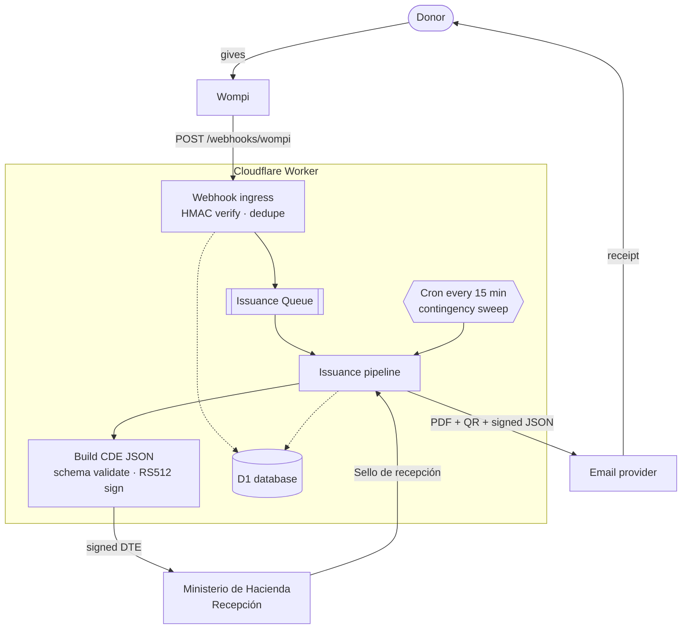
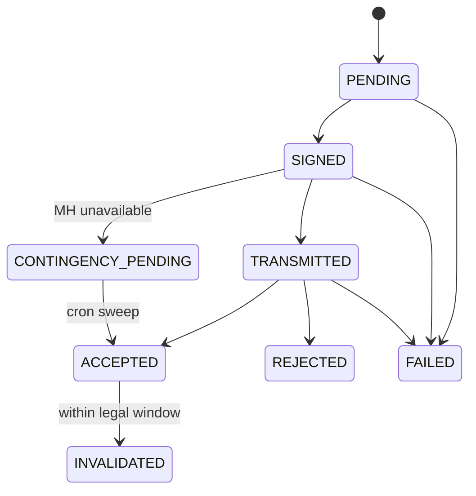

<div align="center">

# 🇸🇻 DiezmosSV

### Electronic donation receipts for Salvadoran churches — on the edge, for pennies.

Open-source Cloudflare Workers app that turns approved **Wompi** donations into legally valid
**Comprobantes de Donación Electrónicos** (CDE — DTE `tipoDte=15`), signs them natively, transmits
them to the **Ministerio de Hacienda**, and emails the donor a PDF receipt — all from a single Worker.

<br/>

[](./LICENSE)
[](https://workers.cloudflare.com/)
[](https://nodejs.org/)
[](https://react.dev/)
[](https://www.typescriptlang.org/)
[](#-project-status)

</div>

---

> [!WARNING]
> **This is not legal or tax advice.** Before any production use, validate your configuration, MH
> credentials, document mappings, and operating procedures with your accountant, your legal
> representative, and the Ministerio de Hacienda onboarding process.

> [!NOTE]
> **DiezmosSV is an independent open-source project.** It is not affiliated with, endorsed by,
> sponsored by, or officially supported by Wompi or Cloudflare. Those names appear only because the
> app integrates with their public services.

---

## 📑 Table of Contents

- [Why DiezmosSV](#-why-diezmossv)
- [How it works](#-how-it-works)
- [Cloudflare architecture](#-cloudflare-architecture)
- [Tech stack](#-tech-stack)
- [Project structure](#-project-structure)
- [Quick start (local)](#-quick-start-local)
- [Validation](#-validation)
- [Deploy to Cloudflare](#-deploy-to-cloudflare)
- [Configuration reference](#-configuration-reference)
- [Wompi webhook](#-wompi-webhook)
- [Admin panel & roles](#-admin-panel--roles)
- [Document lifecycle](#-document-lifecycle)
- [Data model](#-data-model)
- [Compliance notes](#-compliance-notes)
- [Why no JVM signer?](#-why-no-jvm-signer)
- [Project status](#-project-status)
- [Contributing](#-contributing)
- [License](#-license)

---

## 💡 Why DiezmosSV

Issuing CDE DTEs usually means standing up a JVM signer, a database, a queue, and a server that
runs 24/7. For a church receiving a handful of donations a day, that's a lot of cost and operational
burden. DiezmosSV collapses the whole pipeline into **one Cloudflare Worker** — invocation-billed,
auditable, and cheap to run.

| | |
|---|---|
| 🔐 **Verified ingress** | Validates the raw-body `wompi_hash` HMAC and deduplicates Wompi retries by `IdTransaccion` before anything else happens. |
| 🧾 **Correct CDE mapping** | Maps approved donations into MH CDE JSON (`tipoDte=15`) and validates it against the bundled MH JSON schema. |
| ✍️ **Native signing** | Signs DTE JSON in the Worker with WebCrypto as a compact **RS512 JWS** — no external JVM signer required. |
| 🏛️ **MH transmission** | Authenticates with MH, caches the token in D1, transmits to *Recepción*, and records the **Sello de recepción**. |
| 📄 **Donor receipt** | Generates a PDF *representación gráfica* with a QR code and emails it (plus the signed JSON) through a configurable provider. |
| 🌩️ **Resilient by design** | Handles MH-outage **contingency** state and retries transmission on a cron sweep. |
| ⚖️ **Legal invalidation** | Supports signed invalidation events with the CDE legal-window check baked in. |
| 🖥️ **Admin panel** | React SPA for documents, failures, contingency, audit log, users, resend, retry, and invalidation. |
| 🛡️ **Secure access** | PBKDF2 password hashing, bearer-token sessions, and role-based access control. |

> 💸 **Run it before you have credentials.** Local dev ships with `MOCK_EXTERNAL_SERVICES=true`, which
> stubs MH and the email provider — you can click through the full admin panel and issuance pipeline
> with placeholder secrets.

---

## 🔄 How it works

A donation flows from Wompi to a signed, MH-sealed receipt in the donor's inbox without any server
sitting idle between events:



Only events with `ResultadoTransaccion = ExitosaAprobada` are issued. Everything that touches MH,
Wompi, or the donor is recorded in D1 and the audit log.

---

## ☁️ Cloudflare architecture

| Resource | Binding | Role |
|---|---|---|
| **Worker** | `main = src/worker/index.ts` | API, webhook ingress, issuance pipeline, MH client, signer, PDF/email orchestration. |
| **D1** | `DB` | Wompi events, DTE documents, signed events, tokens, users, sessions, audit log, contingency periods. |
| **Queues** | `ISSUANCE_QUEUE` → `diezmossv-local-issuance-example` | Async issuance triggered by approved Wompi webhooks (batch ≤ 10). |
| **Cron Triggers** | `*/15 * * * *` | Contingency sweeps and retransmission attempts. |
| **Static assets** | `ASSETS` → `./dist/client` | React admin panel served from the Worker with SPA fallback. |

`compatibility_date = 2026-06-02` with `nodejs_compat` enabled for crypto operations.

---

## 🧰 Tech stack

**Frontend** · React 19 · Vite 8 · TypeScript 6 · `lucide-react` icons · plain CSS
**Worker** · Cloudflare Workers · D1 (SQLite) · Queues · Cron Triggers · WebCrypto
**Crypto & docs** · WebCrypto `RS512` JWS · `pdf-lib` · `qrcode`
**Validation** · `ajv` + `ajv-formats` against bundled MH JSON schemas
**Tooling** · Wrangler 4 · Vitest 4 · split `tsconfig` for client/worker

---

## 📁 Project structure

```text
DiezmosSV/
├── src/
│   ├── worker/                 # Cloudflare Worker (backend)
│   │   ├── index.ts            # Entry: fetch() · queue() · scheduled()
│   │   ├── config.ts           # Env parsing & validation
│   │   ├── domain/             # wompi · dteBuilder · signer · schema
│   │   ├── services/           # mhClient · pipeline · email · pdf · auth
│   │   ├── storage/            # repository.ts — raw D1 access (no ORM)
│   │   └── utils/              # ids · dates · encoding · http
│   └── client/                 # React + Vite admin panel
├── migrations/                 # D1 schema (0001_init.sql)
├── DTE/svfe-json-schemas/      # MH-bundled JSON schemas for validation
├── docs/                       # Deployment and UAT runbooks
├── examples/                   # wompi-webhook.sample.json (safe test payload)
├── test/worker/                # Vitest unit tests
└── wrangler.toml               # Bindings, vars, queues, crons
```

---

## 🚀 Quick start (local)

**Requirements:** Node.js 22+, npm, a Cloudflare account, a Wompi account with webhook access, and
MH DTE API credentials for the environment you intend to use. Wrangler is installed with the project.

```bash
# 1 — Install dependencies
npm install

# 2 — Create your local env file and fill it in
cp .dev.vars.example .dev.vars

# 3 — Create the local D1 schema
npx wrangler d1 migrations apply diezmossv-local-db-example --local

# 4 — Run the Worker and the admin UI (two terminals)
npm run dev:worker   # Worker on http://127.0.0.1:8787
npm run dev          # Vite UI, proxies /api and /webhooks to the Worker
```

Open the Vite URL and use **`Crear owner`** on first run to bootstrap the initial admin account.

A starter `.dev.vars` looks like this — use **separate** MH credentials for test and production:

```bash
WOMPI_API_SECRET="..."
MH_CERT_PASSWORD="..."
MH_CERT_XML="<CertificadoMH>...</CertificadoMH>"
# Remote Cloudflare deploys can use MH_CERT_XML_PART_1 and MH_CERT_XML_PART_2
# when the certificate XML is over the 5 KB Worker variable limit.

MH_USER_TEST="..."
MH_PASSWORD_TEST="..."
MH_USER_PROD="..."
MH_PASSWORD_PROD="..."

EMAIL_API_URL="..."
EMAIL_API_KEY="..."
EMAIL_FROM="dte@example.org"

EMISOR_CONFIG_JSON="{...}"
```

> 🔒 **Never commit real credentials.** `.dev.vars`, `DTE/Credentials/`, MH PDFs, real Wompi webhook
> samples, build output, and local Wrangler state are all gitignored. Use
> `examples/wompi-webhook.sample.json` for public testing and keep real payloads private.

---

## ✅ Validation

```bash
npm test         # Vitest unit tests
npm run typecheck # Type-check client + worker
npm run build     # Vite build + worker type-check
```

The tests cover:

- Wompi HMAC verification
- CDE schema generation
- Contingency event schema generation
- Native RS512 signing and verification
- CDE invalidation legal-window calculation

---

## 📦 Deploy to Cloudflare

<details>
<summary><strong>TEST/Staging deployment</strong></summary>

<br/>

The default Wrangler config is local/mock. Real Cloudflare testing uses the `staging` environment:

```bash
# 1 - Authenticate Wrangler
npx wrangler login
npm run cf:whoami

# 2 - Create remote resources, then copy the returned D1 id into
#     wrangler.toml under [[env.staging.d1_databases]]
npx wrangler d1 create diezmossv-staging-resource-example
npx wrangler queues create diezmossv-staging-issuance-example

# 3 - Set TEST/staging secrets
npx wrangler secret put WOMPI_API_SECRET --env staging
npx wrangler secret put MH_CERT_PASSWORD --env staging
npx wrangler secret put MH_CERT_XML_PART_1 --env staging
npx wrangler secret put MH_CERT_XML_PART_2 --env staging
npx wrangler secret put MH_USER_TEST --env staging
npx wrangler secret put MH_PASSWORD_TEST --env staging
npx wrangler secret put EMAIL_API_KEY --env staging
npx wrangler secret put EMAIL_API_URL --env staging
npx wrangler secret put EMAIL_FROM --env staging
npx wrangler secret put EMISOR_CONFIG_JSON --env staging

# 4 - Apply migrations and deploy the Worker + ASSETS
npm run cf:migrate:staging
npm run cf:deploy:staging

# 5 - Run the deployed edge smoke test
STAGING_URL="https://YOUR_STAGING_WORKER_URL" \
STAGING_EMAIL="owner@example.org" \
STAGING_PASSWORD="..." \
WOMPI_API_SECRET="..." \
SMOKE_DONOR_DOCUMENT="..." \
npm run smoke:staging
```

Staging runs with `MOCK_EXTERNAL_SERVICES = "false"`. Use only MH ambiente `00` data here:
test MH API user/password, the matching signer certificate XML/password, and a test Wompi secret.
See `docs/cloudflare-staging-uat.md` for the edge smoke test and approval checklist.

</details>

<details>
<summary><strong>Production cutover</strong></summary>

<br/>

Production is intentionally a separate Wrangler environment and should be used only after staging
UAT approval.

```bash
# 1 - Create production resources, then copy the returned D1 id into
#     wrangler.toml under [[env.production.d1_databases]]
npx wrangler d1 create diezmossv-production-resource-example
npx wrangler queues create diezmossv-production-issuance-example

# 2 - Set production secrets
npx wrangler secret put WOMPI_API_SECRET --env production
npx wrangler secret put MH_CERT_PASSWORD --env production
npx wrangler secret put MH_CERT_XML_PART_1 --env production
npx wrangler secret put MH_CERT_XML_PART_2 --env production
npx wrangler secret put MH_USER_PROD --env production
npx wrangler secret put MH_PASSWORD_PROD --env production
npx wrangler secret put EMAIL_API_KEY --env production
npx wrangler secret put EMAIL_API_URL --env production
npx wrangler secret put EMAIL_FROM --env production
npx wrangler secret put EMISOR_CONFIG_JSON --env production

# 3 - Apply migrations and deploy after staging approval
npm run cf:migrate:prod
npm run cf:deploy:prod
```

Do one controlled low-value production issuance with live monitoring before enabling normal volume.

</details>

---

## ⚙️ Configuration reference

**Secrets** - set with `wrangler secret put --env staging` / `--env production` remotely, or in
`.dev.vars` locally:

| Variable | Purpose |
|---|---|
| `WOMPI_API_SECRET` | HMAC secret used to verify the `wompi_hash` on incoming webhooks. |
| `MH_CERT_XML` | MH certificate XML (contains the RSA key material used for signing). Works locally and remotely only when it fits Cloudflare's 5 KB Worker variable limit. |
| `MH_CERT_XML_PART_1` / `MH_CERT_XML_PART_2` | Split form of the same certificate XML for Cloudflare Workers when `MH_CERT_XML` is over the per-variable limit. |
| `MH_CERT_PASSWORD` | Private-key password for the signer. |
| `MH_USER_TEST` / `MH_PASSWORD_TEST` | MH API login for **test** (`ambiente=00`). |
| `MH_USER_PROD` / `MH_PASSWORD_PROD` | MH API login for **production** (`ambiente=01`). |
| `EMAIL_API_KEY` | Transactional email provider API key. |
| `EMAIL_API_URL` / `EMAIL_FROM` | Email endpoint and sender address. |
| `EMISOR_CONFIG_JSON` | Issuer configuration for the real church/taxpayer. Treat as a secret for real deployments. |

> The signer certificate and the MH API login are **different concerns**. `MH_CERT_*` is for signing;
> `MH_USER_*` / `MH_PASSWORD_*` is for the API. Don't use production credentials for test donations —
> a test payment routed to `ambiente=00` with production-only credentials will fail authentication.

**Vars** - set in `wrangler.toml [vars]` and duplicated per Wrangler environment:

| Variable | Purpose |
|---|---|
| `APP_ENV` | Informational environment name. |
| `MOCK_EXTERNAL_SERVICES` | `"true"` stubs MH + email (great for local dev). |
| `MH_AUTH_URL_*` · `MH_RECEPCION_URL_*` · `MH_CONTINGENCIA_URL_*` · `MH_ANULACION_URL_*` | MH endpoints, per environment. |
| `MH_USER_AGENT` | User-Agent header sent to MH. |
| `EMISOR_CONFIG_JSON` | Demo/local issuer config lives in `.dev.vars`; set the real remote value as a Cloudflare secret. |

---

## 🪝 Wompi webhook

Configure Wompi to send approved payment events to:

```text
https://YOUR_WORKER_DOMAIN/webhooks/wompi
```

The Worker only processes events where:

```text
ResultadoTransaccion = ExitosaAprobada
```

**Environment routing** — pick MH credentials that match the target environment:

| Wompi field | MH `ambiente` |
|---|---|
| `EsProductiva=false` | `00` (test) |
| `EsProductiva=true` | `01` (production) |

---

## 👥 Admin panel & roles

The React admin panel handles documents, failures, contingency status, the audit log, user
management, and per-document actions (resend, retry, invalidation) — no CLI-only operations.

| Role | Capabilities |
|---|---|
| `VIEWER` | Read documents and the audit log. |
| `OPERATOR` | Resend email, retry failures, initiate invalidation. |
| `ADMIN` | Manage users and roles. |
| `OWNER` | Top-level operator for church ownership and credential stewardship. |

---

## 🔁 Document lifecycle

Each CDE moves through an explicit status machine, recorded in D1:



---

## 🗄️ Data model

<details>
<summary><strong>D1 tables (migrations/0001_init.sql)</strong></summary>

<br/>

| Table | Purpose |
|---|---|
| `wompi_events` | Incoming Wompi webhooks; dedup by `transaction_id`. |
| `dte_documents` | Issued CDEs: status, plain JSON, signed JWS, MH seal, donor info. |
| `dte_events` | Invalidation and contingency events (one-to-many with documents). |
| `contingency_periods` | Windows when MH was unavailable. |
| `audit_logs` | Immutable action log: actor, action, entity, metadata. |
| `mh_tokens` | Cached MH auth tokens, per environment. |
| `document_sequences` | Control-number counters per environment/prefix. |
| `email_deliveries` | Email send records and provider responses. |
| `users` · `sessions` · `password_reset_tokens` | Authentication and RBAC. |

Foreign keys are enabled (`PRAGMA foreign_keys = ON`). Access is raw SQL via
`src/worker/storage/repository.ts` — no ORM.

</details>

---

## ⚖️ Compliance notes

- CDE is transmitted normally **before** delivery to the donor, except during contingency.
- Contingency documents are sent as transitory and queued for later MH transmission.
- Invalidation is a **signed event**, not a database flag.
- CDE invalidation is blocked outside the **first ten business days** of the month after the sello
  tax period.
- Keep signed JSON, MH responses, and audit records **immutable** for retention.

---

## 🧩 Why no JVM signer?

The app intentionally avoids a JVM signer. The MH certificate XML contains ordinary RSA key material,
and Workers WebCrypto can produce the required `RS512` compact JWS directly — so the entire pipeline
stays inside one Worker.

The official MH signer is still useful as a **conformance oracle** during onboarding. For production,
compare signatures and accepted documents in the MH test environment before switching on real
donations.

---

## 🚧 Project status

This is an early implementation — useful, auditable, and inexpensive — with the core pieces needed for
a production integration. Every church must still provide its own:

- MH test and production API credentials
- MH certificate XML and private-key password
- Wompi webhook secret
- Email provider credentials
- Emisor configuration
- Responsible-person data for invalidation and contingency events
- A legal/finance decision for donors with incomplete identification

---

## 🤝 Contributing

Issues and pull requests are welcome. Before opening a PR, please run the full validation suite
(`npm test && npm run typecheck && npm run build`) and **never** include real credentials, MH
certificates, or production Wompi payloads in commits, fixtures, or screenshots.

---

## 📜 License

Licensed under the **Apache License 2.0** — see [LICENSE](./LICENSE) and [NOTICE](./NOTICE).
Copyright © 2026 Example Person.

<div align="center">
<sub>Built for the church accountant who'd rather not run a server. ✦</sub>
</div>
