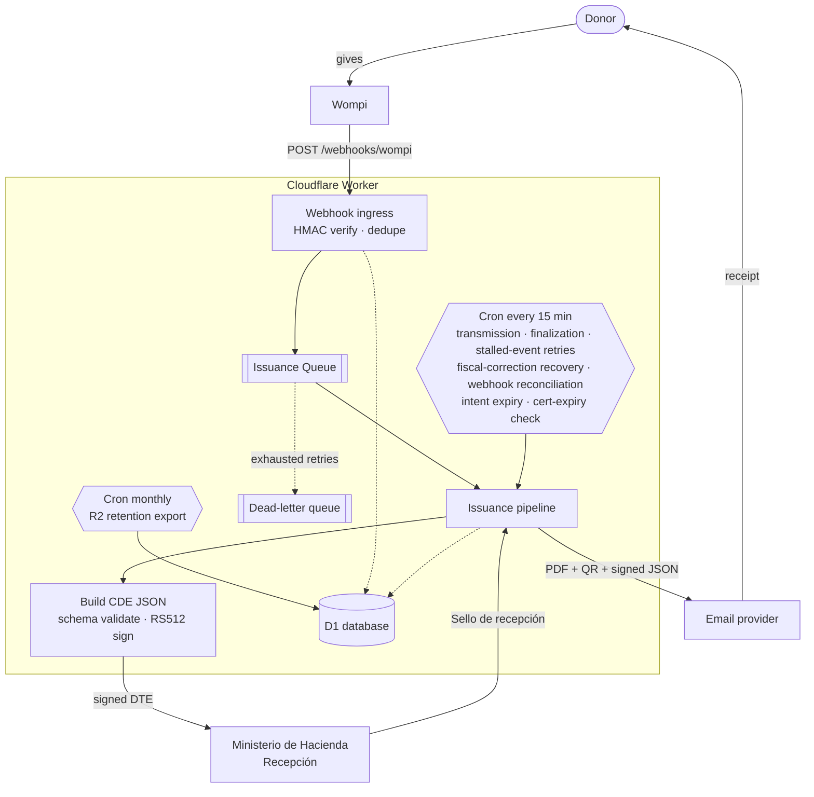
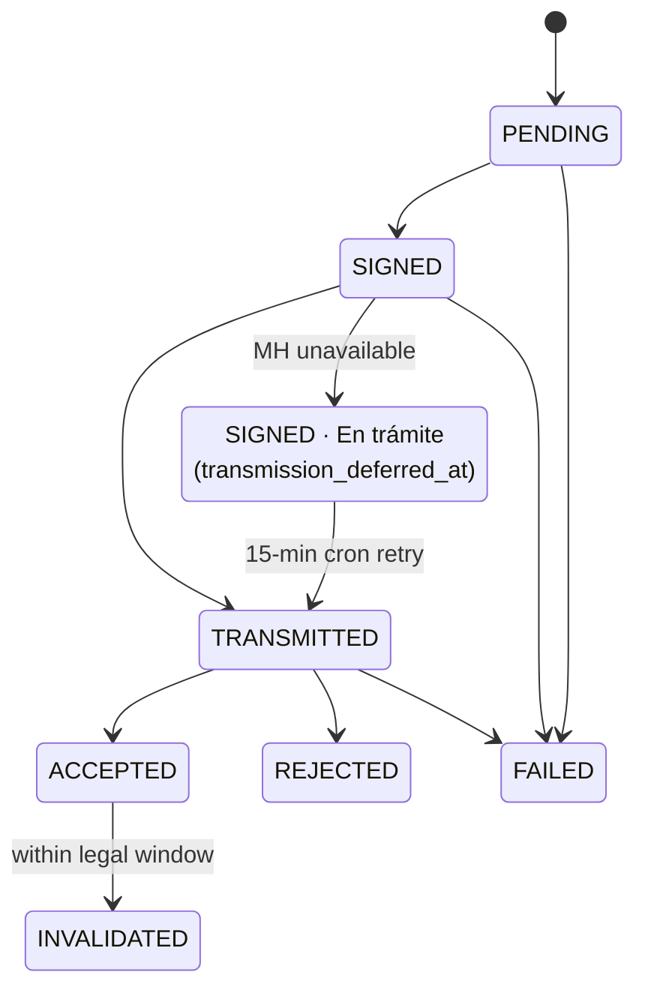
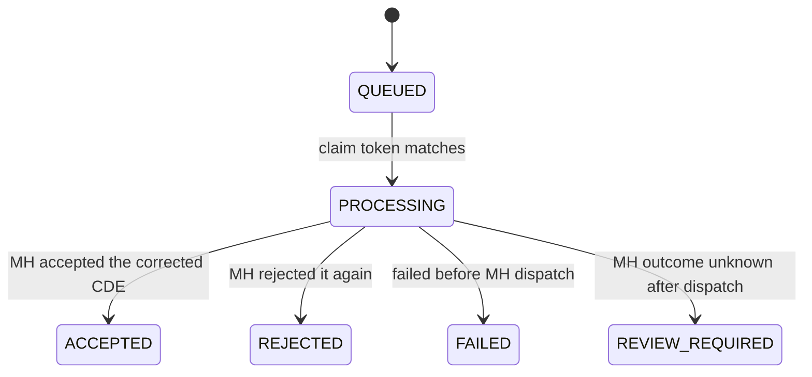
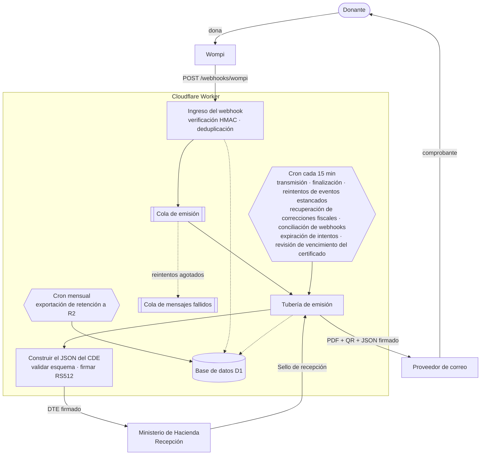
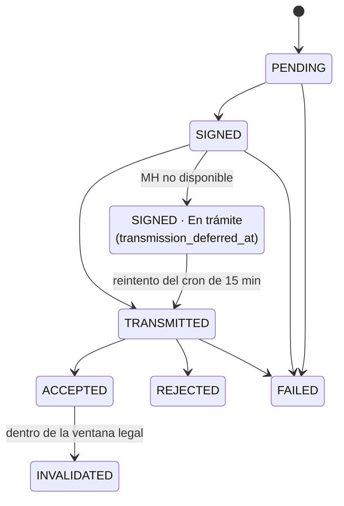
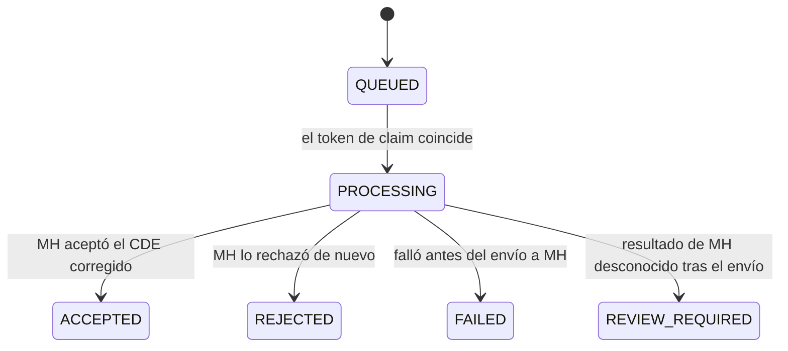

<div align="center">

# 🇸🇻 DiezmosSV

### Electronic donation receipts for Salvadoran churches — on the edge, for pennies.

Open-source Cloudflare Workers app that turns approved **Wompi** donations into legally valid
**Comprobantes de Donación Electrónicos** (CDE — DTE `tipoDte=15`), signs them natively, transmits
them to the **Ministerio de Hacienda**, and emails the donor a PDF receipt — all from a single Worker.

<br/>

[](./LICENSE)
[](https://workers.cloudflare.com/)
[](https://nodejs.org/)
[](https://react.dev/)
[](https://www.typescriptlang.org/)
[](#-project-status)

<br/>

**English** · [Español](#-diezmossv--español)

</div>

---

> [!WARNING]
> **This is not legal or tax advice.** Before any production use, validate your configuration, MH
> credentials, document mappings, and operating procedures with your accountant, your legal
> representative, and the Ministerio de Hacienda onboarding process.

> [!NOTE]
> **DiezmosSV is an independent open-source project.** It is not affiliated with, endorsed by,
> sponsored by, or officially supported by Wompi or Cloudflare. Those names appear only because the
> app integrates with their public services.

---

## 📑 Table of Contents

- [Why DiezmosSV](#-why-diezmossv)
- [How it works](#-how-it-works)
- [Cloudflare architecture](#-cloudflare-architecture)
- [Tech stack](#-tech-stack)
- [Project structure](#-project-structure)
- [Quick start (local)](#-quick-start-local)
- [Validation](#-validation)
- [Deploy to Cloudflare](#-deploy-to-cloudflare)
- [Configuration reference](#-configuration-reference)
- [Security](#-security)
- [Wompi webhook](#-wompi-webhook)
- [Online donations (/donar)](#-online-donations-donar)
- [Admin panel & roles](#-admin-panel--roles)
- [Document lifecycle](#-document-lifecycle)
  - [Fiscal corrections](#fiscal-corrections)
- [Data model](#-data-model)
- [Compliance notes](#-compliance-notes)
- [Why no JVM signer?](#-why-no-jvm-signer)
- [Project status](#-project-status)
- [Contributing](#-contributing)
- [License](#-license)

---

## 💡 Why DiezmosSV

Issuing CDE DTEs usually means standing up a JVM signer, a database, a queue, and a server that
runs 24/7. For a church receiving a handful of donations a day, that's a lot of cost and operational
burden. DiezmosSV collapses the whole pipeline into **one Cloudflare Worker** — invocation-billed,
auditable, and cheap to run.

| | |
|---|---|
| 🔐 **Verified ingress** | Validates the raw-body `wompi_hash` HMAC and deduplicates on **two** keys before anything else happens: Wompi's `IdTransaccion`, and — for dynamic `/donar` links — the numeric payment-link id, which is the stable fiscal idempotency key because a single-use link admits exactly one successful payment. The same payment arriving twice under two different transaction identifiers therefore still produces exactly one CDE. |
| 🧾 **Correct CDE mapping** | Maps approved donations into MH CDE JSON (`tipoDte=15`) and validates it against the bundled MH JSON schema. |
| ✍️ **Native signing** | Signs DTE JSON in the Worker with WebCrypto as a compact **RS512 JWS** — no external JVM signer required. |
| 🏛️ **MH transmission** | Authenticates with MH, caches the token in D1, transmits to *Recepción*, and records the **Sello de recepción**. |
| 📄 **Donor receipt** | Generates a PDF *representación gráfica* with a QR code and emails it (plus the signed JSON) through a configurable provider. |
| 🌩️ **Resilient by design** | On an MH outage the CDE is signed normally, the donor gets an immediate **transitorio** receipt, and a 15-minute cron retries transmission until MH seals it (deferred transmission — the contingency evento excludes tipo 15 per the Anexo, field 35). A dead-letter queue plus a stalled-event sweep self-heal issuance messages that exhaust their retries. |
| 📡 **Missed-webhook reconciliation** | A webhook that Wompi never delivered is not a lost donation. Every 15 minutes the Worker re-reads up to 25 unresolved `/donar` intents from the last 7 days directly against the Wompi payment-link API and, when the link shows a completed payment, replays it through the *same* verified ingest path a real webhook takes — audited as `WOMPI_RECONCILED`. Correlation stays strict (a payload that does not bind to the stored intent and link id is refused and audited as `WOMPI_RECONCILIATION_REJECTED`), and a Wompi outage leaves the intent eligible for the next tick instead of consuming it. |
| 🧷 **One legal submission, ever** | Every MH-facing transmission or invalidation first acquires a durable **fiscal operation claim**. An ambiguous outcome (timeout, interrupted isolate) freezes the document for operator reconciliation instead of risking a duplicate legal submission — every retry path fails closed while the claim is held. |
| ⚖️ **Legal invalidation** | Supports signed invalidation events with the CDE legal-window check baked in, and emails the donor a branded notice when MH accepts the invalidation. |
| 🩹 **Fiscal corrections** | A CDE that MH rejected on `receptor` fields — or a Wompi payment whose donor data never produced a CDE at all — is repaired from the panel instead of by hand. The operator edits only the 14 receptor fields (everything else is refused as `protected_field`), and the Worker rebuilds, re-signs, and re-transmits under a **fresh `codigoGeneracion` and `numeroControl`** reserved by a database trigger. Idempotent by request UUID and payload digest, single-owner by claim token, and never blindly retried once the MH dispatch has started. |
| 🖥️ **Admin panel** | React SPA for documents, donors, failures (CDE **and** pre-CDE), contingency history (read-only), audit log, analytics, users, exports, backups, resend, retry, fiscal correction, reissue, and invalidation — no CLI-only operations. |
| 📊 **Donation analytics** | The **Analítica** view charts Wompi-lane giving trends — amounts, counts, diezmo/ofrenda mix — bucketed in El Salvador time, with capacity-bounded queries. |
| 🎁 **Donor care built in** | One-click **constancia anual** (annual donation-summary certificate) per donor or in bulk, plus a CRM-ready donor contact export. |
| 🔎 **Donor explorer** | The **Donantes** view resolves accepted CDEs into a donor register — identity, contact, location, gift count, lifetime total, and last gift — keyed by fiscal document, falling back to email, then to the document itself. Filter by document type/number, name, email, amount range, diezmo/ofrenda, and online/manual origin; export the filtered set as CSV. ADMIN and above; document numbers are masked in the table and revealed only in the detail panel. |
| 🏷️ **White-label** | Rebrand the panel, donor pages, donor email, **the receipt PDF, and the annual certificate** with your church's display name, accent color, support address, and logos (stored in R2) from the **Marca** settings — no fork needed. An uploaded logo is fitted into the same reserved ink band as the built-in default, so the surrounding layout stays valid. |
| 🛡️ **Secure access** | PBKDF2 password hashing, bearer-token sessions, role-based access control, self-service password reset, and D1-backed rate limiting on login, password reset, and public donation endpoints — with per-claim audit provenance. |
| 📬 **Branded email** | All donor email (receipt, invalidation notice, annual certificate, password reset) is sent as branded HTML with configurable templates. |
| 🚨 **Operational alerting** | Alerts a configurable email address on emission failures, receipt-delivery failures, MH unavailability, stalled events, retention failures, and MH signer-certificate expiry. Each incident also emits a privacy-safe `operational_alert` Workers Logs event for independent Cloudflare Observability alerting and Notifications delivery. |
| 🗃️ **Legal retention** | A monthly cron exports an immutable, hash-verified snapshot of all legal records to R2 for multi-year tax retention independent of D1. The **Respaldos mensuales** panel browses, verifies, and downloads each month as a ZIP. |

> 💸 **Run it before you have credentials.** The default (local) `wrangler.toml` config sets
> `MOCK_EXTERNAL_SERVICES = "true"`, which stubs MH and the email provider — you can click through the
> full admin panel and issuance pipeline with placeholder secrets. Mock mode is **explicit opt-in**:
> it is only active when `MOCK_EXTERNAL_SERVICES` is exactly `"true"`, so staging and production
> (where it is `"false"`) always hit the real MH and email services.
>
> 📖 **Operating the panel day to day?** Non-technical operators should read the Spanish
> [operator runbook](./docs/runbook-operador.md).

---

## 🔄 How it works

A donation flows from Wompi to a signed, MH-sealed receipt in the donor's inbox without any server
sitting idle between events:



Only events with `ResultadoTransaccion = ExitosaAprobada` are issued. Everything that touches MH,
Wompi, or the donor is recorded in D1 and the audit log.

The public `/donar` page opens on a two-door landing: **El Salvador y el mundo** routes to the
SV fiscal form (Wompi + CDE), and **EE. UU.** routes straight to the Givebutter block for a
US-deductible receipt (`?ruta=sv` / `?ruta=eeuu` deep-links a door). The whole web UI (donor pages
and admin) uses **Gotham**, self-hosted as latin-subset woff2 under `src/client/fonts/` — the
licensed OTFs are never committed; only the generated woff2 subsets are.

---

## ☁ Cloudflare architecture

| Resource | Binding | Role |
|---|---|---|
| **Worker** | `main = src/worker/index.ts` | API, webhook ingress, issuance pipeline, MH client, signer, PDF/email orchestration. |
| **D1** | `DB` | Wompi events, DTE documents, signed events, tokens, users, sessions, audit log, contingency periods, app settings. |
| **Queues** | `ISSUANCE_QUEUE` → `diezmossv-local-issuance-example` (+ `-dlq`) | Async issuance (batch ≤ 10, up to 3 retries) for three message kinds: an approved Wompi webhook, a hand-issued advanced CDE, and a fiscal correction — each identified by its own ownership token, and a message carrying none is rejected outright. Messages that exhaust retries land in a dead-letter queue that audits and alerts on each one. |
| **R2** | `ARCHIVE` → `diezmossv-<env>-archive-example` | Monthly legal-retention export bucket (NDJSON snapshots + SHA-256 manifest), plus the branding logo objects (`branding/logo`, `branding/donor-logo`). |
| **Cron Triggers** | `*/15 * * * *` · `0 9 1 * *` | Every 15 min, ten independently-guarded sweeps: expired login/rate-limit claim cleanup, deferred-transmission retry, post-accept finalization retry, accepted-Wompi finalization retry, stalled pre-CDE event sweep, stalled fiscal-correction recovery, missed-webhook reconciliation against the Wompi payment-link API, donation-intent expiry + Wompi link deactivation, and the signer-certificate expiry check. One failing sweep never aborts the tick. Monthly (09:00 UTC on the 1st): R2 retention export. |
| **Static assets** | `ASSETS` → `./dist/client` | React admin panel served from the Worker with SPA fallback. |

`compatibility_date = 2026-06-02` with `nodejs_compat` enabled for crypto operations. `APP_ORIGIN`
is set per environment for building absolute links (e.g. password-reset URLs).

Every 15-minute sweep is wrapped independently: a sweep that throws is logged as a
Workers Logs error event and the tick continues with the next one, so one degraded
dependency (MH, Wompi, R2) never starves the others. Bounded work per tick — the
intent expiry sweep snapshots at most 100 rows and the webhook reconciliation at most
25 — so public traffic cannot make one cron invocation unbounded.

Observability is enabled in every environment at `head_sampling_rate = 1`, with
invocation logs and traces off — the Worker emits its own structured events (notably
the privacy-safe `operational_alert`) rather than relying on per-request logging, which
keeps donor traffic out of the log stream while still making incidents alertable.

---

## 🧰 Tech stack

**Frontend** · React 19 · Vite 8 · TypeScript 7 · `lucide-react` icons · plain CSS
**Worker** · Cloudflare Workers · D1 (SQLite) · Queues · Cron Triggers · WebCrypto
**Crypto & docs** · WebCrypto `RS512` JWS · `pdf-lib` · `qrcode`
**Validation** · `ajv` + `ajv-formats` against bundled MH JSON schemas
**Tooling** · Wrangler 4 · Vitest 4 · Playwright 1.62 (real-Worker e2e) · split `tsconfig` for client/worker

---

## 📁 Project structure

```text
DiezmosSV/
├── src/
│   ├── worker/                 # Cloudflare Worker (backend)
│   │   ├── index.ts            # Entry: fetch() · queue() · scheduled()
│   │   ├── config.ts           # Env parsing & emisor validation
│   │   ├── domain/             # wompi · dteBuilder · signer · schema
│   │   ├── routes/             # router.ts — declarative route table + RBAC dispatch
│   │   ├── services/           # pipeline · mhClient · email(+Html/Sender/Templates) · pdf
│   │   │                       # auth · credentials · alerts · observability · retention
│   │   │                       # analytics · certificate · contacts · backups · f960
│   │   │                       # branding · orgLogo · donations · donorExport · wompiApi
│   │   │                       # wompiNotifications · fiscalCorrection · environmentPolicy
│   │   ├── storage/            # repository.ts + repository/ (13 modules) — raw D1, no ORM
│   │   └── utils/              # ids · dates · encoding · http · guards · zip
│   ├── client/                 # React + Vite admin panel, /donar, fonts, assets
│   └── shared/                 # Catalogs · DUI · NIT · legal windows · password policy
│                               # fiscal corrections · checkout · money · email
├── migrations/                 # D1 schema (incremental, append-only 0001…0031)
├── DTE/svfe-json-schemas/      # MH-bundled JSON schemas for validation
├── docs/                       # Deploy/UAT · operator runbook · retention-restore
│                               # fiscal-claim cutover/reconciliation · pre-CDE recovery
│                               # local-artifact boundary · plans/ · superpowers/
├── scripts/                    # Private-config wrangler wrapper, deploy guards, D1 preflight
├── examples/                   # wompi-webhook.sample.json (safe test payload)
├── test/                       # Vitest: client · worker · migrations · scripts
├── e2e/                        # Playwright specs (donar, admin, security, smoke)
└── wrangler.toml               # Bindings, vars, queues, crons, observability
```

---

## 🚀 Quick start (local)

**Requirements:** Node.js 22.16+, npm, a Cloudflare account, a Wompi account with webhook access, and
MH DTE API credentials for the environment you intend to use. Wrangler is installed with the project.

```bash
# 1 — Install dependencies
npm install

# 2 — Create a private out-of-tree env file and fill it in
PRIVATE_ROOT="$HOME/Library/Application Support/DiezmosSV/private"
install -d -m 700 "$PRIVATE_ROOT/env"
install -m 600 .dev.vars.example "$PRIVATE_ROOT/env/local-operator.env"

# 3 — Create the local D1 schema
npx wrangler d1 migrations apply diezmossv-local-db-example --local

# 4 — Run the Worker and the admin UI (two terminals)
npm run dev:worker   # Worker on http://127.0.0.1:8787
npm run dev          # Vite UI, proxies /api and /webhooks to the Worker
```

Open the Vite URL and use **`Crear owner`** on first run to bootstrap the initial admin account.
The setup form requires the `BOOTSTRAP_OWNER_TOKEN` value from your private local operator env file.
Generate a fresh 32-byte base64url token; the Worker accepts only the `bt_` prefix followed by the
43-character encoded value:

```bash
printf 'bt_%s\n' "$(openssl rand -base64 32 | tr '+/' '-_' | tr -d '=\n')"
```

A starter operator env looks like this. Local execution is locked to MH TEST (`ambiente=00`), so do
not place production API credentials in the local file:

```bash
WOMPI_API_SECRET="..."
BOOTSTRAP_OWNER_TOKEN="bt_<43-character-base64url-value>"
CLOUDFLARE_ACCOUNT_ID="..."
CLOUDFLARE_API_TOKEN="..."
MH_CERT_PASSWORD="..."
MH_CERT_XML="<CertificadoMH>...</CertificadoMH>"
# Remote Cloudflare deploys can use MH_CERT_XML_PART_1 and MH_CERT_XML_PART_2
# when the certificate XML is over the 5 KB Worker variable limit.

MH_USER_TEST="..."
MH_PASSWORD_TEST="..."
# Optional deployment-owned alternative selected before dispatch when Cloudflare cannot address arbitrary recipients.
# Must be an absolute HTTPS URL without embedded credentials; never set it from the credentials panel.
# EMAIL_PROVIDER_URL="https://email-provider.example/send"
# EMAIL_API_KEY="..."
EMAIL_FROM="dte@example.org"

EMISOR_CONFIG_JSON="{...}"
```

> 🔒 **Never place real credentials or donor artifacts in the checkout, even when gitignored.**
> `npm run dev:worker` reads `~/Library/Application Support/DiezmosSV/private/env/local-operator.env`.
> Override it with `DIEZMOSSV_ENV_FILE=/approved/path`. Run
> `npm run security:check-private-boundary` before sharing the checkout. See
> [the local-artifact runbook](docs/local-private-artifacts.md).

---

## ✅ Validation

```bash
npm test                        # Vitest unit tests (client · worker · migrations · scripts)
npm run typecheck               # Type-check client + worker
npm run types:check             # Verify the generated Cloudflare binding types are current
npm run migrations:check-immutability   # Applied migrations must never be edited
npm run build                   # Vite build + worker type-check
npm run security:check-private-boundary

# Playwright drives a real local Worker on :8787, not Vite. PW_PERSIST_TO keeps the
# suite's D1 isolated from your dev checkout's local database.
DIEZMOSSV_ENV_FILE=.dev.vars.ci PW_PERSIST_TO=/tmp/diezmossv-e2e npx playwright test
```

The unit tests cover, among other areas:

- Wompi HMAC verification
- CDE schema generation
- Native RS512 signing and verification, plus certificate-expiry parsing
- CDE invalidation legal-window calculation
- Auth rate limiting, password reset, and branded email templates
- Fiscal-correction claim ownership, control-number reservation, and recovery
- Donor-explorer grouping, filters, and CSV export bounds
- Deploy-guard scripts (`assert-fiscal-cutover`, `assert-donation-lane-config`,
  private-wrangler-config, D1 migration preflight)

CI (`.github/workflows/ci.yml`) runs two jobs on pushes to `main` and `codex/**`, and
on pull requests to `main`.

**test-and-build** installs `poppler-utils` (the PDF tests inspect rendered output with
`pdftotext`/`pdftoppm`), then runs `security:check-private-boundary` →
`migrations:check-immutability` → `types:check` → `typecheck` → `vitest run` → `build`.
The boundary check reads an optional `PRIVATE_BOUNDARY_FORBIDDEN_HOSTS` repository
secret; without it the generic checks still run and the script warns that host checks
are inactive — it never names an organization in the public tree.

**e2e** runs the Playwright suite against the committed non-secret mock env in
`.dev.vars.ci`: it installs the Chromium browser, applies the local D1 migrations
against a fresh runner (exercising the bootstrap path naturally), and runs
`npx playwright test`. `playwright.config.ts` owns the web server — it builds the
client, re-applies migrations, and starts a real `wrangler dev` on port 8787, so the
suite drives the actual Worker rather than Vite. The HTML report is uploaded as an
artifact on failure.

---

## 📦 Deploy to Cloudflare

<details>
<summary><strong>TEST/Staging deployment</strong></summary>

<br/>

The committed `wrangler.toml` is an inert local/example config. Before any remote command, select a
private config that is an absolute path outside this repository, owned by the current user, and
owner-only mode `0600`:

```bash
export DIEZMOSSV_WRANGLER_CONFIG="/absolute/path/outside/this/repository/wrangler.toml"
install -d -m 700 "$(dirname "$DIEZMOSSV_WRANGLER_CONFIG")"
install -m 600 wrangler.toml "$DIEZMOSSV_WRANGLER_CONFIG"

# Edit only the selected private file, then authenticate through its validated copy.
node scripts/run-private-wrangler.mjs login
npm run cf:whoami
```

The wrapper rejects a relative, in-repository, symlinked, non-`0600`, or differently owned file.
Put real D1 IDs, routes, origins, Worker/resource names, queue names, and R2 bucket names only in the
selected private config; leave the public example and its zero IDs unchanged. Root, staging, and
production must each contain exactly one `send_email` binding named `EMAIL`, without
`allowed_sender_addresses`.

Create the remote resources in an owner-controlled Cloudflare workflow, record their returned names
and IDs only in the selected private config, then verify that config through the wrapper:

```bash
node scripts/run-private-wrangler.mjs d1 list
node scripts/run-private-wrangler.mjs queues list
node scripts/run-private-wrangler.mjs r2 bucket list

# Set TEST/staging secrets through the same selected config.
node scripts/run-private-wrangler.mjs secret put WOMPI_API_SECRET --env staging
node scripts/run-private-wrangler.mjs secret put BOOTSTRAP_OWNER_TOKEN --env staging
node scripts/run-private-wrangler.mjs secret put CLOUDFLARE_ACCOUNT_ID --env staging
node scripts/run-private-wrangler.mjs secret put CLOUDFLARE_API_TOKEN --env staging
node scripts/run-private-wrangler.mjs secret put MH_CERT_PASSWORD --env staging
node scripts/run-private-wrangler.mjs secret put MH_CERT_XML_PART_1 --env staging
node scripts/run-private-wrangler.mjs secret put MH_CERT_XML_PART_2 --env staging
node scripts/run-private-wrangler.mjs secret put MH_USER_TEST --env staging
node scripts/run-private-wrangler.mjs secret put MH_PASSWORD_TEST --env staging
node scripts/run-private-wrangler.mjs secret put EMAIL_PROVIDER_URL --env staging   # optional deployment-owned alternative
node scripts/run-private-wrangler.mjs secret put EMAIL_API_KEY --env staging   # optional alternative-provider token
node scripts/run-private-wrangler.mjs secret put EMAIL_FROM --env staging
node scripts/run-private-wrangler.mjs secret put EMISOR_CONFIG_JSON --env staging

# Migrate and deploy through package scripts that use the same private wrapper.
npm run cf:migrate:staging
npm run cf:deploy:staging

# Or, for a quiesced fiscal-claim cutover window, one command that asserts the
# acknowledgement, migrates, and deploys:
FISCAL_CUTOVER_QUIESCED=1 npm run cf:cutover:staging

# Run the deployed edge smoke test.
DIEZMOSSV_ENV_FILE="$HOME/Library/Application Support/DiezmosSV/private/env/staging-smoke.env" npm run smoke:staging
```

Every `cf:migrate:*` command first runs a read-only D1 preflight for duplicate non-null
`dte_documents.wompi_event_id` links. Any duplicate blocks the migration for manual
legal-record review; the preflight never deletes, relinks, or chooses a document. The
migration itself runs through `scripts/d1-schema-compatibility.mjs`, which reconciles
the applied-migration ledger before handing off to Wrangler.

Two deploy guards fail the command closed rather than shipping a broken deployment:

| Guard | Runs on | Blocks unless |
|---|---|---|
| `scripts/assert-fiscal-cutover.mjs` | `cf:migrate:prod`, `cf:deploy:prod`, `cf:cutover:staging` | `FISCAL_CUTOVER_QUIESCED=1` is set. Migrations 0020/0021 and the claim-aware Worker must land in **one quiesced maintenance window**: drain old Worker requests, pause queues/cron and mutating traffic, then acknowledge. |
| `scripts/assert-donation-lane-config.mjs` | `cf:deploy:prod` | `VITE_GIVEBUTTER_CAMPAIGN` is set to a real slug — not blank, not the `example-campaign` placeholder. A placeholder build would ship a donation lane pointing at a campaign that does not exist, and nothing downstream would report it. |

Store the smoke settings in that `0600` out-of-tree file. The runner uses this approved path by
default, so `npm run smoke:staging` is sufficient unless you intentionally select another file.
Do not place credentials, Wompi secrets, bootstrap tokens, or donor identity values inline in the
shell command.

Staging runs with `MOCK_EXTERNAL_SERVICES = "false"` and is structurally locked to MH ambiente `00`:
test MH API user/password, the matching signer certificate XML/password, and a test Wompi secret.
See `docs/cloudflare-staging-uat.md` for the edge smoke test and approval checklist.

</details>

<details>
<summary><strong>Production cutover</strong></summary>

<br/>

Production is intentionally a separate Wrangler environment and should be used only after staging
UAT approval. Its live values also stay only in the selected private config described above.

```bash
# Verify the private production targets without printing their values into this repository.
node scripts/run-private-wrangler.mjs d1 list
node scripts/run-private-wrangler.mjs queues list
node scripts/run-private-wrangler.mjs r2 bucket list

# Set production secrets through the selected private config.
node scripts/run-private-wrangler.mjs secret put WOMPI_API_SECRET --env production
node scripts/run-private-wrangler.mjs secret put BOOTSTRAP_OWNER_TOKEN --env production
node scripts/run-private-wrangler.mjs secret put CLOUDFLARE_ACCOUNT_ID --env production
node scripts/run-private-wrangler.mjs secret put CLOUDFLARE_API_TOKEN --env production
node scripts/run-private-wrangler.mjs secret put MH_CERT_PASSWORD --env production
node scripts/run-private-wrangler.mjs secret put MH_CERT_XML_PART_1 --env production
node scripts/run-private-wrangler.mjs secret put MH_CERT_XML_PART_2 --env production
node scripts/run-private-wrangler.mjs secret put MH_USER_PROD --env production
node scripts/run-private-wrangler.mjs secret put MH_PASSWORD_PROD --env production
node scripts/run-private-wrangler.mjs secret put EMAIL_PROVIDER_URL --env production   # optional deployment-owned alternative
node scripts/run-private-wrangler.mjs secret put EMAIL_API_KEY --env production   # optional alternative-provider token
node scripts/run-private-wrangler.mjs secret put EMAIL_FROM --env production
node scripts/run-private-wrangler.mjs secret put EMISOR_CONFIG_JSON --env production

# Migrate and deploy. Both refuse to run outside an acknowledged quiesced window,
# and the deploy additionally refuses a placeholder Givebutter campaign slug.
FISCAL_CUTOVER_QUIESCED=1 npm run cf:migrate:prod
FISCAL_CUTOVER_QUIESCED=1 VITE_GIVEBUTTER_CAMPAIGN="<this deployment's slug>" npm run cf:deploy:prod
```

The committed example ships `DONATION_INTAKE_DISABLED = "true"` in
`[env.production.vars]`. Leave it in place until the production lane has been
approved, then remove it (or set any other value) in the selected private config and
redeploy. It only closes public intake: the webhook, the queue, the cron sweeps, and
the admin panel continue to serve donations already in flight.

Do one controlled low-value production issuance with live monitoring before enabling normal volume.

</details>

---

## ⚙ Configuration reference

**Secrets** - set remotely with `scripts/run-private-wrangler.mjs secret put` and the config selected
by `DIEZMOSSV_WRANGLER_CONFIG`, or in the out-of-tree file selected by `DIEZMOSSV_ENV_FILE` locally:

| Variable | Purpose |
|---|---|
| `WOMPI_API_SECRET` | HMAC secret used to verify the `wompi_hash` on incoming webhooks. |
| `WOMPI_CLIENT_ID` / `WOMPI_CLIENT_SECRET` | OAuth client-credentials used to mint the single-use, cards-only Wompi payment links behind `/donar`, and to read a link back during missed-webhook reconciliation. Obtain them from the Wompi merchant panel under **Datos del negocio**. The legacy static-payment-link flow does not need them. |
| `BOOTSTRAP_OWNER_TOKEN` | One-time setup secret required by `/api/auth/bootstrap-owner` before the first owner exists. It must be generated from 32 random bytes and formatted as `bt_` plus 43 base64url characters. Rotate or remove it after the owner account exists. |
| `CLOUDFLARE_ACCOUNT_ID` | Cloudflare account target used by the OWNER-only credential UI when saving Worker secrets. |
| `CLOUDFLARE_API_TOKEN` | Scoped Cloudflare API token used by the OWNER-only credential UI to call the Worker secret bulk-update endpoint. |
| `CLOUDFLARE_API_BASE_URL` | Optional override for the Cloudflare API host the OWNER-only credential UI calls. Leave unset for the public API; set it only when a deployment must route through a different endpoint. |
| `MH_CERT_XML` | MH certificate XML (contains the RSA key material used for signing). Works locally and remotely only when it fits Cloudflare's 5 KB Worker variable limit. |
| `MH_CERT_XML_PART_1` / `MH_CERT_XML_PART_2` | Split form of the same certificate XML for Cloudflare Workers when `MH_CERT_XML` is over the per-variable limit. |
| `MH_CERT_PASSWORD` | Private-key password for the signer. |
| `MH_USER_TEST` / `MH_PASSWORD_TEST` | MH API login for **test** (`ambiente=00`). |
| `MH_USER_PROD` / `MH_PASSWORD_PROD` | MH API login for **production** (`ambiente=01`). |
| `EMAIL_PROVIDER_URL` / `EMAIL_API_KEY` | Optional alternative transactional provider selected before dispatch when Cloudflare arbitrary-recipient delivery is not enabled. The deployment-owned URL must be absolute HTTPS without embedded credentials; the provider receives a `POST` JSON body with an `Authorization: Bearer` header. |
| `EMAIL_FROM` | **Required for real sends.** Sender address used by Cloudflare Email Service or the selected HTTP provider. The sender domain must be onboarded in Cloudflare Email Sending. The selected private config must keep the `EMAIL` binding free of `allowed_sender_addresses` so an OWNER update does not conflict with deployment configuration. |
| `EMISOR_CONFIG_JSON` | Issuer configuration for the real church/taxpayer. Treat as a secret for real deployments. |

> The signer certificate and the MH API login are **different concerns**. `MH_CERT_*` is for signing;
> `MH_USER_*` / `MH_PASSWORD_*` is for the API. Don't use production credentials for test donations —
> a test payment routed to `ambiente=00` with production-only credentials will fail authentication.

**Vars** - the committed `wrangler.toml` contains inert examples; remote values belong in the
selected private config and are duplicated per Wrangler environment:

| Variable | Purpose |
|---|---|
| `APP_ENV` | Security boundary: `local`/`staging` permit only `00`; `production` permits only `01`; missing or unknown values permit no issuance. |
| `APP_ORIGIN` | Public base URL of the deployment, used to build absolute links such as password-reset URLs. |
| `MOCK_EXTERNAL_SERVICES` | Mock mode is **explicit opt-in**: MH + email are stubbed only when this is exactly `"true"`. Local `wrangler.toml` sets `"true"`; staging and production set `"false"`. |
| `CLOUDFLARE_SCRIPT_NAME` | Worker script name targeted by the OWNER-only credential UI. |
| `EMAIL` (binding) | Cloudflare `send_email` binding used to send receipt emails with PDF/JSON attachments. Remote root, staging, and production bindings are declared only in the selected private config. |
| `ARCHIVE` (binding) | R2 bucket binding for the monthly legal-retention export and the white-label logo objects. The committed example config names `diezmossv-local-archive-example`, `diezmossv-staging-archive-example`, and `diezmossv-production-archive-example`; real bucket names belong only in the selected private config. |
| `EMAIL_ARBITRARY_RECIPIENTS` | Optional `"true"` marker set after Cloudflare Email Sending is confirmed able to reach external donor addresses. The committed example already sets it for `staging`; local and production leave it unset. |
| `DONATION_INTAKE_DISABLED` | Emergency kill switch for the public donation lane. When exactly `"true"`, `POST /api/donations/intent` and `/api/donations/intent/*` return `503 donation_intake_disabled`, and `/`, `/donar`, and `/donar/gracias` serve an empty locked-down document. Checked before the API router, so the Wompi webhook, the issuance pipeline, and the admin panel keep working — in-flight donations still receive their CDE. The committed example sets it to `"true"` for `production`; unset or any other value leaves intake open. |
| `MH_AUTH_URL_*` · `MH_RECEPCION_URL_*` · `MH_ANULACION_URL_*` | MH endpoints available only for the deployment's credential lane. `MH_AUTH_URL_TEST_FALLBACK` is the narrow central-auth fallback for TEST accounts after MH code 106; it is not a PROD transmission capability. |
| `MH_USER_AGENT` | User-Agent header sent to MH. |
| `EMISOR_CONFIG_JSON` | Demo/local issuer config lives in the selected private env file; set the real remote value as a Cloudflare secret. |

**Build-time vars** - read by Vite and baked into the client bundle by `npm run build` (which every
`cf:deploy:*` script runs). They are **not** Worker vars and are **not** secrets — anything set here
ships to the browser:

| Variable | Purpose |
|---|---|
| `VITE_GIVEBUTTER_CAMPAIGN` | Givebutter campaign slug for the **EE. UU.** donor door. It is the path segment in both `https://givebutter.com/embed/c/<slug>` (the framed giving form) and `https://givebutter.com/<slug>` (the hosted fallback link). Unset, the client falls back to the placeholder `example-campaign`, so a fresh clone runs without pointing at anyone's real campaign. Set it before building any deployment that serves US donors. |

Remote staging/production email delivery selects exactly one provider before dispatch. When both are
configured, set `EMAIL_ARBITRARY_RECIPIENTS=true` only after the Cloudflare `send_email` binding can
reach arbitrary donor addresses; that selects Cloudflare, while an unset marker selects the configured
HTTP provider. If Cloudflare is the only configured provider, it remains the sole dispatch path, but
the credential status does not call arbitrary-recipient delivery ready until the marker is set. The
Worker never retries the same receipt through a second provider after a dispatch attempt, because an
error may arrive after the first provider accepted it.

The alternative HTTP provider must return JSON with an explicit acceptance contract. A successful
send is recognized only for HTTP `200` or `202` with
`{"status":"accepted","id":"<provider-id>"}` (or `messageId` instead of `id`). A pre-acceptance
rejection is retry-safe only for an HTTP `4xx` JSON response shaped as
`{"status":"rejected","accepted":false,"code":"<STABLE_CODE>"}`. Empty, malformed, oversized,
non-JSON, generic `4xx`, unrecognized `2xx`, timeout, network, and `5xx` responses are outcome-unknown
and require manual review; the Worker does not auto-retry them. A successful provider response must
include a non-empty delivery ID, but the Worker never persists that raw value. It immediately stores
only a fixed-length `sha256:` digest, so future provider ID formats cannot be rejected after an
accepted send and a provider-returned URL, address, or credential cannot enter durable evidence.

Operational alert email recipients use durable dispatch claims keyed to the incident and normalized
recipient. Post-dispatch uncertainty is never reclaimed automatically, and the email alert is
complete only when every configured recipient is confirmed sent. Audit rows are secondary operator
history rather than the duplicate-send fence. The same incident is therefore suppressed after a
confirmed send while a later incident for the same CDE can alert again. Independently, every
non-empty incident emits a privacy-safe `operational_alert` event to Workers Logs; configure a
Cloudflare Workers Observability alert and a Cloudflare Notification policy to route that signal.

`EMAIL_PROVIDER_URL` is deployment-owned. Set it with Wrangler or the Cloudflare deployment
configuration, not from the application credentials panel. After the release is deployed and the
new binding is verified, delete the superseded email-endpoint secret left by earlier releases from
each deployment. This repository change does not modify staging or production configuration.

The admin UI includes an OWNER-only **Configuración** workspace for updating MH test/production API
credentials, the signer certificate/password, issuer config JSON, Wompi HMAC, and the Email Service
sender/alternative-provider token — plus emission environment, email templates, branding (Marca), and
the alert address. It shows the deployment-owned alternative destination as read-only status.
Cloudflare Worker secrets are write-only: the screen only shows configured/pending status,
never the secret values. Blank fields preserve the existing secret, and successful updates are audited
by secret name only. If `CLOUDFLARE_ACCOUNT_ID`, `CLOUDFLARE_SCRIPT_NAME`, or
`CLOUDFLARE_API_TOKEN` is missing, the screen remains read-only and tells the owner that the
Cloudflare writer is not configured.

---

## 🪝 Wompi webhook

Configure Wompi to send approved payment events to:

```text
https://YOUR_WORKER_DOMAIN/webhooks/wompi
```

The Worker only processes events where:

```text
ResultadoTransaccion = ExitosaAprobada
```

**Environment routing** — pick MH credentials that match the target environment:

| Wompi field | MH `ambiente` |
|---|---|
| `EsProductiva=false` | `00` (test) |
| `EsProductiva=true` | `01` (production) |

The signed flag is stored as evidence, but it cannot widen a deployment: an incompatible event is
audited and quarantined without paid marking or queueing.

Every accepted webhook row also carries a **pre-CDE issuance lifecycle**
(`PROCESSING → DOCUMENT_CREATED / FAILED / RETRY_QUEUED / DEAD_LETTERED / IGNORED`) with reserved
control numbers, attempt counts, and error evidence — so a donation that fails before a CDE exists
is visible and recoverable from the **Fallos** view instead of vanishing into queue history.

**When the webhook never arrives.** Delivery is not assumed. Every 15 minutes the
Worker reconciles unresolved `/donar` intents against the Wompi payment-link API
(up to 25 per tick, intents created within the last 7 days, re-checked at most every
10 minutes) and replays any completed payment through the same ingest, HMAC-equivalent
correlation, and dedup that a real webhook goes through — recorded as `WOMPI_RECONCILED`
with `source: payment_link_api`. Because the numeric payment-link id is a unique dedup
key, a webhook that arrives *after* reconciliation cannot produce a second CDE. The
sweep is disabled under `MOCK_EXTERNAL_SERVICES = "true"`.

---

## 💳 Online donations (`/donar`)

Besides the legacy static Wompi payment link, the app serves a public **`/donar`** page. The donor
data is **split** between the form and Wompi's hosted sheet:

- **Formulario `/donar`** → the donor's fiscal **documento** and **dirección** (catalog-coded
  department/municipio/distrito + complemento), plus an optional phone and the amount.
- **Hoja de Wompi** → the donor's **nombre** and **correo**, which Wompi's hosted sheet requires and
  now asks for exclusively (they cannot be prefilled or disabled via the API).

**Document types accepted** (CAT-022): each type has its own validation, enforced on the form and
again on the server. Las empresas donan con NIT y razón social — but the /donar select labels the
`36` type **"Empresa"**, not "NIT": many natural persons still hold legacy personal NITs and a
literal "NIT" option would bait them into the razón-social requirement (post-reform, a natural
person's document is the DUI). Donor-facing labeling only — the stored code stays `36` and the
admin quick-CDE form keeps the raw CAT-022 labels. Select order: DUI, Empresa, Otro, Pasaporte,
Carnet de Residente.

| Tipo (label on /donar) | Code | Rule | Stored as |
|---|---|---|---|
| DUI | `13` | Check-digit validated | `XXXXXXXX-X` |
| Empresa (NIT) | `36` | **NIT de la empresa**: 14 digits, **format-only** (no check digit: MH validates NITs server-side, and a homebrew checksum would reject valid NITs). Requires the **razón social** (1–200 chars), stored on the intent's `donor_name` so the comprobante names the empresa instead of the Wompi cardholder. | `XXXX-XXXXXX-XXX-X` |
| Otro | `37` | Free text, ≤50 chars | As entered |
| Pasaporte | `03` | Free text, 5–30 chars | Uppercased |
| Carnet de Residente | `02` | Free text, 5–30 chars | Uppercased |

**Foreign donors** — a "Resido en el extranjero" checkbox replaces the three geography selects with a
**País** select (CAT-020, `SV` excluded) plus the free-text dirección. The intent stores the
`00/00/00` "Otro (Para extranjeros)" codes (CAT-008/012/013) and the country in `donor_pais`; the
emitted CDE marks the receptor `codDomiciliado: 2` with `codPais` from the intent, and the PDF prints
the complemento + country name instead of the placeholder catalog labels.

**US donors → Givebutter (no CDE — deliberate).** When "Resido en el extranjero" is checked **and the
país is Estados Unidos (`US`)**, the SV fiscal fields collapse entirely and the page embeds the
**Givebutter** giving form for the deployment's configured campaign (see `VITE_GIVEBUTTER_CAMPAIGN` in
the [configuration reference](#-configuration-reference)), run by the US 501(c)(3) that acts as the
church's US giving vehicle. A US taxpayer needs a US-deductible receipt, not a Salvadoran CDE, and the
gift belongs on the US entity's books — so these donations flow entirely through Givebutter and
**never touch Wompi, the intent table, the webhook, or the CDE pipeline**. There is **no backend
involvement**: no intent is created, no migration exists, and Givebutter emails its own tax receipt.
The page embeds Givebutter's frameable `https://givebutter.com/embed/c/<campaign>` iframe directly —
**not** the `widgets.givebutter.com` script — so third-party JavaScript does not execute on the app
origin. (The hosted campaign page sends `x-frame-options: sameorigin`, which is why the embed URL is
used rather than the campaign page.) The chosen amount plus a **"Donación mensual"**
segmented control (**Única** | **Mensual**, a radiogroup whose accessible name is still
"Donación mensual") are prefilled in the
iframe URL — `frequency=monthly` is sent only for a monthly gift, and a one-time gift
carries no frequency param. A short notice states that the embedded form is in English.
The block's intro copy is composed at runtime from the deployment's own branding record,
never from a literal, so a reusable build never ships someone else's organization name.
If the embedded form does not load within ~4 s, a prominent **"Donar en GiveButter"**
link to `https://givebutter.com/<campaign>?amount=…` (opens in a new tab) is shown; a small **"Done en GiveButter"** version of that link is always present beneath the
form (GiveButter is the anchor text — no raw URL is shown). There is **no escape hatch** back to the SV
form: the donor deliberately chose the EE. UU. door, and **"← Cambiar opción"** is the way back. The
Givebutter constants (campaign, embed URL) live in `src/client/donation.ts`.

Both doors fund the **same** mother church in El Salvador — the US 501(c)(3) is only the US giving
vehicle, never a different beneficiary; the copy is residence-based, not
destination-based. On the SV path the donor first states whether the gift is a **diezmo** or an
**ofrenda** (a required chip selector); that choice names the Wompi payment sheet and rides on the CDE
apéndice as an informational `TipoAportacion` line, while the legal `descripcion` stays **`DONACIÓN`**.

The Worker validates the form data, persists a **donation intent** (identity + address only; name and
email are stored null, except the empresa razón social), and mints a **single-use, cards-only Wompi
payment link** via the Wompi API (tarjeta de crédito/débito únicamente — puntoAgricola, cuotas,
Bitcoin, QuickPay, and Nequi are disabled; Wompi is also told **not** to email the donor, since the
app sends the CDE itself). When the payment webhook arrives, the CDE `receptor` **merges** the two
sources: `tipoDocumento` / `numDocumento` / `direccion` come from the intent (canonical catalog codes
and a clean document), while `correo` comes from the webhook (what the donor typed on Wompi's sheet);
`nombre` prefers the intent's razón social (empresa donors), falling back to the webhook name; the
telephone prefers the intent's phone, falling back to the webhook's `Celular`.

**Two new secrets** are required to call the Wompi API for the single-use link (the legacy static-link
flow does not need them). Obtain `client_id` / `client_secret` from the Wompi merchant panel under
**Datos del negocio**, then set them per environment through the private wrapper after selecting the
absolute owner-only config with `DIEZMOSSV_WRANGLER_CONFIG`:

```bash
node scripts/run-private-wrangler.mjs secret put WOMPI_CLIENT_ID --env staging      # or --env production
node scripts/run-private-wrangler.mjs secret put WOMPI_CLIENT_SECRET --env staging   # or --env production
```

**Intent lifecycle** (`donation_intents.status`):

| Status | Meaning |
|---|---|
| `PENDING` | Validated and persisted; the Wompi link is being minted. |
| `LINK_CREATED` | Single-use payment link minted; awaiting the donor's payment. |
| `COMPLETED` | Payment webhook correlated and the CDE was accepted by MH. Links to the emitted `document_id`. |
| `EXPIRED` | The donor never paid; the cron sweep expired the unpaid intent. |

**`paid_at` is not a status.** `COMPLETED` means *MH accepted the CDE*, which the async
pipeline can reach seconds or minutes after the donor pays — or not at all. So the
webhook stamps a separate `paid_at` marker **synchronously, before the queue enqueue
and regardless of it**, and the public status endpoint exposes `paid = (paid_at IS NOT
NULL)`. The donor sees *Gracias* the moment the payment is recorded while the
comprobante continues on its own schedule. The marker is idempotent and is stamped on
replays too; it is donor-UI convenience only — the pipeline still owns fiscal
completion.

**Checkout window.** The payment link is minted when the donor enters Paso 2 and stays
valid for one hour; the hosted checkout interface is configured for **30 minutes**
(`duracionInterfazIntentoMinutos`), and `/donar` polls for exactly that long. Both sides
read the same shared constant, because when they disagreed the page gave up first and
dropped a donor still completing a 3DS bank challenge onto the closing message.

**Correlation model** — the intent id is sent as `identificadorEnlaceComercio` and must return as
`EnlacePago.IdentificadorEnlaceComercio`; `EnlacePago.Id` must also exactly match the numeric link id
stored for that intent. `IdExterno` is never accepted as the selector. Legacy static-link payments
skip the intent lookup entirely. Money truth
always comes from Wompi: if the webhook amount differs from the intent amount, the pipeline records a
`DONATION_INTENT_AMOUNT_MISMATCH` audit entry and still correlates, using the webhook's amount on the
CDE. A `COMPLETED` intent never correlates twice.

**Admin visibility** — the **Exportar** view lists the last 50 online donations (status,
tipo, amount, donor, date, and the emitted `numero de control` for completed ones). The
query is a strict column allowlist: donor document, donor email, client IP, and the
Wompi payment-link URLs are never sent to the browser, because nothing renders them.
The **donor** column is joined from the
emitted CDE's `donor_name` (which came from the webhook), so it is shown only for **COMPLETED**
intents — every other status renders "—", since the intent itself carries no name. A CDE produced from
a completed intent shows a **"Datos del donante verificados en el formulario de donación"** badge in
its detail panel.

Draft `/datos` completion uses a separate one-time 256-bit capability returned only to the in-memory
wizard. D1 stores its SHA-256 hash and clears it atomically on the first valid write; the public intent
id is never write authority.

---

## 🔐 Security

Read [SECURITY.md](SECURITY.md) for supported surfaces, private disclosure, role/audit boundaries,
the donation capability contract, the staging/production invariant, and forbidden local artifacts.

> The legacy static Wompi payment link keeps working: those payments have no intent, so the CDE is
> built from the raw webhook's fallback donor data exactly as before.

---

## 👥 Admin panel & roles

The React admin panel handles documents, donors, failures, the read-only contingency
history, the audit log, donation analytics, user management, exports, per-document
actions (resend, retry, fiscal correction, invalidation), and — for owners — a
**Configuración** workspace. No CLI-only operations. The Spanish navigation reads:
Documentos, Donantes, Fallos, Contingencia, Auditoría, Analítica, Usuarios, Exportar,
Configuración.

- **Donantes** turns accepted CDEs into a donor register. Donors are keyed by fiscal
  document (type + normalized number), falling back to lowercased email, then to the
  document id, and only `ACCEPTED` CDEs in the active emission environment are counted
  — the header says so. Each row carries contact, location, gift count, lifetime total,
  preferred gift type (diezmo/ofrenda/sin clasificar) and origin (en línea/manual/ambos);
  the detail panel adds the first gift and the full address. Filters: document type,
  document number (separator-insensitive substring), name, email, `Total desde`/`hasta`,
  gift type, and origin — gift type and origin are **inclusive**, so a donor who has
  given both ways matches both. `Descargar CSV` exports the filtered set (14 columns,
  full document numbers, UTF-8 BOM, formula-injection guarded) up to 1000 donors; past
  that it asks you to narrow the filters. Every export is audited as `DONORS_EXPORTED`
  with counts and boolean filter flags only — never the filter values. Paged 25 at a
  time; **ADMIN** and above.
- **Fallos** lists both CDE-level failures (`FAILED` and MH `REJECTED`) **and pre-CDE issuance
  failures** — approved Wompi events that died before a document existed — with searchable error
  evidence and guided recovery, so no approved donation is silently lost.
- **Analítica** charts Wompi-lane trends (amounts, counts, diezmo/ofrenda mix) bucketed in
  America/El_Salvador (fixed UTC-6). Hand-issued CDEs (quick/advanced) are excluded **by design** —
  they carry no `wompi_event_id`. Responses are row- and byte-bounded, so an oversized date range
  asks you to narrow it instead of melting the Worker.
- **Exportar** bundles the reporting suite: F960 exports (JSON/CSV/XLSX), the last 50 online
  donations, the **Constancia anual de donaciones** (send each donor a branded annual summary of
  accepted donations — per donor or in bulk, every send audited), **Contactos para CRM** (aggregate
  donor contact export for CRM import), and **Respaldos mensuales** (browse and verify the monthly
  R2 legal snapshots, download a month as a ZIP up to 32 MiB).
- **Configuración** is organized in sections: Ambiente, MH, Wompi, **Notificaciones de
  Wompi** (merchant notification emails and phones, plus whether Wompi itself emails
  the donor — off by default, because the app sends the CDE), Emisor, Correo,
  Plantillas, and **Marca** — white-label branding with a display name, accent color,
  support email, and two logos (admin + donor-facing) stored in R2. Defaults keep the
  historical "ExamplePerson1" identity.

| Role | Capabilities |
|---|---|
| `VIEWER` (Consulta) | Read documents, online-donation intents, pre-CDE issuance failures, the contingency history, the audit log, and Analítica. |
| `OPERATOR` (Operador) | Also: quick CDE, resend email, retry failures (CDE and pre-CDE), **fiscal corrections and reissue**, and initiate invalidation. |
| `ADMIN` (Administrador) | Also: manage users and roles, the **Donantes** explorer and its CSV export, and the **Exportar** suite — F960, annual certificates, CRM contacts, monthly backups. |
| `OWNER` (Propietario) | Also: the **Configuración** workspace — credentials, emission environment, email templates, Wompi notification settings, branding (Marca), alert address, and on-demand retention export. Only an owner may grant the owner role or modify another owner. |

> Navigation is filtered by role for **Donantes**, **Exportar** (ADMIN) and
> **Configuración** (OWNER). **Usuarios** is always visible but its body is
> ADMIN-gated: a viewer or operator opening it sees an explanatory panel, not the
> user list.

> 📖 For a task-oriented walkthrough in Spanish, see the [operator runbook](./docs/runbook-operador.md).

---

## 🔁 Document lifecycle

Each CDE moves through an explicit status machine, recorded in D1:



The deferred state is deliberately **not** a separate status value: it is `SIGNED` plus a
`transmission_deferred_at` marker ("En trámite" in the panel). `dte_documents` is the FK parent of
four tables and D1 cannot rebuild a referenced parent to widen the status `CHECK`, so the marker is
kept — and preserved after resolution as historical evidence of the deferral.

Around this machine sits the **fiscal operation claim**: transmission and invalidation each acquire
a durable single-owner claim immediately before calling MH. If the call ends ambiguously, the claim
is kept, the panel shows **"Resultado fiscal pendiente de conciliación"**, and queue redelivery,
scheduled retry, manual retry, resend, invalidation, and status-dependent exports all fail closed
until a deployment operator reconciles the true MH outcome per
[`docs/fiscal-claim-reconciliation.md`](./docs/fiscal-claim-reconciliation.md).

### Fiscal corrections

A rejected CDE is not a dead end. When the failure is a **receptor** problem — a bad
document number, a wrong domicile, an address MH would not accept — an **Operador**
opens **"Corregir datos fiscales"** from the **Fallos** view and fixes exactly the 14
receptor fields. Everything outside that set (monto, emisor, ambiente, fiscal
identifiers) is rejected server-side as `protected_field`.

Corrections apply to two targets, and to no others:

| Target | Situation | Result |
|---|---|---|
| `WOMPI_EVENT` | An approved payment whose donor data never produced a CDE (*"Pagos sin CDE creado"*) | Issuance re-runs from the raw webhook with the corrected receptor |
| `DTE_DOCUMENT` | An existing CDE in `REJECTED` | The row is rewritten in place under new fiscal identifiers; the pre-correction document is snapshotted and restored if the correction is retired |

This is **not** invalidation. Invalidation acts on an `ACCEPTED` CDE that carries a
sello, sends a signed anulación event to MH, and is bounded by the legal window. A
correction acts on a CDE that MH never accepted — there is no sello, so no legal
window exists, nothing is sent to the `anulacion` endpoint, and the outcome is a
**new** valid document rather than the retirement of an old one.



The safety model is the fiscal-claim model applied to a repair path:

- **Idempotent by construction.** Each correction carries a client-minted UUIDv4
  `request_id` (unique) plus a SHA-256 digest of the canonical receptor payload. A
  replay returns the existing status; the same id with a different payload or a
  different target is refused with `correction_request_conflict`.
- **Single owner.** A `processing_claim_id` qualifies every state-advancing write, and
  the correction additionally holds exactly one of the target's ownership tokens — the
  Wompi issuance attempt id or the document's fiscal claim id, never both.
- **The legal sequence is a database invariant.** Control numbers are reserved once,
  under unique indexes, by a trigger that increments `document_sequences` in the same
  statement transaction and aborts if it does not move exactly one row. Recovery reuses
  the persisted reservation instead of burning a second number.
- **Ambiguity is never resolved by guessing.** A correction that reaches
  `REVIEW_REQUIRED` (`MH_DISPATCH_UNCERTAIN`) blocks any further correction on that
  target and waits for an operator. The 15-minute recovery sweep only re-drives
  corrections that provably never dispatched to MH.
- **Only receptor failures qualify.** The Worker classifies each failure; a
  configuration failure gets **"Reemitir sin cambios"** and the guidance *"Revise
  Configuración y la evidencia técnica antes de volver a intentar."*, while the plain
  retry endpoint conversely refuses a failure that needs a correction.

---

## 🗄 Data model

<details>
<summary><strong>D1 tables (migrations/0001_init.sql, extended through 0031)</strong></summary>

<br/>

| Table | Purpose |
|---|---|
| `wompi_events` | Incoming Wompi webhooks and reconciled payment-link payloads; deduplicated by `transaction_id` **and** by the unique `payment_link_id` (the stable fiscal idempotency key for single-use `/donar` links). Carries the pre-CDE issuance lifecycle: status, reserved control numbers, attempt/error evidence, and the stalled-requeue epoch. |
| `dte_documents` | Issued CDEs: status, plain JSON, signed JWS, MH seal, donor info — plus the deferred-transmission marker, fiscal-operation claim, and post-accept finalization columns. |
| `donation_intents` | `/donar` intents: donor document + catalog-coded address, Wompi link correlation, gift type (diezmo/ofrenda), status lifecycle, and the hashed `/datos` completion capability. |
| `fiscal_corrections` | Receptor-repair attempts for rejected CDEs and pre-CDE Wompi failures: request idempotency (`request_id`, `request_payload_sha256`), per-target `attempt_number`, before/after receptor JSON and changed-field list, the pre-correction document snapshot, ownership tokens, the reserved control-number identifiers, and the status/failure evidence. |
| `dte_events` | Invalidation events, plus historical contingency events (one-to-many with documents). |
| `contingency_periods` | Historical MH-outage windows (read-only; new emissions defer instead). |
| `audit_logs` | Immutable action log: actor, action, entity, metadata. |
| `mh_tokens` | Cached MH auth tokens, per environment. |
| `document_sequences` | Control-number counters per environment/prefix. Advanced by the issuance pipeline and, for fiscal corrections, by a database trigger that increments the counter inside the same statement transaction as the reservation and aborts unless it moves exactly one row. |
| `email_deliveries` | Claimed email attempts, dispatch/outcome evidence, provider IDs, and PDF/JSON evidence hashes. |
| `operational_alert_deliveries` | Incident- and recipient-scoped claims for alert email delivery. |
| `contingency_batches` · `contingency_batch_lines` | Historical MH contingency batch submissions and per-CDE results (read-only). |
| `app_settings` | Runtime settings (emission environment, email templates, branding, alert email). |
| `users` · `sessions` · `password_reset_tokens` | Authentication, RBAC, and self-service password reset. |
| `login_rate_limits` · `security_rate_limit_claims` | D1-backed rate limiting for login, password reset, and public donation intents, with claim provenance recorded on the rows they admit. |

Foreign keys are enabled (`PRAGMA foreign_keys = ON`). Access is raw SQL via
`src/worker/storage/repository.ts` — no ORM.

</details>

---

## ⚖ Compliance notes

- CDE is transmitted normally **before** delivery to the donor, except while MH is unavailable.
- The contingency evento's validation table (Anexo, field 35) excludes tipo 15, so a CDE is **never**
  issued in contingency. During an MH outage the CDE is signed in its normal shape, marked
  `TRANSMISSION_PENDING` ("En trámite"), the donor immediately receives a clearly-labeled
  **transitorio** receipt, and the 15-minute cron retries transmission; on acceptance the donor
  receives the definitive receipt with the Sello de Recepción.
- Every MH-facing transmission or invalidation is guarded by a durable **fiscal operation claim** —
  one owner per legal submission, acquired atomically before the call. Ambiguous outcomes freeze the
  document for evidence-first reconciliation instead of authorizing a second submission
  ([`docs/fiscal-claim-reconciliation.md`](./docs/fiscal-claim-reconciliation.md)). The one-time
  quiesced cutover that introduced the claim model is preserved as a historical record in
  [`docs/fiscal-claim-cutover.md`](./docs/fiscal-claim-cutover.md).
- Invalidation is a **signed event**, not a database flag, and the donor is emailed a branded notice
  once MH accepts it.
- CDE invalidation is only allowed through the **tenth business day of the month following the
  sello** — the legal window per *Normativa de Cumplimiento de los DTE* Cuadro 6. The panel shows the
  remaining time and blocks the action once the window closes.
- A CDE that MH **rejected** was never accepted, carries no sello, and is therefore
  outside the invalidation regime entirely. It is repaired through a **fiscal
  correction**: the receptor block is fixed and the document is re-signed and
  re-transmitted under a **new `codigoGeneracion` and `numeroControl`** reserved by a
  database trigger, so no fiscal identifier is ever reused and the legal sequence
  cannot skip or duplicate. The pre-correction document is snapshotted before the
  rewrite. If the MH outcome of a correction cannot be determined, the correction
  stops at `REVIEW_REQUIRED` and waits for an operator rather than risking a second
  legal submission.
- Keep signed JSON, MH responses, and audit records **immutable** for retention. The monthly R2
  retention export preserves them independently of D1; restoring from it is documented in
  [`docs/retention-restore.md`](./docs/retention-restore.md).

---

## 🧩 Why no JVM signer?

The app intentionally avoids a JVM signer. The MH certificate XML contains ordinary RSA key material,
and Workers WebCrypto can produce the required `RS512` compact JWS directly — so the entire pipeline
stays inside one Worker.

The official MH signer is still useful as a **conformance oracle** during onboarding. For production,
compare signatures and accepted documents in the MH test environment before switching on real
donations.

---

## 🚧 Project status

This is an early implementation — useful, auditable, and inexpensive — with the core pieces needed for
a production integration. Every church must still provide its own:

- MH test and production API credentials
- MH certificate XML and private-key password
- Wompi webhook secret
- Cloudflare Email Service sender domain and `EMAIL_FROM`
- Emisor configuration
- Responsible-person data for invalidation events
- A legal/finance decision for donors with incomplete identification

---

## 🤝 Contributing

Issues and pull requests are welcome. Before opening a PR, please run the same gates CI
runs (`npm run security:check-private-boundary && npm run migrations:check-immutability
&& npm run types:check && npm run typecheck && npm test && npm run build`) and **never**
include real credentials, MH certificates, organization names, domains, or production
Wompi payloads in commits, fixtures, or screenshots.

---

## 📜 License

Licensed under the **Apache License 2.0** — see [LICENSE](./LICENSE) and [NOTICE](./NOTICE).
Copyright © 2026 jomplox.

### Third-party assets

The EE. UU. donation-door flag icon is inlined from [HatScripts/circle-flags](https://github.com/HatScripts/circle-flags)
(`us.svg`), licensed under the **MIT License**. The El Salvador door uses the project's
own inline SVG flag badge (`src/client/assets/sv-flag.svg`) — flag *emoji* are not used,
because Windows renders them as bare letters and other platforms as a blank box.

<div align="center">
<sub>Built for the church accountant who'd rather not run a server. ✦</sub>
</div>

---

<div align="center">

## 🇸🇻 DiezmosSV — Español

### Comprobantes de donación electrónicos para iglesias salvadoreñas — en el edge, por centavos.

Aplicación open source sobre Cloudflare Workers que convierte las donaciones aprobadas de **Wompi**
en **Comprobantes de Donación Electrónicos** legalmente válidos (CDE — DTE `tipoDte=15`), los firma
de forma nativa, los transmite al **Ministerio de Hacienda** y envía al donante su comprobante en PDF
por correo — todo desde un solo Worker.

<br/>

[English](#-diezmossv) · **Español**

</div>

---

> [!WARNING]
> **Esto no es asesoría legal ni tributaria.** Antes de cualquier uso en producción, valide su
> configuración, sus credenciales de MH, el mapeo de documentos y sus procedimientos operativos con
> su contador, su representante legal y el proceso de habilitación del Ministerio de Hacienda.

> [!NOTE]
> **DiezmosSV es un proyecto open source independiente.** No está afiliado, avalado, patrocinado ni
> soportado oficialmente por Wompi ni por Cloudflare. Esos nombres aparecen únicamente porque la
> aplicación se integra con sus servicios públicos.

---

## 📑 Índice

- [Por qué DiezmosSV](#-por-qué-diezmossv)
- [Cómo funciona](#-cómo-funciona)
- [Arquitectura en Cloudflare](#-arquitectura-en-cloudflare)
- [Stack técnico](#-stack-técnico)
- [Estructura del proyecto](#-estructura-del-proyecto)
- [Inicio rápido (local)](#-inicio-rápido-local)
- [Validación](#-validación)
- [Despliegue en Cloudflare](#-despliegue-en-cloudflare)
- [Referencia de configuración](#-referencia-de-configuración)
- [Seguridad](#-seguridad)
- [Webhook de Wompi](#-webhook-de-wompi)
- [Donaciones en línea (/donar)](#-donaciones-en-línea-donar)
- [Panel de administración y roles](#-panel-de-administración-y-roles)
- [Ciclo de vida del documento](#-ciclo-de-vida-del-documento)
  - [Correcciones fiscales](#correcciones-fiscales)
- [Modelo de datos](#-modelo-de-datos)
- [Notas de cumplimiento](#-notas-de-cumplimiento)
- [¿Por qué sin firmador JVM?](#-por-qué-sin-firmador-jvm)
- [Estado del proyecto](#-estado-del-proyecto)
- [Cómo contribuir](#-cómo-contribuir)
- [Licencia](#-licencia)

---

## 💡 Por qué DiezmosSV

Emitir DTE de tipo CDE normalmente implica levantar un firmador JVM, una base de datos, una cola y un
servidor encendido 24/7. Para una iglesia que recibe unas pocas donaciones al día, eso es demasiado
gasto y demasiada carga operativa. DiezmosSV concentra toda la tubería en **un solo Cloudflare Worker** —
facturado por invocación, auditable y barato de operar.

| | |
|---|---|
| 🔐 **Ingreso verificado** | Valida el HMAC `wompi_hash` sobre el cuerpo crudo y deduplica por **dos** llaves antes de hacer cualquier otra cosa: el `IdTransaccion` de Wompi y —para los enlaces dinámicos de `/donar`— el id numérico del enlace de pago, que es la llave de idempotencia fiscal estable porque un enlace de un solo uso admite exactamente una transacción exitosa. Por eso, una misma aportación que llegue dos veces bajo dos identificadores de transacción distintos sigue produciendo exactamente un CDE. |
| 🧾 **Mapeo correcto del CDE** | Convierte las donaciones aprobadas en el JSON de CDE de MH (`tipoDte=15`) y lo valida contra el esquema JSON de MH incluido en el repositorio. |
| ✍️ **Firma nativa** | Firma el JSON del DTE dentro del Worker con WebCrypto como un **JWS compacto RS512** — sin necesidad de un firmador JVM externo. |
| 🏛️ **Transmisión a MH** | Se autentica ante MH, cachea el token en D1, transmite a *Recepción* y registra el **Sello de recepción**. |
| 📄 **Comprobante al donante** | Genera un PDF de *representación gráfica* con código QR y lo envía por correo (junto con el JSON firmado) a través de un proveedor configurable. |
| 🌩️ **Resiliente por diseño** | Ante una caída de MH el CDE se firma con normalidad, el donante recibe de inmediato un comprobante **transitorio** y un cron de 15 minutos reintenta la transmisión hasta que MH lo sella (transmisión diferida — el evento de contingencia excluye el tipo 15 según el Anexo, campo 35). Una cola de mensajes fallidos más un barrido de eventos estancados sanan por sí solos los mensajes de emisión que agotan sus reintentos. |
| 📡 **Conciliación de webhooks no recibidos** | Un webhook que Wompi nunca entregó no es una donación perdida. Cada 15 minutos el Worker vuelve a leer hasta 25 intentos de `/donar` sin resolver de los últimos 7 días directamente contra la API de enlaces de pago de Wompi y, cuando el enlace muestra una transacción completada, la reproduce por la *misma* ruta de ingreso verificada que recorre un webhook real — auditada como `WOMPI_RECONCILED`. La correlación se mantiene estricta (un payload que no calce con el intento almacenado y con el id del enlace se rechaza y se audita como `WOMPI_RECONCILIATION_REJECTED`), y una caída de Wompi deja el intento elegible para el siguiente ciclo en vez de consumirlo. |
| 🧷 **Un solo envío legal, siempre** | Toda transmisión o invalidación dirigida a MH adquiere primero un **claim de operación fiscal** durable. Un resultado ambiguo (timeout, isolate interrumpido) congela el documento para que un operador lo concilie, en lugar de arriesgar un segundo envío legal — cada ruta de reintento falla cerrada mientras el claim siga tomado. |
| ⚖️ **Invalidación legal** | Soporta eventos de invalidación firmados con la verificación de la ventana legal del CDE incorporada, y envía al donante un aviso con la marca de la organización cuando MH acepta la invalidación. |
| 🩹 **Correcciones fiscales** | Un CDE que MH rechazó por campos del `receptor` —o una transacción de Wompi cuyos datos de donante nunca llegaron a producir un CDE— se repara desde el panel y no a mano. El operador edita únicamente los 14 campos del receptor (todo lo demás se rechaza como `protected_field`), y el Worker reconstruye, vuelve a firmar y retransmite bajo un **`codigoGeneracion` y un `numeroControl` nuevos** reservados por un trigger de base de datos. Idempotente por UUID de solicitud y digest del payload, de dueño único por token de claim, y nunca reintentado a ciegas una vez que el envío a MH comenzó. |
| 🖥️ **Panel de administración** | SPA de React para documentos, donantes, fallos (de CDE **y** previos al CDE), historial de contingencia (solo lectura), bitácora de auditoría, analítica, usuarios, exportaciones, respaldos, reenvío, reintento, corrección fiscal, reemisión e invalidación — ninguna operación queda solo en CLI. |
| 📊 **Analítica de donaciones** | La vista **Analítica** grafica las tendencias de entrega del carril de Wompi — montos, conteos y mezcla diezmo/ofrenda — agrupadas en hora de El Salvador y con consultas acotadas por capacidad. |
| 🎁 **Cuidado del donante incluido** | **Constancia anual** de donaciones en un clic, por donante o en lote, más una exportación de contactos de donantes lista para CRM. |
| 🔎 **Explorador de donantes** | La vista **Donantes** resuelve los CDE aceptados en un registro de donantes — identidad, contacto, ubicación, cantidad de aportaciones, total histórico y última aportación — con llave en el documento fiscal, con respaldo en el correo y luego en el documento mismo. Filtre por tipo/número de documento, nombre, correo, rango de monto, diezmo/ofrenda y origen en línea/manual; exporte el conjunto filtrado como CSV. ADMIN en adelante; los números de documento se enmascaran en la tabla y solo se revelan en el panel de detalle. |
| 🏷️ **Marca blanca** | Personalice el panel, las páginas del donante, el correo al donante, **el PDF del comprobante y la constancia anual** con el nombre visible de su iglesia, su color de acento, su dirección de soporte y sus logos (guardados en R2) desde la configuración de **Marca** — sin necesidad de un fork. Un logo cargado se ajusta a la misma banda de tinta reservada que trae el logo por defecto, de modo que el diseño alrededor sigue siendo válido. |
| 🛡️ **Acceso seguro** | Hash de contraseñas con PBKDF2, sesiones por token bearer, control de acceso basado en roles, restablecimiento de contraseña autogestionado y limitación de tasa respaldada en D1 sobre el inicio de sesión, el restablecimiento de contraseña y los endpoints públicos de donación — con procedencia auditada por cada claim. |
| 📬 **Correo con marca** | Todo el correo al donante (comprobante, aviso de invalidación, constancia anual, restablecimiento de contraseña) se envía como HTML con la marca de la organización y plantillas configurables. |
| 🚨 **Alertas operativas** | Alerta a una dirección de correo configurable ante fallos de emisión, fallos de entrega del comprobante, indisponibilidad de MH, eventos estancados, fallos de retención y vencimiento del certificado de firma de MH. Cada incidente emite además un evento `operational_alert` en Workers Logs, libre de datos personales, para alertar de forma independiente desde Cloudflare Observability y entregar por Notifications. |
| 🗃️ **Retención legal** | Un cron mensual exporta a R2 una instantánea inmutable y verificada por hash de todos los registros legales, para retención tributaria de varios años con independencia de D1. El panel **Respaldos mensuales** permite explorar, verificar y descargar cada mes como ZIP. |

> 💸 **Ejecútelo antes de tener credenciales.** La configuración por defecto (local) de `wrangler.toml`
> fija `MOCK_EXTERNAL_SERVICES = "true"`, lo que simula MH y el proveedor de correo — puede recorrer
> todo el panel de administración y la tubería de emisión con secretos de relleno. El modo simulado es
> **explícitamente opcional**: solo se activa cuando `MOCK_EXTERNAL_SERVICES` vale exactamente
> `"true"`, así que staging y producción (donde vale `"false"`) siempre llegan a los servicios reales
> de MH y de correo.
>
> 📖 **¿Va a operar el panel día a día?** Los operadores no técnicos deben leer el
> [manual del operador](./docs/runbook-operador.md), que está en español.

---

## 🔄 Cómo funciona

Una donación fluye desde Wompi hasta un comprobante firmado y sellado por MH en la bandeja del
donante, sin que ningún servidor quede ocioso entre un evento y otro:



Solo se emiten los eventos con `ResultadoTransaccion = ExitosaAprobada`. Todo lo que toca a MH, a
Wompi o al donante queda registrado en D1 y en la bitácora de auditoría.

La página pública `/donar` abre con una portada de dos puertas: **El Salvador y el mundo** dirige al
formulario fiscal SV (Wompi + CDE), y **EE. UU.** dirige directamente al bloque de Givebutter para un
comprobante deducible en EE. UU. (`?ruta=sv` / `?ruta=eeuu` enlaza directo a una puerta). Toda la
interfaz web (páginas del donante y panel de administración) usa **Gotham**, autoalojada como woff2
del subconjunto latino en `src/client/fonts/` — los OTF licenciados nunca se versionan; solo se
versionan los subconjuntos woff2 generados.

---

## ☁ Arquitectura en Cloudflare

| Recurso | Binding | Rol |
|---|---|---|
| **Worker** | `main = src/worker/index.ts` | API, ingreso de webhooks, tubería de emisión, cliente de MH, firmador y orquestación de PDF/correo. |
| **D1** | `DB` | Eventos de Wompi, documentos DTE, eventos firmados, tokens, usuarios, sesiones, bitácora de auditoría, periodos de contingencia y configuración de la aplicación. |
| **Queues** | `ISSUANCE_QUEUE` → `diezmossv-local-issuance-example` (+ `-dlq`) | Emisión asíncrona (lotes ≤ 10, hasta 3 reintentos) para tres tipos de mensaje: un webhook aprobado de Wompi, un CDE avanzado emitido a mano y una corrección fiscal — cada uno identificado por su propio token de propiedad, y un mensaje que no lleve ninguno se rechaza de plano. Los mensajes que agotan los reintentos caen en una cola de mensajes fallidos que audita y alerta por cada uno. |
| **R2** | `ARCHIVE` → `diezmossv-<env>-archive-example` | Bucket de la exportación mensual de retención legal (instantáneas NDJSON + manifiesto SHA-256), más los objetos del logo de marca (`branding/logo`, `branding/donor-logo`). |
| **Cron Triggers** | `*/15 * * * *` · `0 9 1 * *` | Cada 15 min, diez barridos protegidos de forma independiente: limpieza de claims vencidos de login/límite de tasa, reintento de transmisión diferida, reintento de finalización posterior a la aceptación, reintento de finalización de Wompi aceptado, barrido de eventos previos al CDE estancados, recuperación de correcciones fiscales estancadas, conciliación de webhooks no recibidos contra la API de enlaces de pago de Wompi, expiración de intentos de donación + desactivación del enlace de Wompi, y la revisión de vencimiento del certificado del firmador. Un barrido que falle nunca aborta el ciclo. Mensual (09:00 UTC del día 1): exportación de retención a R2. |
| **Activos estáticos** | `ASSETS` → `./dist/client` | Panel de administración de React servido desde el Worker con fallback de SPA. |

`compatibility_date = 2026-06-02` con `nodejs_compat` habilitado para las operaciones de criptografía.
`APP_ORIGIN` se define por ambiente para construir enlaces absolutos (por ejemplo, las URL de
restablecimiento de contraseña).

Cada barrido de 15 minutos se envuelve por separado: un barrido que lanza una excepción se registra
como evento de error en Workers Logs y el ciclo continúa con el siguiente, de modo que una dependencia
degradada (MH, Wompi, R2) nunca deja sin ejecución a las demás. El trabajo por ciclo está acotado —el
barrido de expiración de intentos toma una instantánea de a lo sumo 100 filas y la conciliación de
webhooks de a lo sumo 25—, así que el tráfico público no puede volver ilimitada una invocación del
cron.

La observabilidad está habilitada en todos los ambientes con `head_sampling_rate = 1`, con los logs y
trazas de invocación apagados — el Worker emite sus propios eventos estructurados (en especial el
`operational_alert`, libre de datos personales) en vez de depender del registro por solicitud, lo que
mantiene el tráfico de los donantes fuera del flujo de logs sin perder la capacidad de alertar sobre
incidentes.

---

## 🧰 Stack técnico

**Frontend** · React 19 · Vite 8 · TypeScript 7 · íconos `lucide-react` · CSS plano
**Worker** · Cloudflare Workers · D1 (SQLite) · Queues · Cron Triggers · WebCrypto
**Criptografía y documentos** · JWS `RS512` con WebCrypto · `pdf-lib` · `qrcode`
**Validación** · `ajv` + `ajv-formats` contra los esquemas JSON de MH incluidos
**Herramientas** · Wrangler 4 · Vitest 4 · Playwright 1.62 (e2e contra un Worker real) · `tsconfig` separado para cliente y worker

---

## 📁 Estructura del proyecto

```text
DiezmosSV/
├── src/
│   ├── worker/                 # Cloudflare Worker (backend)
│   │   ├── index.ts            # Entrada: fetch() · queue() · scheduled()
│   │   ├── config.ts           # Lectura del entorno y validación del emisor
│   │   ├── domain/             # wompi · dteBuilder · signer · schema
│   │   ├── routes/             # router.ts — tabla de rutas declarativa + despacho RBAC
│   │   ├── services/           # pipeline · mhClient · email(+Html/Sender/Templates) · pdf
│   │   │                       # auth · credentials · alerts · observability · retention
│   │   │                       # analytics · certificate · contacts · backups · f960
│   │   │                       # branding · orgLogo · donations · donorExport · wompiApi
│   │   │                       # wompiNotifications · fiscalCorrection · environmentPolicy
│   │   ├── storage/            # repository.ts + repository/ (13 módulos) — D1 crudo, sin ORM
│   │   └── utils/              # ids · dates · encoding · http · guards · zip
│   ├── client/                 # Panel React + Vite, /donar, fuentes, recursos
│   └── shared/                 # Catálogos · DUI · NIT · ventanas legales · política de contraseñas
│                               # correcciones fiscales · entrega · montos · correo
├── migrations/                 # Esquema D1 (incremental, solo se agrega, 0001…0031)
├── DTE/svfe-json-schemas/      # Esquemas JSON de MH para validación
├── docs/                       # Despliegue/UAT · manual del operador · restauración de retención
│                               # cutover/conciliación de claims fiscales · recuperación previa al CDE
│                               # frontera de artefactos locales · plans/ · superpowers/
├── scripts/                    # Envoltura de wrangler con config privada, guardas de despliegue, preflight de D1
├── examples/                   # wompi-webhook.sample.json (payload de prueba seguro)
├── test/                       # Vitest: cliente · worker · migraciones · scripts
├── e2e/                        # Specs de Playwright (donar, admin, seguridad, smoke)
└── wrangler.toml               # Bindings, vars, colas, crons, observabilidad
```

---

## 🚀 Inicio rápido (local)

**Requisitos:** Node.js 22.16+, npm, una cuenta de Cloudflare, una cuenta de Wompi con acceso a
webhooks y credenciales de la API DTE de MH para el ambiente que piense usar. Wrangler se instala con
el proyecto.

```bash
# 1 — Instalar dependencias
npm install

# 2 — Crear un archivo de entorno privado fuera del árbol del repositorio y completarlo
PRIVATE_ROOT="$HOME/Library/Application Support/DiezmosSV/private"
install -d -m 700 "$PRIVATE_ROOT/env"
install -m 600 .dev.vars.example "$PRIVATE_ROOT/env/local-operator.env"

# 3 — Crear el esquema local de D1
npx wrangler d1 migrations apply diezmossv-local-db-example --local

# 4 — Levantar el Worker y la interfaz de administración (dos terminales)
npm run dev:worker   # Worker en http://127.0.0.1:8787
npm run dev          # Interfaz de Vite; hace proxy de /api y /webhooks al Worker
```

Abra la URL de Vite y use **`Crear owner`** en la primera ejecución para crear la cuenta de
administración inicial. El formulario de configuración exige el valor de `BOOTSTRAP_OWNER_TOKEN` de su
archivo de entorno privado de operador local. Genere un token nuevo de 32 bytes en base64url; el
Worker solo acepta el prefijo `bt_` seguido de los 43 caracteres codificados:

```bash
printf 'bt_%s\n' "$(openssl rand -base64 32 | tr '+/' '-_' | tr -d '=\n')"
```

Un archivo de entorno de operador inicial se ve así. La ejecución local está fijada a MH TEST
(`ambiente=00`), así que no coloque credenciales de la API de producción en el archivo local:

```bash
WOMPI_API_SECRET="..."
BOOTSTRAP_OWNER_TOKEN="bt_<valor-base64url-de-43-caracteres>"
CLOUDFLARE_ACCOUNT_ID="..."
CLOUDFLARE_API_TOKEN="..."
MH_CERT_PASSWORD="..."
MH_CERT_XML="<CertificadoMH>...</CertificadoMH>"
# Los despliegues remotos en Cloudflare pueden usar MH_CERT_XML_PART_1 y MH_CERT_XML_PART_2
# cuando el XML del certificado supera el límite de 5 KB por variable del Worker.

MH_USER_TEST="..."
MH_PASSWORD_TEST="..."
# Alternativa opcional, propiedad del despliegue, seleccionada antes del envío cuando Cloudflare no puede
# entregar a destinatarios arbitrarios. Debe ser una URL HTTPS absoluta sin credenciales incrustadas;
# nunca la configure desde el panel de credenciales.
# EMAIL_PROVIDER_URL="https://email-provider.example/send"
# EMAIL_API_KEY="..."
EMAIL_FROM="dte@example.org"

EMISOR_CONFIG_JSON="{...}"
```

> 🔒 **Nunca coloque credenciales reales ni artefactos de donantes dentro de la copia de trabajo del
> repositorio, aunque estén en `.gitignore`.** `npm run dev:worker` lee
> `~/Library/Application Support/DiezmosSV/private/env/local-operator.env`. Puede sobrescribir esa
> ruta con `DIEZMOSSV_ENV_FILE=/ruta/aprobada`. Ejecute
> `npm run security:check-private-boundary` antes de compartir su copia de trabajo. Vea
> [el manual de artefactos locales](docs/local-private-artifacts.md).

---

## ✅ Validación

```bash
npm test                        # Pruebas unitarias de Vitest (cliente · worker · migraciones · scripts)
npm run typecheck               # Verificación de tipos de cliente + worker
npm run types:check             # Verifica que los tipos generados de los bindings de Cloudflare estén al día
npm run migrations:check-immutability   # Las migraciones aplicadas nunca deben editarse
npm run build                   # Build de Vite + verificación de tipos del worker
npm run security:check-private-boundary

# Playwright maneja un Worker local real en :8787, no Vite. PW_PERSIST_TO mantiene el
# D1 de la suite aislado de la base local de su copia de trabajo.
DIEZMOSSV_ENV_FILE=.dev.vars.ci PW_PERSIST_TO=/tmp/diezmossv-e2e npx playwright test
```

Las pruebas unitarias cubren, entre otras áreas:

- Verificación del HMAC de Wompi
- Generación del esquema del CDE
- Firma y verificación nativas RS512, más el análisis del vencimiento del certificado
- Cálculo de la ventana legal de invalidación del CDE
- Limitación de tasa de autenticación, restablecimiento de contraseña y plantillas de correo con marca
- Propiedad del claim de corrección fiscal, reserva del número de control y recuperación
- Agrupación, filtros y límites de exportación CSV del explorador de donantes
- Scripts de guarda del despliegue (`assert-fiscal-cutover`, `assert-donation-lane-config`,
  configuración privada de wrangler, preflight de migraciones de D1)

CI (`.github/workflows/ci.yml`) ejecuta dos jobs en los push a `main` y `codex/**`, y en los pull
requests hacia `main`.

**test-and-build** instala `poppler-utils` (las pruebas de PDF inspeccionan la salida renderizada con
`pdftotext`/`pdftoppm`) y luego ejecuta `security:check-private-boundary` →
`migrations:check-immutability` → `types:check` → `typecheck` → `vitest run` → `build`. La
verificación de frontera lee un secreto opcional del repositorio,
`PRIVATE_BOUNDARY_FORBIDDEN_HOSTS`; sin él las verificaciones genéricas se ejecutan igual y el script
advierte que las verificaciones de host están inactivas — nunca nombra a una organización en el árbol
público.

**e2e** ejecuta la suite de Playwright contra el entorno simulado sin secretos versionado en
`.dev.vars.ci`: instala el navegador Chromium, aplica las migraciones locales de D1 sobre un runner
limpio (ejercitando de forma natural la ruta de bootstrap) y ejecuta `npx playwright test`.
`playwright.config.ts` es dueño del servidor web — compila el cliente, vuelve a aplicar las
migraciones y arranca un `wrangler dev` real en el puerto 8787, de modo que la suite maneja el Worker
de verdad y no Vite. El reporte HTML se sube como artefacto cuando hay fallos.

---

## 📦 Despliegue en Cloudflare

<details>
<summary><strong>Despliegue en TEST/Staging</strong></summary>

<br/>

El `wrangler.toml` versionado es una configuración inerte de ejemplo para uso local. Antes de
cualquier comando remoto, seleccione una configuración privada que sea una ruta absoluta fuera de este
repositorio, propiedad del usuario actual y con permisos exclusivos de dueño `0600`:

```bash
export DIEZMOSSV_WRANGLER_CONFIG="/ruta/absoluta/fuera/de/este/repositorio/wrangler.toml"
install -d -m 700 "$(dirname "$DIEZMOSSV_WRANGLER_CONFIG")"
install -m 600 wrangler.toml "$DIEZMOSSV_WRANGLER_CONFIG"

# Edite únicamente el archivo privado seleccionado y luego autentíquese a través de su copia validada.
node scripts/run-private-wrangler.mjs login
npm run cf:whoami
```

La envoltura rechaza un archivo relativo, dentro del repositorio, enlazado simbólicamente, sin permisos
`0600` o de otro dueño. Coloque los IDs reales de D1, las rutas, los orígenes, los nombres de
Worker/recursos, los nombres de cola y los nombres de bucket de R2 únicamente en la configuración
privada seleccionada; deje sin cambios el ejemplo público y sus IDs en cero. La raíz, staging y
producción deben contener cada una exactamente un binding `send_email` llamado `EMAIL`, sin
`allowed_sender_addresses`.

Cree los recursos remotos mediante un flujo de Cloudflare controlado por el dueño, registre los
nombres e IDs devueltos únicamente en la configuración privada seleccionada y luego verifique esa
configuración a través de la envoltura:

```bash
node scripts/run-private-wrangler.mjs d1 list
node scripts/run-private-wrangler.mjs queues list
node scripts/run-private-wrangler.mjs r2 bucket list

# Defina los secretos de TEST/staging con la misma configuración seleccionada.
node scripts/run-private-wrangler.mjs secret put WOMPI_API_SECRET --env staging
node scripts/run-private-wrangler.mjs secret put BOOTSTRAP_OWNER_TOKEN --env staging
node scripts/run-private-wrangler.mjs secret put CLOUDFLARE_ACCOUNT_ID --env staging
node scripts/run-private-wrangler.mjs secret put CLOUDFLARE_API_TOKEN --env staging
node scripts/run-private-wrangler.mjs secret put MH_CERT_PASSWORD --env staging
node scripts/run-private-wrangler.mjs secret put MH_CERT_XML_PART_1 --env staging
node scripts/run-private-wrangler.mjs secret put MH_CERT_XML_PART_2 --env staging
node scripts/run-private-wrangler.mjs secret put MH_USER_TEST --env staging
node scripts/run-private-wrangler.mjs secret put MH_PASSWORD_TEST --env staging
node scripts/run-private-wrangler.mjs secret put EMAIL_PROVIDER_URL --env staging   # alternativa opcional del despliegue
node scripts/run-private-wrangler.mjs secret put EMAIL_API_KEY --env staging   # token opcional del proveedor alternativo
node scripts/run-private-wrangler.mjs secret put EMAIL_FROM --env staging
node scripts/run-private-wrangler.mjs secret put EMISOR_CONFIG_JSON --env staging

# Migre y despliegue con los scripts de npm, que usan la misma envoltura privada.
npm run cf:migrate:staging
npm run cf:deploy:staging

# O, para una ventana de cutover de claims fiscales con tráfico detenido, un solo comando que
# valida el reconocimiento, migra y despliega:
FISCAL_CUTOVER_QUIESCED=1 npm run cf:cutover:staging

# Ejecute la prueba de humo contra el edge desplegado.
DIEZMOSSV_ENV_FILE="$HOME/Library/Application Support/DiezmosSV/private/env/staging-smoke.env" npm run smoke:staging
```

Cada comando `cf:migrate:*` ejecuta primero un preflight de solo lectura sobre D1 en busca de enlaces
`dte_documents.wompi_event_id` duplicados y no nulos. Cualquier duplicado bloquea la migración para
revisión manual del registro legal; el preflight nunca borra, reenlaza ni elige un documento. La
migración en sí corre a través de `scripts/d1-schema-compatibility.mjs`, que reconcilia el libro de
migraciones aplicadas antes de entregar el control a Wrangler.

Dos guardas de despliegue hacen fallar el comando en vez de publicar un despliegue roto:

| Guarda | Se ejecuta en | Bloquea salvo que |
|---|---|---|
| `scripts/assert-fiscal-cutover.mjs` | `cf:migrate:prod`, `cf:deploy:prod`, `cf:cutover:staging` | `FISCAL_CUTOVER_QUIESCED=1` esté definido. Las migraciones 0020/0021 y el Worker con soporte de claims deben entrar en **una sola ventana de mantenimiento con tráfico detenido**: drene las solicitudes del Worker anterior, pause colas/cron y el tráfico que muta datos, y luego reconozca la ventana. |
| `scripts/assert-donation-lane-config.mjs` | `cf:deploy:prod` | `VITE_GIVEBUTTER_CAMPAIGN` apunte a un slug real — ni vacío ni el marcador `example-campaign`. Un build con el marcador publicaría un carril de donación apuntando a una campaña inexistente, y nada aguas abajo lo reportaría. |

Guarde los parámetros de la prueba de humo en ese archivo `0600` fuera del árbol del repositorio. El
runner usa esa ruta aprobada por defecto, así que `npm run smoke:staging` basta salvo que
intencionalmente seleccione otro archivo. No coloque credenciales, secretos de Wompi, tokens de
bootstrap ni valores de identidad de donantes en línea dentro del comando de shell.

Staging corre con `MOCK_EXTERNAL_SERVICES = "false"` y está estructuralmente fijado al ambiente `00`
de MH: usuario/contraseña de prueba de la API de MH, el certificado XML del firmador con su contraseña
correspondiente y un secreto de prueba de Wompi. Vea `docs/cloudflare-staging-uat.md` para la prueba
de humo contra el edge y la lista de aprobación.

</details>

<details>
<summary><strong>Cutover a producción</strong></summary>

<br/>

Producción es deliberadamente un ambiente de Wrangler aparte y debe usarse solo después de aprobar la
UAT en staging. Sus valores en vivo también quedan únicamente en la configuración privada seleccionada
que se describió arriba.

```bash
# Verifique los destinos privados de producción sin imprimir sus valores dentro de este repositorio.
node scripts/run-private-wrangler.mjs d1 list
node scripts/run-private-wrangler.mjs queues list
node scripts/run-private-wrangler.mjs r2 bucket list

# Defina los secretos de producción con la configuración privada seleccionada.
node scripts/run-private-wrangler.mjs secret put WOMPI_API_SECRET --env production
node scripts/run-private-wrangler.mjs secret put BOOTSTRAP_OWNER_TOKEN --env production
node scripts/run-private-wrangler.mjs secret put CLOUDFLARE_ACCOUNT_ID --env production
node scripts/run-private-wrangler.mjs secret put CLOUDFLARE_API_TOKEN --env production
node scripts/run-private-wrangler.mjs secret put MH_CERT_PASSWORD --env production
node scripts/run-private-wrangler.mjs secret put MH_CERT_XML_PART_1 --env production
node scripts/run-private-wrangler.mjs secret put MH_CERT_XML_PART_2 --env production
node scripts/run-private-wrangler.mjs secret put MH_USER_PROD --env production
node scripts/run-private-wrangler.mjs secret put MH_PASSWORD_PROD --env production
node scripts/run-private-wrangler.mjs secret put EMAIL_PROVIDER_URL --env production   # alternativa opcional del despliegue
node scripts/run-private-wrangler.mjs secret put EMAIL_API_KEY --env production   # token opcional del proveedor alternativo
node scripts/run-private-wrangler.mjs secret put EMAIL_FROM --env production
node scripts/run-private-wrangler.mjs secret put EMISOR_CONFIG_JSON --env production

# Migre y despliegue. Ambos se niegan a correr fuera de una ventana detenida y reconocida,
# y el despliegue además rechaza un slug de campaña de Givebutter que sea un marcador.
FISCAL_CUTOVER_QUIESCED=1 npm run cf:migrate:prod
FISCAL_CUTOVER_QUIESCED=1 VITE_GIVEBUTTER_CAMPAIGN="<slug de este despliegue>" npm run cf:deploy:prod
```

El ejemplo versionado incluye `DONATION_INTAKE_DISABLED = "true"` en `[env.production.vars]`. Déjelo
tal cual hasta que el carril de producción esté aprobado; luego elimínelo (o póngale cualquier otro
valor) en la configuración privada seleccionada y vuelva a desplegar. Solo cierra la recepción
pública: el webhook, la cola, los barridos del cron y el panel de administración siguen atendiendo las
donaciones que ya están en curso.

Haga una emisión de producción controlada y de bajo monto, con monitoreo en vivo, antes de habilitar
el volumen normal.

</details>

---

## ⚙ Referencia de configuración

**Secretos** - se definen de forma remota con `scripts/run-private-wrangler.mjs secret put` y la
configuración seleccionada por `DIEZMOSSV_WRANGLER_CONFIG`, o localmente en el archivo fuera del árbol
del repositorio seleccionado por `DIEZMOSSV_ENV_FILE`:

| Variable | Propósito |
|---|---|
| `WOMPI_API_SECRET` | Secreto HMAC usado para verificar el `wompi_hash` de los webhooks entrantes. |
| `WOMPI_CLIENT_ID` / `WOMPI_CLIENT_SECRET` | Credenciales de cliente OAuth usadas para generar los enlaces de pago de Wompi de un solo uso y solo con tarjeta que están detrás de `/donar`, y para releer un enlace durante la conciliación de webhooks no recibidos. Obténgalas en el panel de comercios de Wompi bajo **Datos del negocio**. El flujo heredado de enlace de pago estático no las necesita. |
| `BOOTSTRAP_OWNER_TOKEN` | Secreto de configuración de un solo uso exigido por `/api/auth/bootstrap-owner` antes de que exista el primer owner. Debe generarse a partir de 32 bytes aleatorios y tener el formato `bt_` más 43 caracteres base64url. Rótelo o elimínelo una vez que la cuenta owner exista. |
| `CLOUDFLARE_ACCOUNT_ID` | Cuenta de Cloudflare destino que usa la interfaz de credenciales exclusiva de OWNER al guardar secretos del Worker. |
| `CLOUDFLARE_API_TOKEN` | Token de API de Cloudflare con alcance acotado que usa la interfaz de credenciales exclusiva de OWNER para llamar al endpoint de actualización masiva de secretos del Worker. |
| `CLOUDFLARE_API_BASE_URL` | Sobrescritura opcional del host de la API de Cloudflare al que llama la interfaz de credenciales exclusiva de OWNER. Déjelo sin definir para la API pública; defínalo solo cuando un despliegue deba enrutar por otro endpoint. |
| `MH_CERT_XML` | XML del certificado de MH (contiene el material de llave RSA usado para firmar). Funciona local y remotamente solo cuando cabe en el límite de 5 KB por variable del Worker de Cloudflare. |
| `MH_CERT_XML_PART_1` / `MH_CERT_XML_PART_2` | Forma dividida del mismo XML del certificado para Cloudflare Workers cuando `MH_CERT_XML` supera el límite por variable. |
| `MH_CERT_PASSWORD` | Contraseña de la llave privada del firmador. |
| `MH_USER_TEST` / `MH_PASSWORD_TEST` | Credenciales de la API de MH para **pruebas** (`ambiente=00`). |
| `MH_USER_PROD` / `MH_PASSWORD_PROD` | Credenciales de la API de MH para **producción** (`ambiente=01`). |
| `EMAIL_PROVIDER_URL` / `EMAIL_API_KEY` | Proveedor transaccional alternativo opcional, seleccionado antes del envío cuando la entrega a destinatarios arbitrarios de Cloudflare no está habilitada. La URL, propiedad del despliegue, debe ser HTTPS absoluta y sin credenciales incrustadas; el proveedor recibe un cuerpo JSON por `POST` con un encabezado `Authorization: Bearer`. |
| `EMAIL_FROM` | **Obligatorio para envíos reales.** Dirección remitente usada por Cloudflare Email Service o por el proveedor HTTP seleccionado. El dominio remitente debe estar habilitado en Cloudflare Email Sending. La configuración privada seleccionada debe mantener el binding `EMAIL` libre de `allowed_sender_addresses` para que una actualización del OWNER no entre en conflicto con la configuración del despliegue. |
| `EMISOR_CONFIG_JSON` | Configuración del emisor de la iglesia/contribuyente real. Trátelo como secreto en despliegues reales. |

> El certificado del firmador y las credenciales de la API de MH son **asuntos distintos**.
> `MH_CERT_*` sirve para firmar; `MH_USER_*` / `MH_PASSWORD_*` sirve para la API. No use credenciales
> de producción para donaciones de prueba — una transacción de prueba enrutada a `ambiente=00` con
> credenciales exclusivas de producción fallará la autenticación.

**Vars** - el `wrangler.toml` versionado contiene ejemplos inertes; los valores remotos pertenecen a la
configuración privada seleccionada y se duplican por ambiente de Wrangler:

| Variable | Propósito |
|---|---|
| `APP_ENV` | Frontera de seguridad: `local`/`staging` permiten solo `00`; `production` permite solo `01`; un valor ausente o desconocido no permite ninguna emisión. |
| `APP_ORIGIN` | URL base pública del despliegue, usada para construir enlaces absolutos como las URL de restablecimiento de contraseña. |
| `MOCK_EXTERNAL_SERVICES` | El modo simulado es **explícitamente opcional**: MH y el correo se simulan solo cuando este valor es exactamente `"true"`. El `wrangler.toml` local lo fija en `"true"`; staging y producción lo fijan en `"false"`. |
| `CLOUDFLARE_SCRIPT_NAME` | Nombre del script del Worker al que apunta la interfaz de credenciales exclusiva de OWNER. |
| `EMAIL` (binding) | Binding `send_email` de Cloudflare usado para enviar los correos del comprobante con los adjuntos PDF/JSON. Los bindings remotos de raíz, staging y producción se declaran únicamente en la configuración privada seleccionada. |
| `ARCHIVE` (binding) | Binding del bucket de R2 para la exportación mensual de retención legal y los objetos del logo de marca blanca. La configuración de ejemplo versionada nombra `diezmossv-local-archive-example`, `diezmossv-staging-archive-example` y `diezmossv-production-archive-example`; los nombres reales de bucket pertenecen únicamente a la configuración privada seleccionada. |
| `EMAIL_ARBITRARY_RECIPIENTS` | Marcador opcional `"true"` que se define después de confirmar que Cloudflare Email Sending puede alcanzar direcciones externas de donantes. El ejemplo versionado ya lo define para `staging`; local y producción lo dejan sin definir. |
| `DONATION_INTAKE_DISABLED` | Interruptor de emergencia del carril público de donaciones. Cuando vale exactamente `"true"`, `POST /api/donations/intent` y `/api/donations/intent/*` responden `503 donation_intake_disabled`, y `/`, `/donar` y `/donar/gracias` sirven un documento vacío y cerrado. Se evalúa antes del router de la API, así que el webhook de Wompi, la tubería de emisión y el panel de administración siguen funcionando — las donaciones en curso igual reciben su CDE. El ejemplo versionado lo fija en `"true"` para `production`; sin definir o con cualquier otro valor, la recepción queda abierta. |
| `MH_AUTH_URL_*` · `MH_RECEPCION_URL_*` · `MH_ANULACION_URL_*` | Endpoints de MH disponibles solo para el carril de credenciales del despliegue. `MH_AUTH_URL_TEST_FALLBACK` es el respaldo acotado de autenticación central para cuentas TEST tras el código 106 de MH; no es una capacidad de transmisión en PROD. |
| `MH_USER_AGENT` | Encabezado User-Agent enviado a MH. |
| `EMISOR_CONFIG_JSON` | La configuración del emisor de demostración/local vive en el archivo de entorno privado seleccionado; el valor remoto real se define como secreto de Cloudflare. |

**Vars de tiempo de build** - las lee Vite y quedan incrustadas en el bundle del cliente por
`npm run build` (que ejecuta cada script `cf:deploy:*`). **No** son vars del Worker y **no** son
secretos — todo lo que se defina aquí viaja al navegador:

| Variable | Propósito |
|---|---|
| `VITE_GIVEBUTTER_CAMPAIGN` | Slug de la campaña de Givebutter para la puerta de donantes de **EE. UU.** Es el segmento de ruta tanto en `https://givebutter.com/embed/c/<slug>` (el formulario de donación embebido) como en `https://givebutter.com/<slug>` (el enlace alojado de respaldo). Sin definir, el cliente recurre al marcador `example-campaign`, de modo que un clon nuevo funciona sin apuntar a la campaña real de nadie. Defínalo antes de compilar cualquier despliegue que atienda donantes de EE. UU. |

La entrega de correo remota en staging/producción selecciona exactamente un proveedor antes del envío.
Cuando ambos están configurados, defina `EMAIL_ARBITRARY_RECIPIENTS=true` solo después de que el
binding `send_email` de Cloudflare pueda alcanzar direcciones arbitrarias de donantes; eso selecciona
a Cloudflare, mientras que un marcador sin definir selecciona el proveedor HTTP configurado. Si
Cloudflare es el único proveedor configurado, sigue siendo la única ruta de envío, pero el estado de
las credenciales no declara lista la entrega a destinatarios arbitrarios hasta que el marcador esté
definido. El Worker nunca reintenta el mismo comprobante por un segundo proveedor después de un
intento de envío, porque un error puede llegar después de que el primer proveedor ya lo aceptó.

El proveedor HTTP alternativo debe devolver JSON con un contrato de aceptación explícito. Un envío
exitoso solo se reconoce con HTTP `200` o `202` y
`{"status":"accepted","id":"<provider-id>"}` (o `messageId` en lugar de `id`). Un rechazo previo a la
aceptación solo es seguro de reintentar con una respuesta JSON HTTP `4xx` con la forma
`{"status":"rejected","accepted":false,"code":"<STABLE_CODE>"}`. Las respuestas vacías, malformadas,
sobredimensionadas, no JSON, `4xx` genéricas, `2xx` no reconocidas, con timeout, de red y `5xx` se
consideran de resultado desconocido y requieren revisión manual; el Worker no las reintenta
automáticamente. Una respuesta exitosa del proveedor debe incluir un ID de entrega no vacío, pero el
Worker nunca persiste ese valor crudo. De inmediato guarda únicamente un digest `sha256:` de longitud
fija, de modo que futuros formatos de ID del proveedor no puedan ser rechazados después de un envío
aceptado y que una URL, dirección o credencial devuelta por el proveedor no pueda entrar en la
evidencia durable.

Los destinatarios del correo de alertas operativas usan claims de envío durables asociados al
incidente y al destinatario normalizado. La incertidumbre posterior al envío nunca se reclama de forma
automática, y la alerta por correo está completa solo cuando cada destinatario configurado quedó
confirmado como enviado. Las filas de auditoría son historia secundaria para el operador, no la
barrera contra envíos duplicados. Por eso un mismo incidente se suprime tras un envío confirmado,
mientras que un incidente posterior sobre el mismo CDE sí puede volver a alertar. De forma
independiente, todo incidente no vacío emite un evento `operational_alert` libre de datos personales a
Workers Logs; configure una alerta de Cloudflare Workers Observability y una política de Cloudflare
Notifications para enrutar esa señal.

`EMAIL_PROVIDER_URL` es propiedad del despliegue. Defínala con Wrangler o con la configuración de
despliegue de Cloudflare, no desde el panel de credenciales de la aplicación. Después de desplegar la
versión y verificar el nuevo binding, elimine de cada despliegue el secreto del endpoint de correo
sustituido que dejaron versiones anteriores. Este cambio en el repositorio no modifica la
configuración de staging ni de producción.

La interfaz de administración incluye un espacio de trabajo **Configuración** exclusivo de OWNER para
actualizar las credenciales de la API de MH de prueba/producción, el certificado y la contraseña del
firmador, el JSON de configuración del emisor, el HMAC de Wompi y el remitente de Email Service o el
token del proveedor alternativo — además del ambiente de emisión, las plantillas de correo, la marca
(Marca) y la dirección de alertas. Muestra el destino alternativo propiedad del despliegue como estado
de solo lectura. Los secretos del Worker de Cloudflare son de solo escritura: la pantalla solo muestra
el estado configurado/pendiente, nunca los valores. Los campos en blanco preservan el secreto
existente y las actualizaciones exitosas se auditan únicamente por nombre del secreto. Si faltan
`CLOUDFLARE_ACCOUNT_ID`, `CLOUDFLARE_SCRIPT_NAME` o `CLOUDFLARE_API_TOKEN`, la pantalla queda en solo
lectura y le indica al owner que el escritor de Cloudflare no está configurado.

---

## 🪝 Webhook de Wompi

Configure Wompi para que envíe los eventos de transacción aprobada a:

```text
https://SU_DOMINIO_DEL_WORKER/webhooks/wompi
```

El Worker solo procesa los eventos donde:

```text
ResultadoTransaccion = ExitosaAprobada
```

**Enrutamiento por ambiente** — elija credenciales de MH que correspondan al ambiente destino:

| Campo de Wompi | `ambiente` de MH |
|---|---|
| `EsProductiva=false` | `00` (pruebas) |
| `EsProductiva=true` | `01` (producción) |

La bandera firmada se guarda como evidencia, pero no puede ampliar lo que un despliegue emite: un
evento incompatible se audita y se pone en cuarentena, sin marcarlo como recibido ni encolarlo.

Cada fila de webhook aceptado lleva además un **ciclo de vida de emisión previo al CDE**
(`PROCESSING → DOCUMENT_CREATED / FAILED / RETRY_QUEUED / DEAD_LETTERED / IGNORED`) con números de
control reservados, conteo de intentos y evidencia del error — así una donación que falla antes de que
exista un CDE queda visible y recuperable desde la vista **Fallos**, en vez de desaparecer en el
historial de la cola.

**Cuando el webhook nunca llega.** La entrega no se da por sentada. Cada 15 minutos el Worker
concilia los intentos de `/donar` sin resolver contra la API de enlaces de pago de Wompi (hasta 25 por
ciclo, intentos creados en los últimos 7 días, revisados como máximo cada 10 minutos) y reproduce toda
transacción completada por el mismo ingreso, la misma correlación equivalente al HMAC y la misma
deduplicación que atraviesa un webhook real — registrado como `WOMPI_RECONCILED` con
`source: payment_link_api`. Como el id numérico del enlace de pago es una llave de deduplicación
única, un webhook que llegue *después* de la conciliación no puede producir un segundo CDE. El barrido
se desactiva con `MOCK_EXTERNAL_SERVICES = "true"`.

---

## 💳 Donaciones en línea (`/donar`)

Además del enlace de pago estático heredado de Wompi, la aplicación sirve una página pública
**`/donar`**. Los datos del donante quedan **repartidos** entre el formulario y la hoja alojada de
Wompi:

- **Formulario `/donar`** → el **documento** fiscal y la **dirección** del donante (departamento,
  municipio y distrito codificados por catálogo + complemento), más un teléfono opcional y el monto.
- **Hoja de Wompi** → el **nombre** y el **correo** del donante, que la hoja alojada de Wompi exige y
  hoy pide en exclusiva (no se pueden precargar ni deshabilitar por API).

**Tipos de documento aceptados** (CAT-022): cada tipo tiene su propia validación, aplicada en el
formulario y de nuevo en el servidor. Las empresas donan con NIT y razón social — pero el select de
/donar etiqueta el tipo `36` como **"Empresa"** y no como "NIT": muchas personas naturales aún
conservan NIT personales heredados y una opción literal "NIT" las llevaría a la exigencia de razón
social (tras la reforma, el documento de una persona natural es el DUI). Es solo etiquetado de cara al
donante — el código almacenado sigue siendo `36` y el formulario de CDE rápido del panel conserva las
etiquetas crudas de CAT-022. El select se ordena así: DUI, Empresa, Otro, Pasaporte, Carnet de
Residente.

| Tipo (etiqueta en /donar) | Código | Regla | Se guarda como |
|---|---|---|---|
| DUI | `13` | Validado con dígito verificador | `XXXXXXXX-X` |
| Empresa (NIT) | `36` | **NIT de la empresa**: 14 dígitos, **solo formato** (sin dígito verificador: MH valida los NIT del lado del servidor, y una suma de verificación casera rechazaría NIT válidos). Exige la **razón social** (1–200 caracteres), guardada en el `donor_name` del intento para que el comprobante nombre a la empresa y no al tarjetahabiente de Wompi. | `XXXX-XXXXXX-XXX-X` |
| Otro | `37` | Texto libre, ≤50 caracteres | Tal como se ingresó |
| Pasaporte | `03` | Texto libre, 5–30 caracteres | En mayúsculas |
| Carnet de Residente | `02` | Texto libre, 5–30 caracteres | En mayúsculas |

**Donantes en el extranjero** — una casilla "Resido en el extranjero" reemplaza los tres selects de
geografía por un select de **País** (CAT-020, con `SV` excluido) más la dirección en texto libre. El
intento guarda los códigos `00/00/00` de "Otro (Para extranjeros)" (CAT-008/012/013) y el país en
`donor_pais`; el CDE emitido marca al receptor con `codDomiciliado: 2` y el `codPais` del intento, y
el PDF imprime el complemento + el nombre del país en lugar de las etiquetas de relleno del catálogo.

**Donantes de EE. UU. → Givebutter (sin CDE — a propósito).** Cuando "Resido en el extranjero" está
marcado **y el país es Estados Unidos (`US`)**, los campos fiscales SV desaparecen por completo y la
página embebe el formulario de donación de **Givebutter** para la campaña configurada del despliegue
(vea `VITE_GIVEBUTTER_CAMPAIGN` en la [referencia de configuración](#-referencia-de-configuración)),
operada por la 501(c)(3) estadounidense que sirve de vehículo de donación en EE. UU. para la iglesia.
Un contribuyente estadounidense necesita un comprobante deducible en EE. UU., no un CDE salvadoreño, y
la aportación corresponde a los libros de la entidad estadounidense — por eso estas donaciones fluyen
enteramente por Givebutter y **nunca tocan Wompi, la tabla de intentos, el webhook ni la tubería del
CDE**. **No hay participación del backend**: no se crea ningún intento, no existe ninguna migración y
Givebutter envía por correo su propio comprobante tributario. La página embebe directamente el iframe
enmarcable de Givebutter `https://givebutter.com/embed/c/<campaign>` — **no** el script de
`widgets.givebutter.com` — para que no se ejecute JavaScript de terceros en el origen de la
aplicación. (La página alojada de la campaña envía `x-frame-options: sameorigin`, y por eso se usa la
URL de embebido en lugar de la página de campaña.) El monto elegido más un control segmentado
**"Donación mensual"** (**Única** | **Mensual**, un radiogroup cuyo nombre accesible sigue siendo
"Donación mensual") se precargan en la URL del iframe — `frequency=monthly` se envía solo para una
aportación mensual, y una aportación única no lleva parámetro de frecuencia. Un aviso corto indica que
el formulario embebido está en inglés. El texto introductorio del bloque se compone en tiempo de
ejecución a partir del propio registro de marca del despliegue, nunca de un literal, de modo que un
build reutilizable jamás publique el nombre de otra organización. Si el formulario embebido no carga
en unos ~4 s, se muestra un enlace prominente **"Donar en GiveButter"** hacia
`https://givebutter.com/<campaign>?amount=…` (abre en una pestaña nueva); una versión pequeña de ese
enlace, **"Done en GiveButter"**, está siempre presente debajo del formulario (GiveButter es el texto
del enlace — no se muestra ninguna URL cruda). **No hay puerta de escape** de regreso al formulario
SV: el donante eligió deliberadamente la puerta de EE. UU., y **"← Cambiar opción"** es el camino de
vuelta. Las constantes de Givebutter (campaña, URL de embebido) viven en `src/client/donation.ts`.

Ambas puertas financian a la **misma** iglesia madre en El Salvador — la 501(c)(3) estadounidense es
solo el vehículo de donación en EE. UU., nunca un beneficiario distinto; el texto se basa en la
residencia, no en el destino. En la ruta SV el donante primero indica si su aportación es un **diezmo**
o una **ofrenda** (un selector de chips obligatorio); esa elección da nombre a la hoja de Wompi y viaja
en el apéndice del CDE como una línea informativa `TipoAportacion`, mientras que la `descripcion` legal
se mantiene en **`DONACIÓN`**.

El Worker valida los datos del formulario, persiste un **intento de donación** (identidad + dirección
únicamente; el nombre y el correo se guardan nulos, salvo la razón social de la empresa) y genera un
**enlace de pago de Wompi de un solo uso y solo con tarjeta** mediante la API de Wompi (tarjeta de
crédito/débito únicamente — puntoAgricola, cuotas, Bitcoin, QuickPay y Nequi quedan deshabilitados; a
Wompi también se le indica **no** escribirle al donante, ya que la aplicación envía el CDE por su
cuenta). Cuando llega el webhook de la transacción, el `receptor` del CDE **combina** las dos fuentes:
`tipoDocumento` / `numDocumento` / `direccion` vienen del intento (códigos canónicos de catálogo y un
documento limpio), mientras que `correo` viene del webhook (lo que el donante escribió en la hoja de
Wompi); `nombre` prefiere la razón social del intento (donantes empresa) y recurre al nombre del
webhook; el teléfono prefiere el del intento y recurre al `Celular` del webhook.

**Se requieren dos secretos nuevos** para llamar a la API de Wompi y generar el enlace de un solo uso
(el flujo heredado de enlace estático no los necesita). Obtenga `client_id` / `client_secret` en el
panel de comercios de Wompi bajo **Datos del negocio**, y luego defínalos por ambiente a través de la
envoltura privada tras seleccionar la configuración absoluta de dueño exclusivo con
`DIEZMOSSV_WRANGLER_CONFIG`:

```bash
node scripts/run-private-wrangler.mjs secret put WOMPI_CLIENT_ID --env staging      # o --env production
node scripts/run-private-wrangler.mjs secret put WOMPI_CLIENT_SECRET --env staging   # o --env production
```

**Ciclo de vida del intento** (`donation_intents.status`):

| Estado | Significado |
|---|---|
| `PENDING` | Validado y persistido; se está generando el enlace de Wompi. |
| `LINK_CREATED` | Enlace de un solo uso generado; se espera la entrega del donante. |
| `COMPLETED` | Webhook correlacionado y CDE aceptado por MH. Enlaza con el `document_id` emitido. |
| `EXPIRED` | El donante nunca completó su entrega; el barrido del cron expiró el intento. |

**`paid_at` no es un estado.** `COMPLETED` significa *que MH aceptó el CDE*, algo que la tubería
asíncrona puede alcanzar segundos o minutos después de que el donante completa su entrega — o nunca.
Por eso el webhook estampa un marcador `paid_at` aparte **de forma síncrona, antes del encolado y con
independencia de él**, y el endpoint público de estado expone `paid = (paid_at IS NOT NULL)`. El
donante ve *Gracias* en el momento en que la entrega queda registrada, mientras el comprobante sigue
su propio ritmo. El marcador es idempotente y también se estampa en las reproducciones; es solo una
comodidad para la interfaz del donante — la tubería sigue siendo la dueña de la finalización fiscal.

**Ventana de entrega.** El enlace de pago se genera cuando el donante entra al Paso 2 y sigue válido
por una hora; la interfaz alojada de Wompi está configurada para **30 minutos**
(`duracionInterfazIntentoMinutos`), y `/donar` consulta exactamente durante ese lapso. Ambos lados leen
la misma constante compartida, porque cuando discrepaban la página se rendía primero y dejaba a un
donante que todavía estaba resolviendo un desafío 3DS de su banco frente al mensaje de cierre.

**Modelo de correlación** — el id del intento se envía como `identificadorEnlaceComercio` y debe
regresar como `EnlacePago.IdentificadorEnlaceComercio`; además, `EnlacePago.Id` debe coincidir
exactamente con el id numérico del enlace guardado para ese intento. `IdExterno` nunca se acepta como
selector. Las entregas por enlace estático heredado se saltan por completo la búsqueda del intento. La
verdad sobre el monto siempre viene de Wompi: si el monto del webhook difiere del monto del intento, la
tubería registra una entrada de auditoría `DONATION_INTENT_AMOUNT_MISMATCH` y correlaciona de todos
modos, usando el monto del webhook en el CDE. Un intento `COMPLETED` nunca correlaciona dos veces.

**Visibilidad en el panel** — la vista **Exportar** lista las últimas 50 donaciones en línea (estado,
tipo, monto, donante, fecha y el `numero de control` emitido para las completadas). La consulta usa
una lista blanca estricta de columnas: el documento del donante, su correo, la IP del cliente y las URL
de los enlaces de pago de Wompi nunca se envían al navegador, porque nada los renderiza. La columna
**donante** se une desde el `donor_name` del CDE emitido (que vino del webhook), así que solo se
muestra para los intentos **COMPLETED** — cualquier otro estado renderiza "—", ya que el intento en sí
no lleva nombre. Un CDE producido a partir de un intento completado muestra la insignia **"Datos del
donante verificados en el formulario de donación"** en su panel de detalle.

La finalización del borrador en `/datos` usa una capacidad de un solo uso de 256 bits, aparte,
devuelta únicamente al asistente en memoria. D1 guarda su hash SHA-256 y lo borra atómicamente en la
primera escritura válida; el id público del intento nunca es autoridad de escritura.

---

## 🔐 Seguridad

Lea [SECURITY.md](SECURITY.md) para conocer las superficies soportadas, la divulgación privada, las
fronteras de roles y auditoría, el contrato de capacidades de donación, el invariante de
staging/producción y los artefactos locales prohibidos.

> El enlace de pago estático heredado de Wompi sigue funcionando: esas entregas no tienen intento, así
> que el CDE se construye con los datos de respaldo del donante que trae el webhook crudo, exactamente
> como antes.

---

## 👥 Panel de administración y roles

El panel de administración de React cubre documentos, donantes, fallos, el historial de contingencia de
solo lectura, la bitácora de auditoría, la analítica de donaciones, la gestión de usuarios, las
exportaciones, las acciones por documento (reenviar, reintentar, corrección fiscal, invalidación) y
—para los owners— un espacio de trabajo **Configuración**. Ninguna operación queda solo en CLI. La
navegación en español dice: Documentos, Donantes, Fallos, Contingencia, Auditoría, Analítica, Usuarios,
Exportar, Configuración.

- **Donantes** convierte los CDE aceptados en un registro de donantes. Los donantes se identifican por
  documento fiscal (tipo + número normalizado), con respaldo en el correo en minúsculas y luego en el
  id del documento, y solo se cuentan los CDE `ACCEPTED` del ambiente de emisión activo — el
  encabezado lo dice. Cada fila lleva contacto, ubicación, cantidad de aportaciones, total histórico,
  tipo de aportación preferido (diezmo/ofrenda/sin clasificar) y origen (en línea/manual/ambos); el
  panel de detalle agrega la primera aportación y la dirección completa. Filtros: tipo de documento,
  número de documento (subcadena insensible a separadores), nombre, correo, `Total desde`/`hasta`,
  tipo de aportación y origen — el tipo de aportación y el origen son **inclusivos**, así que un
  donante que ha dado de ambas formas calza en ambos. `Descargar CSV` exporta el conjunto filtrado (14
  columnas, números de documento completos, BOM UTF-8, protegido contra inyección de fórmulas) hasta
  1000 donantes; más allá de eso le pide acotar los filtros. Cada exportación se audita como
  `DONORS_EXPORTED` solo con conteos y banderas booleanas de filtro — nunca los valores de los
  filtros. Paginado de 25 en 25; **ADMIN** en adelante.
- **Fallos** lista tanto los fallos a nivel de CDE (`FAILED` y `REJECTED` de MH) **como los fallos de
  emisión previos al CDE** — eventos aprobados de Wompi que murieron antes de que existiera un
  documento — con evidencia del error buscable y recuperación guiada, para que ninguna donación
  aprobada se pierda en silencio.
- **Analítica** grafica las tendencias del carril de Wompi (montos, conteos, mezcla diezmo/ofrenda)
  agrupadas en America/El_Salvador (UTC-6 fijo). Los CDE emitidos a mano (rápido/avanzado) se excluyen
  **por diseño** — no llevan `wompi_event_id`. Las respuestas están acotadas por filas y por bytes,
  así que un rango de fechas excesivo le pide acotarlo en vez de fundir el Worker.
- **Exportar** agrupa la suite de reportes: exportaciones F960 (JSON/CSV/XLSX), las últimas 50
  donaciones en línea, la **Constancia anual de donaciones** (enviar a cada donante un resumen anual
  con la marca de la organización de sus donaciones aceptadas — por donante o en lote, con cada envío
  auditado), **Contactos para CRM** (exportación agregada de contactos de donantes para importar a un
  CRM) y **Respaldos mensuales** (explorar y verificar las instantáneas legales mensuales en R2,
  descargar un mes como ZIP de hasta 32 MiB).
- **Configuración** está organizada en secciones: Ambiente, MH, Wompi, **Notificaciones de Wompi**
  (correos y teléfonos de notificación del comercio, más si Wompi mismo le escribe al donante —
  apagado por defecto, porque la aplicación envía el CDE), Emisor, Correo, Plantillas y **Marca** —
  marca blanca con nombre visible, color de acento, correo de soporte y dos logos (panel y cara al
  donante) guardados en R2. Los valores por defecto conservan la identidad histórica
  "ExamplePerson1".

| Rol | Capacidades |
|---|---|
| `VIEWER` (Consulta) | Leer documentos, intentos de donación en línea, fallos de emisión previos al CDE, el historial de contingencia, la bitácora de auditoría y Analítica. |
| `OPERATOR` (Operador) | Además: CDE rápido, reenviar correo, reintentar fallos (de CDE y previos al CDE), **correcciones fiscales y reemisión**, e iniciar una invalidación. |
| `ADMIN` (Administrador) | Además: gestionar usuarios y roles, el explorador **Donantes** y su exportación CSV, y la suite **Exportar** — F960, constancias anuales, contactos para CRM, respaldos mensuales. |
| `OWNER` (Propietario) | Además: el espacio de trabajo **Configuración** — credenciales, ambiente de emisión, plantillas de correo, ajustes de notificación de Wompi, marca (Marca), dirección de alertas y exportación de retención bajo demanda. Solo un owner puede otorgar el rol de owner o modificar a otro owner. |

> La navegación se filtra por rol para **Donantes** y **Exportar** (ADMIN) y para **Configuración**
> (OWNER). **Usuarios** siempre está visible, pero su contenido está restringido a ADMIN: un usuario
> de consulta o un operador que la abra ve un panel explicativo, no la lista de usuarios.

> 📖 Para un recorrido orientado a tareas en español, vea el
> [manual del operador](./docs/runbook-operador.md).

---

## 🔁 Ciclo de vida del documento

Cada CDE recorre una máquina de estados explícita, registrada en D1:



El estado diferido deliberadamente **no** es un valor de estado aparte: es `SIGNED` más un marcador
`transmission_deferred_at` ("En trámite" en el panel). `dte_documents` es el padre de clave foránea de
cuatro tablas y D1 no puede reconstruir un padre referenciado para ampliar el `CHECK` del estado, así
que se conserva el marcador — y se preserva después de resolverse como evidencia histórica del
diferimiento.

Alrededor de esta máquina está el **claim de operación fiscal**: la transmisión y la invalidación
adquieren cada una un claim durable de dueño único justo antes de llamar a MH. Si la llamada termina de
forma ambigua, el claim se conserva, el panel muestra **"Resultado fiscal pendiente de conciliación"**,
y la reentrega desde la cola, el reintento programado, el reintento manual, el reenvío, la invalidación
y las exportaciones que dependen del estado fallan cerradas hasta que un operador del despliegue
concilie el resultado real de MH según
[`docs/fiscal-claim-reconciliation.md`](./docs/fiscal-claim-reconciliation.md).

### Correcciones fiscales

Un CDE rechazado no es un callejón sin salida. Cuando la falla es un problema del **receptor** —un
número de documento equivocado, un domicilio incorrecto, una dirección que MH no aceptaría— un
**Operador** abre **"Corregir datos fiscales"** desde la vista **Fallos** y corrige exactamente los 14
campos del receptor. Todo lo que quede fuera de ese conjunto (monto, emisor, ambiente, identificadores
fiscales) se rechaza del lado del servidor como `protected_field`.

Las correcciones aplican a dos objetivos, y a ninguno más:

| Objetivo | Situación | Resultado |
|---|---|---|
| `WOMPI_EVENT` | Una transacción aprobada cuyos datos de donante nunca produjeron un CDE (*"Pagos sin CDE creado"*) | La emisión vuelve a ejecutarse desde el webhook crudo con el receptor corregido |
| `DTE_DOCUMENT` | Un CDE existente en `REJECTED` | La fila se reescribe en sitio bajo nuevos identificadores fiscales; el documento previo a la corrección se guarda como instantánea y se restaura si la corrección se retira |

Esto **no** es una invalidación. La invalidación actúa sobre un CDE `ACCEPTED` que ya tiene sello,
envía a MH un evento de anulación firmado y está acotada por la ventana legal. Una corrección actúa
sobre un CDE que MH nunca aceptó — no hay sello, así que no existe ventana legal, no se envía nada al
endpoint de `anulacion`, y el resultado es un documento **nuevo** y válido en lugar del retiro de uno
antiguo.



El modelo de seguridad es el modelo del claim fiscal aplicado a una ruta de reparación:

- **Idempotente por construcción.** Cada corrección lleva un `request_id` UUIDv4 acuñado por el cliente
  (único) más un digest SHA-256 del payload canónico del receptor. Una reproducción devuelve el estado
  existente; el mismo id con un payload distinto o un objetivo distinto se rechaza con
  `correction_request_conflict`.
- **Dueño único.** Un `processing_claim_id` califica cada escritura que avanza el estado, y la
  corrección además sostiene exactamente uno de los tokens de propiedad del objetivo — el id del
  intento de emisión de Wompi o el id del claim fiscal del documento, nunca ambos.
- **La secuencia legal es un invariante de la base de datos.** Los números de control se reservan una
  sola vez, bajo índices únicos, mediante un trigger que incrementa `document_sequences` dentro de la
  misma transacción de la sentencia y aborta si no mueve exactamente una fila. La recuperación reutiliza
  la reserva persistida en vez de quemar un segundo número.
- **La ambigüedad nunca se resuelve adivinando.** Una corrección que llega a `REVIEW_REQUIRED`
  (`MH_DISPATCH_UNCERTAIN`) bloquea cualquier corrección posterior sobre ese objetivo y espera a un
  operador. El barrido de recuperación de 15 minutos solo vuelve a impulsar correcciones que
  demostrablemente nunca se enviaron a MH.
- **Solo califican los fallos del receptor.** El Worker clasifica cada fallo; un fallo de configuración
  recibe **"Reemitir sin cambios"** y la guía *"Revise Configuración y la evidencia técnica antes de
  volver a intentar."*, mientras que el endpoint de reintento simple, a la inversa, rechaza un fallo
  que necesita una corrección.

---

## 📚 Modelo de datos

<details>
<summary><strong>Tablas de D1 (migrations/0001_init.sql, extendidas hasta la 0031)</strong></summary>

<br/>

| Tabla | Propósito |
|---|---|
| `wompi_events` | Webhooks entrantes de Wompi y payloads conciliados desde enlaces de pago; deduplicados por `transaction_id` **y** por el `payment_link_id` único (la llave estable de idempotencia fiscal para los enlaces de un solo uso de `/donar`). Lleva el ciclo de vida de emisión previo al CDE: estado, números de control reservados, evidencia de intentos/errores y la época de reencolado por estancamiento. |
| `dte_documents` | CDE emitidos: estado, JSON plano, JWS firmado, sello de MH, datos del donante — más el marcador de transmisión diferida, el claim de operación fiscal y las columnas de finalización posterior a la aceptación. |
| `donation_intents` | Intentos de `/donar`: documento del donante + dirección codificada por catálogo, correlación con el enlace de Wompi, tipo de aportación (diezmo/ofrenda), ciclo de vida del estado y la capacidad hasheada de finalización de `/datos`. |
| `fiscal_corrections` | Intentos de reparación del receptor para CDE rechazados y fallos de Wompi previos al CDE: idempotencia de la solicitud (`request_id`, `request_payload_sha256`), `attempt_number` por objetivo, JSON del receptor antes/después y lista de campos modificados, la instantánea del documento previo a la corrección, los tokens de propiedad, los identificadores del número de control reservado y el estado con la evidencia del fallo. |
| `dte_events` | Eventos de invalidación, más los eventos históricos de contingencia (uno a muchos con los documentos). |
| `contingency_periods` | Ventanas históricas de caída de MH (solo lectura; las emisiones nuevas se difieren en su lugar). |
| `audit_logs` | Bitácora inmutable de acciones: actor, acción, entidad, metadatos. |
| `mh_tokens` | Tokens de autenticación de MH cacheados, por ambiente. |
| `document_sequences` | Contadores de número de control por ambiente/prefijo. Los avanza la tubería de emisión y, para las correcciones fiscales, un trigger de base de datos que incrementa el contador dentro de la misma transacción de la sentencia que hace la reserva y aborta salvo que mueva exactamente una fila. |
| `email_deliveries` | Intentos de correo reclamados, evidencia de envío/resultado, IDs del proveedor y hashes de evidencia del PDF/JSON. |
| `operational_alert_deliveries` | Claims por incidente y por destinatario para la entrega del correo de alerta. |
| `contingency_batches` · `contingency_batch_lines` | Envíos históricos de lotes de contingencia a MH y sus resultados por CDE (solo lectura). |
| `app_settings` | Configuración en tiempo de ejecución (ambiente de emisión, plantillas de correo, marca, correo de alertas). |
| `users` · `sessions` · `password_reset_tokens` | Autenticación, RBAC y restablecimiento de contraseña autogestionado. |
| `login_rate_limits` · `security_rate_limit_claims` | Limitación de tasa respaldada en D1 para el inicio de sesión, el restablecimiento de contraseña y los intentos públicos de donación, con la procedencia del claim registrada en las filas que admite. |

Las claves foráneas están habilitadas (`PRAGMA foreign_keys = ON`). El acceso es SQL crudo a través de
`src/worker/storage/repository.ts` — sin ORM.

</details>

---

## ⚖ Notas de cumplimiento

- El CDE se transmite normalmente **antes** de entregarlo al donante, salvo mientras MH esté no
  disponible.
- La tabla de validación del evento de contingencia (Anexo, campo 35) excluye el tipo 15, así que un
  CDE **nunca** se emite en contingencia. Durante una caída de MH el CDE se firma con su forma normal,
  se marca `TRANSMISSION_PENDING` ("En trámite"), el donante recibe de inmediato un comprobante
  claramente rotulado como **transitorio**, y el cron de 15 minutos reintenta la transmisión; al ser
  aceptado, el donante recibe el comprobante definitivo con el Sello de Recepción.
- Toda transmisión o invalidación dirigida a MH está protegida por un **claim de operación fiscal**
  durable — un solo dueño por envío legal, adquirido de forma atómica antes de la llamada. Los
  resultados ambiguos congelan el documento para una conciliación basada en evidencia en lugar de
  autorizar un segundo envío
  ([`docs/fiscal-claim-reconciliation.md`](./docs/fiscal-claim-reconciliation.md)). El cutover único
  con tráfico detenido que introdujo el modelo de claims se conserva como registro histórico en
  [`docs/fiscal-claim-cutover.md`](./docs/fiscal-claim-cutover.md).
- La invalidación es un **evento firmado**, no una bandera en la base de datos, y al donante se le
  envía por correo un aviso con la marca de la organización una vez que MH la acepta.
- La invalidación de un CDE solo se permite hasta el **décimo día hábil del mes siguiente al sello** —
  la ventana legal según la *Normativa de Cumplimiento de los DTE*, Cuadro 6. El panel muestra el
  tiempo restante y bloquea la acción una vez cerrada la ventana.
- Un CDE que MH **rechazó** nunca fue aceptado, no tiene sello y por lo tanto queda completamente fuera
  del régimen de invalidación. Se repara con una **corrección fiscal**: se arregla el bloque del
  receptor y el documento se vuelve a firmar y a transmitir bajo un **`codigoGeneracion` y un
  `numeroControl` nuevos** reservados por un trigger de base de datos, de modo que ningún identificador
  fiscal se reutiliza y la secuencia legal no puede saltar ni duplicar. El documento previo a la
  corrección se guarda como instantánea antes de la reescritura. Si el resultado de MH para una
  corrección no puede determinarse, la corrección se detiene en `REVIEW_REQUIRED` y espera a un
  operador en lugar de arriesgar un segundo envío legal.
- Mantenga **inmutables** el JSON firmado, las respuestas de MH y los registros de auditoría para la
  retención. La exportación mensual de retención a R2 los preserva con independencia de D1; cómo
  restaurar desde ella está documentado en [`docs/retention-restore.md`](./docs/retention-restore.md).

---

## 🧩 ¿Por qué sin firmador JVM?

La aplicación evita deliberadamente un firmador JVM. El XML del certificado de MH contiene material de
llave RSA común y corriente, y WebCrypto de Workers puede producir directamente el JWS compacto `RS512`
requerido — así toda la tubería se mantiene dentro de un solo Worker.

El firmador oficial de MH sigue siendo útil como **oráculo de conformidad** durante la habilitación.
Para producción, compare firmas y documentos aceptados en el ambiente de pruebas de MH antes de
habilitar donaciones reales.

---

## 🚧 Estado del proyecto

Esta es una implementación temprana —útil, auditable y económica— con las piezas centrales que
requiere una integración de producción. Cada iglesia debe aportar igualmente lo suyo:

- Credenciales de la API de MH de pruebas y de producción
- XML del certificado de MH y contraseña de la llave privada
- Secreto del webhook de Wompi
- Dominio remitente de Cloudflare Email Service y `EMAIL_FROM`
- Configuración del emisor
- Datos del responsable para los eventos de invalidación
- Una decisión legal/financiera para los donantes con identificación incompleta

---

## 🤝 Cómo contribuir

Los issues y los pull requests son bienvenidos. Antes de abrir un PR, ejecute las mismas verificaciones
que corre CI (`npm run security:check-private-boundary && npm run migrations:check-immutability
&& npm run types:check && npm run typecheck && npm test && npm run build`) y **nunca** incluya
credenciales reales, certificados de MH, nombres de organizaciones, dominios ni payloads de Wompi de
producción en los commits, los fixtures ni las capturas de pantalla.

---

## 📜 Licencia

Licenciado bajo la **Apache License 2.0** — vea [LICENSE](./LICENSE) y [NOTICE](./NOTICE).
Copyright © 2026 jomplox.

### Recursos de terceros

El ícono de bandera de la puerta de EE. UU. está incrustado desde
[HatScripts/circle-flags](https://github.com/HatScripts/circle-flags) (`us.svg`), bajo **Licencia
MIT**. La puerta de El Salvador usa la insignia de bandera en SVG incrustado propia del proyecto
(`src/client/assets/sv-flag.svg`) — no se usan *emoji* de bandera, porque Windows los renderiza como
letras sueltas y otras plataformas como un recuadro vacío.

<div align="center">
<sub>Hecho para el contador de la iglesia que preferiría no administrar un servidor. ✦</sub>
</div>
