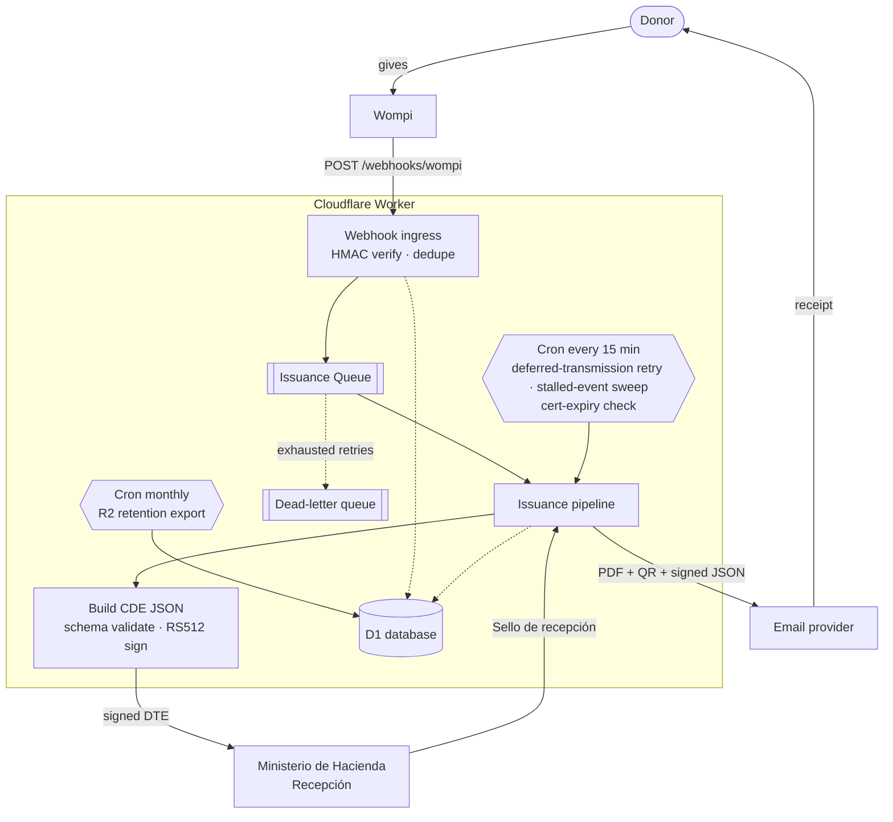
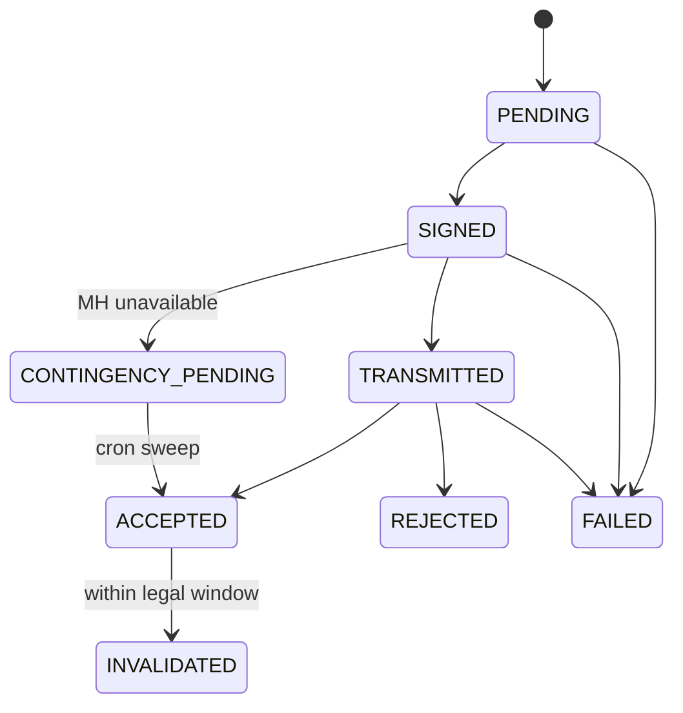

<div align="center">

# 🇸🇻 DiezmosSV

### Electronic donation receipts for Salvadoran churches — on the edge, for pennies.

Open-source Cloudflare Workers app that turns approved **Wompi** donations into legally valid
**Comprobantes de Donación Electrónicos** (CDE — DTE `tipoDte=15`), signs them natively, transmits
them to the **Ministerio de Hacienda**, and emails the donor a PDF receipt — all from a single Worker.

<br/>

[](./LICENSE)
[](https://workers.cloudflare.com/)
[](https://nodejs.org/)
[](https://react.dev/)
[](https://www.typescriptlang.org/)
[](#-project-status)

</div>

---

> [!WARNING]
> **This is not legal or tax advice.** Before any production use, validate your configuration, MH
> credentials, document mappings, and operating procedures with your accountant, your legal
> representative, and the Ministerio de Hacienda onboarding process.

> [!NOTE]
> **DiezmosSV is an independent open-source project.** It is not affiliated with, endorsed by,
> sponsored by, or officially supported by Wompi or Cloudflare. Those names appear only because the
> app integrates with their public services.

---

## 📑 Table of Contents

- [Why DiezmosSV](#-why-diezmossv)
- [How it works](#-how-it-works)
- [Cloudflare architecture](#-cloudflare-architecture)
- [Tech stack](#-tech-stack)
- [Project structure](#-project-structure)
- [Quick start (local)](#-quick-start-local)
- [Validation](#-validation)
- [Deploy to Cloudflare](#-deploy-to-cloudflare)
- [Configuration reference](#-configuration-reference)
- [Security](#-security)
- [Wompi webhook](#-wompi-webhook)
- [Online donations (/donar)](#-online-donations-donar)
- [Admin panel & roles](#-admin-panel--roles)
- [Document lifecycle](#-document-lifecycle)
- [Data model](#-data-model)
- [Compliance notes](#-compliance-notes)
- [Why no JVM signer?](#-why-no-jvm-signer)
- [Project status](#-project-status)
- [Contributing](#-contributing)
- [License](#-license)

---

## 💡 Why DiezmosSV

Issuing CDE DTEs usually means standing up a JVM signer, a database, a queue, and a server that
runs 24/7. For a church receiving a handful of donations a day, that's a lot of cost and operational
burden. DiezmosSV collapses the whole pipeline into **one Cloudflare Worker** — invocation-billed,
auditable, and cheap to run.

| | |
|---|---|
| 🔐 **Verified ingress** | Validates the raw-body `wompi_hash` HMAC and deduplicates Wompi retries by `IdTransaccion` before anything else happens. |
| 🧾 **Correct CDE mapping** | Maps approved donations into MH CDE JSON (`tipoDte=15`) and validates it against the bundled MH JSON schema. |
| ✍️ **Native signing** | Signs DTE JSON in the Worker with WebCrypto as a compact **RS512 JWS** — no external JVM signer required. |
| 🏛️ **MH transmission** | Authenticates with MH, caches the token in D1, transmits to *Recepción*, and records the **Sello de recepción**. |
| 📄 **Donor receipt** | Generates a PDF *representación gráfica* with a QR code and emails it (plus the signed JSON) through a configurable provider. |
| 🌩️ **Resilient by design** | On an MH outage the CDE is signed normally, the donor gets an immediate **transitorio** receipt, and a 15-minute cron retries transmission until MH seals it (deferred transmission — the contingency evento excludes tipo 15 per the Anexo, field 35). A dead-letter queue plus a stalled-event sweep self-heal issuance messages that exhaust their retries. |
| ⚖️ **Legal invalidation** | Supports signed invalidation events with the CDE legal-window check baked in, and emails the donor a branded notice when MH accepts the invalidation. |
| 🖥️ **Admin panel** | React SPA for documents, failures, contingency history (read-only), audit log, users, exports, resend, retry, and invalidation. |
| 🛡️ **Secure access** | PBKDF2 password hashing, bearer-token sessions, role-based access control, self-service password reset, and rate-limited auth endpoints. |
| 📬 **Branded email** | All donor email (receipt, invalidation notice, password reset) is sent as branded HTML with configurable templates. |
| 🚨 **Operational alerting** | Emails a configurable address on emission failures, MH unavailability (deferred-transmission backlog), stalled events, and MH signer-certificate expiry (30/14/3-day warnings). |
| 🗃️ **Legal retention** | A monthly cron exports an immutable, hash-verified snapshot of all legal records to R2 for multi-year tax retention independent of D1. |

> 💸 **Run it before you have credentials.** The default (local) `wrangler.toml` config sets
> `MOCK_EXTERNAL_SERVICES = "true"`, which stubs MH and the email provider — you can click through the
> full admin panel and issuance pipeline with placeholder secrets. Mock mode is **explicit opt-in**:
> it is only active when `MOCK_EXTERNAL_SERVICES` is exactly `"true"`, so staging and production
> (where it is `"false"`) always hit the real MH and email services.
>
> 📖 **Operating the panel day to day?** Non-technical operators should read the Spanish
> [operator runbook](./docs/runbook-operador.md).

---

## 🔄 How it works

A donation flows from Wompi to a signed, MH-sealed receipt in the donor's inbox without any server
sitting idle between events:



Only events with `ResultadoTransaccion = ExitosaAprobada` are issued. Everything that touches MH,
Wompi, or the donor is recorded in D1 and the audit log.

The public `/donar` page opens on a two-door landing: **El Salvador y el mundo** routes to the
SV fiscal form (Wompi + CDE), and **EE. UU.** routes straight to the Givebutter (FMCE) block for a
US-deductible receipt (`?ruta=sv` / `?ruta=eeuu` deep-links a door). The whole web UI (donor pages
and admin) uses **Gotham**, self-hosted as latin-subset woff2 under `src/client/fonts/` — the
licensed OTFs are never committed; only the generated woff2 subsets are.

---

## ☁️ Cloudflare architecture

| Resource | Binding | Role |
|---|---|---|
| **Worker** | `main = src/worker/index.ts` | API, webhook ingress, issuance pipeline, MH client, signer, PDF/email orchestration. |
| **D1** | `DB` | Wompi events, DTE documents, signed events, tokens, users, sessions, audit log, contingency periods, app settings. |
| **Queues** | `ISSUANCE_QUEUE` → `diezmossv-local-issuance-example` (+ `-dlq`) | Async issuance triggered by approved Wompi webhooks (batch ≤ 10, up to 3 retries). Messages that exhaust retries land in a dead-letter queue that audits and alerts on each one. |
| **R2** | `ARCHIVE` → `example-worker-archive-*` | Monthly legal-retention export bucket (NDJSON snapshots + SHA-256 manifest). |
| **Cron Triggers** | `*/15 * * * *` · `0 9 1 * *` | Every 15 min: deferred-transmission retry, stalled-event sweep, and signer-certificate expiry check. Monthly (09:00 UTC on the 1st): R2 retention export. |
| **Static assets** | `ASSETS` → `./dist/client` | React admin panel served from the Worker with SPA fallback. |

`compatibility_date = 2026-06-02` with `nodejs_compat` enabled for crypto operations. `APP_ORIGIN`
is set per environment for building absolute links (e.g. password-reset URLs).

---

## 🧰 Tech stack

**Frontend** · React 19 · Vite 8 · TypeScript 6 · `lucide-react` icons · plain CSS
**Worker** · Cloudflare Workers · D1 (SQLite) · Queues · Cron Triggers · WebCrypto
**Crypto & docs** · WebCrypto `RS512` JWS · `pdf-lib` · `qrcode`
**Validation** · `ajv` + `ajv-formats` against bundled MH JSON schemas
**Tooling** · Wrangler 4 · Vitest 4 · split `tsconfig` for client/worker

---

## 📁 Project structure

```text
DiezmosSV/
├── src/
│   ├── worker/                 # Cloudflare Worker (backend)
│   │   ├── index.ts            # Entry: fetch() · queue() · scheduled()
│   │   ├── config.ts           # Env parsing & validation
│   │   ├── domain/             # wompi · dteBuilder · signer · schema
│   │   ├── services/           # mhClient · pipeline · email · pdf · auth · alerts · retention · f960 · credentials
│   │   ├── storage/            # repository.ts — raw D1 access (no ORM)
│   │   └── utils/              # ids · dates · encoding · http
│   ├── client/                 # React + Vite admin panel
│   └── shared/                 # Catalogs, DUI, legal windows, password policy (client + worker)
├── migrations/                 # D1 schema (incremental 0001…0008)
├── DTE/svfe-json-schemas/      # MH-bundled JSON schemas for validation
├── docs/                       # Deployment/UAT runbooks · operator runbook · retention-restore
├── examples/                   # wompi-webhook.sample.json (safe test payload)
├── test/                       # Vitest unit tests (client + worker)
└── wrangler.toml               # Bindings, vars, queues, crons
```

---

## 🚀 Quick start (local)

**Requirements:** Node.js 22+, npm, a Cloudflare account, a Wompi account with webhook access, and
MH DTE API credentials for the environment you intend to use. Wrangler is installed with the project.

```bash
# 1 — Install dependencies
npm install

# 2 — Create a private out-of-tree env file and fill it in
PRIVATE_ROOT="$HOME/Library/Application Support/DiezmosSV/private"
install -d -m 700 "$PRIVATE_ROOT/env"
install -m 600 .dev.vars.example "$PRIVATE_ROOT/env/local-operator.env"

# 3 — Create the local D1 schema
npx wrangler d1 migrations apply diezmossv-local-db-example --local

# 4 — Run the Worker and the admin UI (two terminals)
npm run dev:worker   # Worker on http://127.0.0.1:8787
npm run dev          # Vite UI, proxies /api and /webhooks to the Worker
```

Open the Vite URL and use **`Crear owner`** on first run to bootstrap the initial admin account.
The setup form requires the `BOOTSTRAP_OWNER_TOKEN` value from your private local operator env file.

A starter operator env looks like this. Local execution is locked to MH TEST (`ambiente=00`), so do
not place production API credentials in the local file:

```bash
WOMPI_API_SECRET="..."
BOOTSTRAP_OWNER_TOKEN="..."
CLOUDFLARE_ACCOUNT_ID="..."
CLOUDFLARE_API_TOKEN="..."
MH_CERT_PASSWORD="..."
MH_CERT_XML="<CertificadoMH>...</CertificadoMH>"
# Remote Cloudflare deploys can use MH_CERT_XML_PART_1 and MH_CERT_XML_PART_2
# when the certificate XML is over the 5 KB Worker variable limit.

MH_USER_TEST="..."
MH_PASSWORD_TEST="..."
# Optional fallback when Cloudflare Email Service is limited to verified destination addresses.
# EMAIL_API_URL="https://email-provider.example/send"
# EMAIL_API_KEY="..."
EMAIL_FROM="dte@example.org"

EMISOR_CONFIG_JSON="{...}"
```

> 🔒 **Never place real credentials or donor artifacts in the checkout, even when gitignored.**
> `npm run dev:worker` reads `~/Library/Application Support/DiezmosSV/private/env/local-operator.env`.
> Override it with `DIEZMOSSV_ENV_FILE=/approved/path`. Run
> `npm run security:check-private-boundary` before sharing the checkout. See
> [the local-artifact runbook](docs/local-private-artifacts.md).

---

## ✅ Validation

```bash
npm test          # Vitest unit tests (npx vitest run)
npm run typecheck # Type-check client + worker
npm run build     # Vite build + worker type-check
DIEZMOSSV_ENV_FILE=.dev.vars.ci npx playwright test # Non-secret mock env
npm run security:check-private-boundary
```

The unit tests cover, among other areas:

- Wompi HMAC verification
- CDE schema generation
- Native RS512 signing and verification, plus certificate-expiry parsing
- CDE invalidation legal-window calculation
- Auth rate limiting, password reset, and branded email templates

CI (`.github/workflows/ci.yml`) runs two jobs on every push: a **test-and-build** job
(`typecheck` → `vitest run` → `build`) and a separate **e2e** job that runs the Playwright suite
against the committed non-secret mock env in `.dev.vars.ci`.

---

## 📦 Deploy to Cloudflare

<details>
<summary><strong>TEST/Staging deployment</strong></summary>

<br/>

The default Wrangler config is local/mock. Real Cloudflare testing uses the `staging` environment:

```bash
# 1 - Authenticate Wrangler
npx wrangler login
npm run cf:whoami

# 2 - Create remote resources, then copy the returned D1 id into
#     wrangler.toml under [[env.staging.d1_databases]]
npx wrangler d1 create diezmossv-staging-resource-example
npx wrangler queues create diezmossv-staging-issuance-example
npx wrangler queues create diezmossv-staging-issuance-example-dlq
npx wrangler r2 bucket create diezmossv-staging-archive-example

# 3 - Set TEST/staging secrets
npx wrangler secret put WOMPI_API_SECRET --env staging
npx wrangler secret put BOOTSTRAP_OWNER_TOKEN --env staging
npx wrangler secret put CLOUDFLARE_ACCOUNT_ID --env staging
npx wrangler secret put CLOUDFLARE_API_TOKEN --env staging
npx wrangler secret put MH_CERT_PASSWORD --env staging
npx wrangler secret put MH_CERT_XML_PART_1 --env staging
npx wrangler secret put MH_CERT_XML_PART_2 --env staging
npx wrangler secret put MH_USER_TEST --env staging
npx wrangler secret put MH_PASSWORD_TEST --env staging
npx wrangler secret put EMAIL_API_URL --env staging   # optional fallback
npx wrangler secret put EMAIL_API_KEY --env staging   # optional fallback
npx wrangler secret put EMAIL_FROM --env staging
npx wrangler secret put EMISOR_CONFIG_JSON --env staging

# 4 - Apply migrations and deploy the Worker + ASSETS
npm run cf:migrate:staging
npm run cf:deploy:staging

# 5 - Run the deployed edge smoke test
DIEZMOSSV_ENV_FILE="$HOME/Library/Application Support/DiezmosSV/private/env/staging-smoke.env" npm run smoke:staging
```

Store the smoke settings in that `0600` out-of-tree file. The runner uses this approved path by
default, so `npm run smoke:staging` is sufficient unless you intentionally select another file.
Do not place credentials, Wompi secrets, bootstrap tokens, or donor identity values inline in the
shell command.

Staging runs with `MOCK_EXTERNAL_SERVICES = "false"` and is structurally locked to MH ambiente `00`:
test MH API user/password, the matching signer certificate XML/password, and a test Wompi secret.
See `docs/cloudflare-staging-uat.md` for the edge smoke test and approval checklist.

</details>

<details>
<summary><strong>Production cutover</strong></summary>

<br/>

Production is intentionally a separate Wrangler environment and should be used only after staging
UAT approval.

```bash
# 1 - Create production resources, then copy the returned D1 id into
#     wrangler.toml under [[env.production.d1_databases]]
npx wrangler d1 create diezmossv-production-resource-example
npx wrangler queues create diezmossv-production-issuance-example
npx wrangler queues create diezmossv-production-issuance-example-dlq
npx wrangler r2 bucket create diezmossv-production-archive-example

# 2 - Set production secrets
npx wrangler secret put WOMPI_API_SECRET --env production
npx wrangler secret put BOOTSTRAP_OWNER_TOKEN --env production
npx wrangler secret put CLOUDFLARE_ACCOUNT_ID --env production
npx wrangler secret put CLOUDFLARE_API_TOKEN --env production
npx wrangler secret put MH_CERT_PASSWORD --env production
npx wrangler secret put MH_CERT_XML_PART_1 --env production
npx wrangler secret put MH_CERT_XML_PART_2 --env production
npx wrangler secret put MH_USER_PROD --env production
npx wrangler secret put MH_PASSWORD_PROD --env production
npx wrangler secret put EMAIL_API_URL --env production   # optional fallback
npx wrangler secret put EMAIL_API_KEY --env production   # optional fallback
npx wrangler secret put EMAIL_FROM --env production
npx wrangler secret put EMISOR_CONFIG_JSON --env production

# 3 - Apply migrations and deploy after staging approval
npm run cf:migrate:prod
npm run cf:deploy:prod
```

Do one controlled low-value production issuance with live monitoring before enabling normal volume.

</details>

---

## ⚙️ Configuration reference

**Secrets** - set with `wrangler secret put --env staging` / `--env production` remotely, or in the
out-of-tree file selected by `DIEZMOSSV_ENV_FILE` locally:

| Variable | Purpose |
|---|---|
| `WOMPI_API_SECRET` | HMAC secret used to verify the `wompi_hash` on incoming webhooks. |
| `BOOTSTRAP_OWNER_TOKEN` | One-time setup secret required by `/api/auth/bootstrap-owner` before the first owner exists. Rotate or remove it after the owner account exists. |
| `CLOUDFLARE_ACCOUNT_ID` | Cloudflare account target used by the OWNER-only credential UI when saving Worker secrets. |
| `CLOUDFLARE_API_TOKEN` | Scoped Cloudflare API token used by the OWNER-only credential UI to call the Worker secret bulk-update endpoint. |
| `MH_CERT_XML` | MH certificate XML (contains the RSA key material used for signing). Works locally and remotely only when it fits Cloudflare's 5 KB Worker variable limit. |
| `MH_CERT_XML_PART_1` / `MH_CERT_XML_PART_2` | Split form of the same certificate XML for Cloudflare Workers when `MH_CERT_XML` is over the per-variable limit. |
| `MH_CERT_PASSWORD` | Private-key password for the signer. |
| `MH_USER_TEST` / `MH_PASSWORD_TEST` | MH API login for **test** (`ambiente=00`). |
| `MH_USER_PROD` / `MH_PASSWORD_PROD` | MH API login for **production** (`ambiente=01`). |
| `EMAIL_API_URL` / `EMAIL_API_KEY` | Optional fallback transactional provider used when Cloudflare Email Service rejects arbitrary donor recipients. Receives a `POST` JSON body with an `Authorization: Bearer` header. |
| `EMAIL_FROM` | **Required for real sends.** Sender address used by Cloudflare Email Service and the HTTP fallback. The sender domain must be onboarded in Cloudflare Email Sending and match a `send_email` `allowed_sender_addresses` entry in `wrangler.toml`. |
| `EMISOR_CONFIG_JSON` | Issuer configuration for the real church/taxpayer. Treat as a secret for real deployments. |

> The signer certificate and the MH API login are **different concerns**. `MH_CERT_*` is for signing;
> `MH_USER_*` / `MH_PASSWORD_*` is for the API. Don't use production credentials for test donations —
> a test payment routed to `ambiente=00` with production-only credentials will fail authentication.

**Vars** - set in `wrangler.toml [vars]` and duplicated per Wrangler environment:

| Variable | Purpose |
|---|---|
| `APP_ENV` | Security boundary: `local`/`staging` permit only `00`; `production` permits only `01`; missing or unknown values permit no issuance. |
| `APP_ORIGIN` | Public base URL of the deployment, used to build absolute links such as password-reset URLs. |
| `MOCK_EXTERNAL_SERVICES` | Mock mode is **explicit opt-in**: MH + email are stubbed only when this is exactly `"true"`. Local `wrangler.toml` sets `"true"`; staging and production set `"false"`. |
| `CLOUDFLARE_SCRIPT_NAME` | Worker script name targeted by the OWNER-only credential UI. |
| `EMAIL` (binding) | Cloudflare `send_email` binding used to send receipt emails with PDF/JSON attachments. Declared in `wrangler.toml` under `[[send_email]]`. |
| `ARCHIVE` (binding) | R2 bucket binding for the monthly legal-retention export (`example-worker-archive-*`). |
| `EMAIL_ARBITRARY_RECIPIENTS` | Optional `"true"` marker after Cloudflare Email Sending is confirmed to send to external donor addresses. |
| `MH_AUTH_URL_*` · `MH_RECEPCION_URL_*` · `MH_ANULACION_URL_*` | MH endpoints available only for the deployment's credential lane. `MH_AUTH_URL_TEST_FALLBACK` is the narrow central-auth fallback for TEST accounts after MH code 106; it is not a PROD transmission capability. |
| `MH_USER_AGENT` | User-Agent header sent to MH. |
| `EMISOR_CONFIG_JSON` | Demo/local issuer config lives in the selected private env file; set the real remote value as a Cloudflare secret. |

Remote staging/production email delivery uses Cloudflare Email Service first. The binding is declared
as `send_email` in `wrangler.toml` and is restricted to the configured `EMAIL_FROM` sender. To send
receipts to arbitrary donor addresses, the Cloudflare account must have Email Sending enabled for the
sender domain; otherwise Cloudflare may only permit delivery to verified destination addresses. If
Cloudflare returns `destination address is not a verified address`, the Worker can fall back to
`EMAIL_API_URL` / `EMAIL_API_KEY` so donors do not need to be pre-verified in Cloudflare.

The admin UI includes an OWNER-only **Credenciales** screen for updating MH test/production API
credentials, the signer certificate/password, issuer config JSON, Wompi HMAC, and the Email Service
sender/fallback settings. Cloudflare Worker secrets are write-only: the screen only shows configured/pending status,
never the secret values. Blank fields preserve the existing secret, and successful updates are audited
by secret name only. If `CLOUDFLARE_ACCOUNT_ID`, `CLOUDFLARE_SCRIPT_NAME`, or
`CLOUDFLARE_API_TOKEN` is missing, the screen remains read-only and tells the owner that the
Cloudflare writer is not configured.

---

## 🪝 Wompi webhook

Configure Wompi to send approved payment events to:

```text
https://YOUR_WORKER_DOMAIN/webhooks/wompi
```

The Worker only processes events where:

```text
ResultadoTransaccion = ExitosaAprobada
```

**Environment routing** — pick MH credentials that match the target environment:

| Wompi field | MH `ambiente` |
|---|---|
| `EsProductiva=false` | `00` (test) |
| `EsProductiva=true` | `01` (production) |

The signed flag is stored as evidence, but it cannot widen a deployment: an incompatible event is
audited and quarantined without paid marking or queueing.

---

## 💳 Online donations (`/donar`)

Besides the legacy static Wompi payment link, the app serves a public **`/donar`** page. The donor
data is **split** between the form and Wompi's hosted sheet:

- **Formulario `/donar`** → the donor's fiscal **documento** and **dirección** (catalog-coded
  department/municipio/distrito + complemento), plus an optional phone and the amount.
- **Hoja de Wompi** → the donor's **nombre** and **correo**, which Wompi's hosted sheet requires and
  now asks for exclusively (they cannot be prefilled or disabled via the API).

**Document types accepted** (CAT-022): each type has its own validation, enforced on the form and
again on the server. Las empresas donan con NIT y razón social — but the /donar select labels the
`36` type **"Empresa"**, not "NIT": many natural persons still hold legacy personal NITs and a
literal "NIT" option would bait them into the razón-social requirement (post-reform, a natural
person's document is the DUI). Donor-facing labeling only — the stored code stays `36` and the
admin quick-CDE form keeps the raw CAT-022 labels. Select order: DUI, Empresa, Otro, Pasaporte,
Carnet de Residente.

| Tipo (label on /donar) | Code | Rule | Stored as |
|---|---|---|---|
| DUI | `13` | Check-digit validated | `XXXXXXXX-X` |
| Empresa (NIT) | `36` | **NIT de la empresa**: 14 digits, **format-only** (no check digit: MH validates NITs server-side, and a homebrew checksum would reject valid NITs). Requires the **razón social**, stored on the intent's `donor_name` so the comprobante names the empresa instead of the Wompi cardholder. | `XXXX-XXXXXX-XXX-X` |
| Otro | `37` | Free text, ≤50 chars | As entered |
| Pasaporte | `03` | Free text, 5–30 chars | Uppercased |
| Carnet de Residente | `02` | Free text, 5–30 chars | Uppercased |

**Foreign donors** — a "Resido en el extranjero" checkbox replaces the three geography selects with a
**País** select (CAT-020, `SV` excluded) plus the free-text dirección. The intent stores the
`00/00/00` "Otro (Para extranjeros)" codes (CAT-008/012/013) and the country in `donor_pais`; the
emitted CDE marks the receptor `codDomiciliado: 2` with `codPais` from the intent, and the PDF prints
the complemento + country name instead of the placeholder catalog labels.

**US donors → Givebutter (no CDE — deliberate).** When "Resido en el extranjero" is checked **and the
país is Estados Unidos (`US`)**, the SV fiscal fields collapse entirely and the page embeds the
**Givebutter** giving form for the campaign **`example-campaign`** ("Mis Diezmos y Ofrendas") of the US
501(c)(3) **Friends of Misión ExampleOrganization (FMCE)**, account `000000`. A US taxpayer needs a
US-deductible receipt, not a Salvadoran CDE, and the gift belongs on the US entity's books — so these
donations flow entirely through Givebutter and **never touch Wompi, the intent table, the webhook, or
the CDE pipeline**. There is **no backend involvement**: no intent is created, no migration exists, and
Givebutter emails its own tax receipt. The page embeds Givebutter's frameable
`https://givebutter.com/embed/c/example-campaign` iframe directly — **not** the
`widgets.givebutter.com` script — so third-party JavaScript does not execute on the app origin. The
chosen amount plus an optional **"Donación mensual"** toggle (`frequency=monthly`) are prefilled in the
iframe URL. If the embedded form does not load within ~4 s, a prominent **"Donar en GiveButter"** link
to `https://givebutter.com/example-campaign?amount=…` (opens in a new tab) is shown; a small **"Done en
GiveButter"** version of that link is always present beneath the form (GiveButter is the anchor text —
no raw URL is shown). There is **no escape hatch** back to the SV form: the donor deliberately chose the
EE. UU. door, and **"← Cambiar opción"** is the way back. All Givebutter constants (account, campaign,
embed URL) live in `src/client/donation.ts`.

Both doors fund the **same** mother church in El Salvador — Friends of Misión ExampleOrganization (the US
501(c)(3)) is only the US giving vehicle, never a different beneficiary; the copy is residence-based, not
destination-based. On the SV path the donor first states whether the gift is a **diezmo** or an
**ofrenda** (a required chip selector); that choice names the Wompi payment sheet and rides on the CDE
apéndice as an informational `TipoAportacion` line, while the legal `descripcion` stays **`DONACIÓN`**.

The Worker validates the form data, persists a **donation intent** (identity + address only; name and
email are stored null, except the empresa razón social), and mints a **single-use, cards-only Wompi
payment link** via the Wompi API (tarjeta de crédito/débito únicamente — puntoAgricola, cuotas,
Bitcoin, QuickPay, and Nequi are disabled; Wompi is also told **not** to email the donor, since the
app sends the CDE itself). When the payment webhook arrives, the CDE `receptor` **merges** the two
sources: `tipoDocumento` / `numDocumento` / `direccion` come from the intent (canonical catalog codes
and a clean document), while `correo` comes from the webhook (what the donor typed on Wompi's sheet);
`nombre` prefers the intent's razón social (empresa donors), falling back to the webhook name; the
telephone prefers the intent's phone, falling back to the webhook's `Celular`.

**Two new secrets** are required to call the Wompi API for the single-use link (the legacy static-link
flow does not need them). Obtain `client_id` / `client_secret` from the Wompi merchant panel under
**Datos del negocio**, then set them per environment:

```bash
npx wrangler secret put WOMPI_CLIENT_ID --env staging      # or --env production
npx wrangler secret put WOMPI_CLIENT_SECRET --env staging   # or --env production
```

**Intent lifecycle** (`donation_intents.status`):

| Status | Meaning |
|---|---|
| `PENDING` | Validated and persisted; the Wompi link is being minted. |
| `LINK_CREATED` | Single-use payment link minted; awaiting the donor's payment. |
| `COMPLETED` | Payment webhook correlated and the CDE was accepted by MH. Links to the emitted `document_id`. |
| `EXPIRED` | The donor never paid; the cron sweep expired the unpaid intent. |

**Correlation model** — the intent id is sent as `identificadorEnlaceComercio` and must return as
`EnlacePago.IdentificadorEnlaceComercio`; `EnlacePago.Id` must also exactly match the numeric link id
stored for that intent. `IdExterno` is never accepted as the selector. Legacy static-link payments
skip the intent lookup entirely. Money truth
always comes from Wompi: if the webhook amount differs from the intent amount, the pipeline records a
`DONATION_INTENT_AMOUNT_MISMATCH` audit entry and still correlates, using the webhook's amount on the
CDE. A `COMPLETED` intent never correlates twice.

**Admin visibility** — the **Exportar** view lists the last 50 online donations (status, amount, donor,
date, and the emitted `numero de control` for completed ones). The **donor** column is joined from the
emitted CDE's `donor_name` (which came from the webhook), so it is shown only for **COMPLETED**
intents — every other status renders "—", since the intent itself carries no name. A CDE produced from
a completed intent shows a **"Datos del donante verificados en el formulario de donación"** badge in
its detail panel.

Draft `/datos` completion uses a separate one-time 256-bit capability returned only to the in-memory
wizard. D1 stores its SHA-256 hash and clears it atomically on the first valid write; the public intent
id is never write authority.

---

## 🔐 Security

Read [SECURITY.md](SECURITY.md) for supported surfaces, private disclosure, role/audit boundaries,
the donation capability contract, the staging/production invariant, and forbidden local artifacts.

> The legacy static Wompi payment link keeps working: those payments have no intent, so the CDE is
> built from the raw webhook's fallback donor data exactly as before.

---

## 👥 Admin panel & roles

The React admin panel handles documents, failures, the read-only contingency history, the audit log, user
management, F960 exports, per-document actions (resend, retry, invalidation), and — for owners — a
**Configuración** workspace covering MH/Wompi/email credentials, the active emission environment,
email templates, and the operational alert address. No CLI-only operations. The Spanish navigation
reads: Documentos, Fallos, Contingencia, Auditoría, Usuarios, Exportar, Configuración.

| Role | Capabilities |
|---|---|
| `VIEWER` (Consulta) | Read documents, the contingency history, and the audit log. |
| `OPERATOR` (Operador) | Also: quick CDE, resend email, retry failures, initiate invalidation. |
| `ADMIN` (Administrador) | Also: manage users and roles, and run F960 exports. |
| `OWNER` (Propietario) | Also: the **Configuración** workspace — credentials, emission environment, email templates, alert address, and retention export. |

> 📖 For a task-oriented walkthrough in Spanish, see the [operator runbook](./docs/runbook-operador.md).

---

## 🔁 Document lifecycle

Each CDE moves through an explicit status machine, recorded in D1:



---

## 🗄️ Data model

<details>
<summary><strong>D1 tables (migrations/0001_init.sql, extended through 0008)</strong></summary>

<br/>

| Table | Purpose |
|---|---|
| `wompi_events` | Incoming Wompi webhooks; dedup by `transaction_id`. |
| `dte_documents` | Issued CDEs: status, plain JSON, signed JWS, MH seal, donor info. |
| `dte_events` | Invalidation events, plus historical contingency events (one-to-many with documents). |
| `contingency_periods` | Historical MH-outage windows (read-only; new emissions defer instead). |
| `audit_logs` | Immutable action log: actor, action, entity, metadata. |
| `mh_tokens` | Cached MH auth tokens, per environment. |
| `document_sequences` | Control-number counters per environment/prefix. |
| `email_deliveries` | Email send records, provider responses, and PDF/JSON evidence hashes. |
| `contingency_batches` · `contingency_batch_lines` | Historical MH contingency batch submissions and per-CDE results (read-only). |
| `app_settings` | Runtime settings (emission environment, email templates, alert email). |
| `users` · `sessions` · `password_reset_tokens` | Authentication, RBAC, and self-service password reset. |

Foreign keys are enabled (`PRAGMA foreign_keys = ON`). Access is raw SQL via
`src/worker/storage/repository.ts` — no ORM.

</details>

---

## ⚖️ Compliance notes

- CDE is transmitted normally **before** delivery to the donor, except while MH is unavailable.
- The contingency evento's validation table (Anexo, field 35) excludes tipo 15, so a CDE is **never**
  issued in contingency. During an MH outage the CDE is signed in its normal shape, marked
  `TRANSMISSION_PENDING` ("En trámite"), the donor immediately receives a clearly-labeled
  **transitorio** receipt, and the 15-minute cron retries transmission; on acceptance the donor
  receives the definitive receipt with the Sello de Recepción.
- Invalidation is a **signed event**, not a database flag, and the donor is emailed a branded notice
  once MH accepts it.
- CDE invalidation is only allowed through the **tenth business day of the month following the
  sello** — the legal window per *Normativa de Cumplimiento de los DTE* Cuadro 6. The panel shows the
  remaining time and blocks the action once the window closes.
- Keep signed JSON, MH responses, and audit records **immutable** for retention. The monthly R2
  retention export preserves them independently of D1; restoring from it is documented in
  [`docs/retention-restore.md`](./docs/retention-restore.md).

---

## 🧩 Why no JVM signer?

The app intentionally avoids a JVM signer. The MH certificate XML contains ordinary RSA key material,
and Workers WebCrypto can produce the required `RS512` compact JWS directly — so the entire pipeline
stays inside one Worker.

The official MH signer is still useful as a **conformance oracle** during onboarding. For production,
compare signatures and accepted documents in the MH test environment before switching on real
donations.

---

## 🚧 Project status

This is an early implementation — useful, auditable, and inexpensive — with the core pieces needed for
a production integration. Every church must still provide its own:

- MH test and production API credentials
- MH certificate XML and private-key password
- Wompi webhook secret
- Cloudflare Email Service sender domain and `EMAIL_FROM`
- Emisor configuration
- Responsible-person data for invalidation events
- A legal/finance decision for donors with incomplete identification

---

## 🤝 Contributing

Issues and pull requests are welcome. Before opening a PR, please run the full validation suite
(`npm test && npm run typecheck && npm run build`) and **never** include real credentials, MH
certificates, or production Wompi payloads in commits, fixtures, or screenshots.

---

## 📜 License

Licensed under the **Apache License 2.0** — see [LICENSE](./LICENSE) and [NOTICE](./NOTICE).
Copyright © 2026 Example Person.

### Third-party assets

The EE. UU. donation-door flag icon is inlined from [HatScripts/circle-flags](https://github.com/HatScripts/circle-flags)
(`us.svg`), licensed under the **MIT License**. The El Salvador door uses the church's own flag asset
(`src/client/assets/sv-flag.png`).

<div align="center">
<sub>Built for the church accountant who'd rather not run a server. ✦</sub>
</div>
