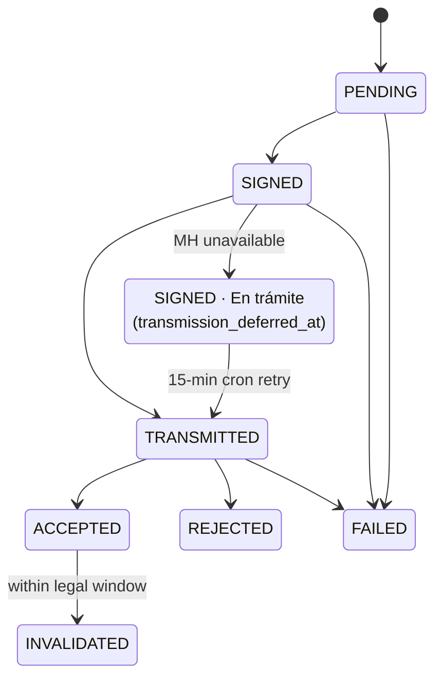
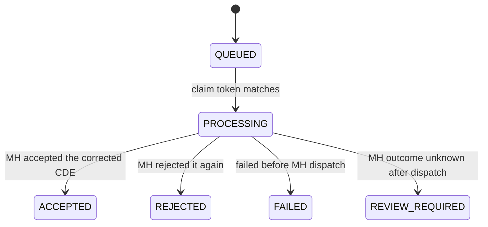

<div align="center">

# 🇸🇻 DiezmosSV

### Electronic donation receipts for Salvadoran churches — on the edge, for pennies.

Open-source Cloudflare Workers app that turns approved **Wompi** donations into legally valid
**Comprobantes de Donación Electrónicos** (CDE — DTE `tipoDte=15`), signs them natively, transmits
them to the **Ministerio de Hacienda**, and emails the donor a PDF receipt — all from a single Worker.

<br/>

[](./LICENSE)
[](https://workers.cloudflare.com/)
[](https://nodejs.org/)
[](https://react.dev/)
[](https://www.typescriptlang.org/)
[](#-project-status)

<br/>

**English** · [Español](README.es.md)

</div>

---

> [!WARNING]
> **This is not legal or tax advice.** Before any production use, validate your configuration, MH
> credentials, document mappings, and operating procedures with your accountant, your legal
> representative, and the Ministerio de Hacienda onboarding process.

> [!NOTE]
> **DiezmosSV is an independent open-source project.** It is not affiliated with, endorsed by,
> sponsored by, or officially supported by Wompi or Cloudflare. Those names appear only because the
> app integrates with their public services.

---

## 📑 Table of Contents

- [Why DiezmosSV](#-why-diezmossv)
- [How it works](#-how-it-works)
- [Cloudflare architecture](#-cloudflare-architecture)
- [Tech stack](#-tech-stack)
- [Project structure](#-project-structure)
- [Quick start (local)](#-quick-start-local)
- [Validation](#-validation)
- [Deploy to Cloudflare](#-deploy-to-cloudflare)
- [Configuration reference](#-configuration-reference)
- [Security](#-security)
- [Wompi webhook](#-wompi-webhook)
- [Online donations (/donar)](#-online-donations-donar)
- [Admin panel & roles](#-admin-panel--roles)
- [Document lifecycle](#-document-lifecycle)
  - [Fiscal corrections](#fiscal-corrections)
- [Data model](#-data-model)
- [Compliance notes](#-compliance-notes)
- [Why no JVM signer?](#-why-no-jvm-signer)
- [Project status](#-project-status)
- [Contributing](#-contributing)
- [License](#-license)

---

## 💡 Why DiezmosSV

Issuing CDE DTEs usually means standing up a JVM signer, a database, a queue, and a server that
runs 24/7. For a church receiving a handful of donations a day, that's a lot of cost and operational
burden. DiezmosSV collapses the whole pipeline into **one Cloudflare Worker** — invocation-billed,
auditable, and cheap to run.

| | |
|---|---|
| 🔐 **Verified ingress** | Validates the raw-body `wompi_hash` HMAC and deduplicates on **two** keys before anything else happens: Wompi's `IdTransaccion`, and — for dynamic `/donar` links — the numeric payment-link id, which is the stable fiscal idempotency key because a single-use link admits exactly one successful payment. The same payment arriving twice under two different transaction identifiers therefore still produces exactly one CDE. |
| 🧾 **Correct CDE mapping** | Maps approved donations into MH CDE JSON (`tipoDte=15`) and validates it against the bundled MH JSON schema. |
| ✍️ **Native signing** | Signs DTE JSON in the Worker with WebCrypto as a compact **RS512 JWS** — no external JVM signer required. |
| 🏛️ **MH transmission** | Authenticates with MH, caches the token in D1, transmits to *Recepción*, and records the **Sello de recepción**. |
| 📄 **Donor receipt** | Generates a PDF *representación gráfica* with a QR code and emails it (plus the signed JSON) through a configurable provider. |
| 🌩️ **Resilient by design** | On an MH outage the CDE is signed normally, the donor gets an immediate **transitorio** receipt, and a 15-minute cron retries transmission until MH seals it (deferred transmission — the contingency evento excludes tipo 15 per the Anexo, field 35). A dead-letter queue plus a stalled-event sweep self-heal issuance messages that exhaust their retries. |
| 📡 **Missed-webhook reconciliation** | A webhook that Wompi never delivered is not a lost donation. Every 15 minutes the Worker re-reads up to 25 unresolved `/donar` intents from the last 7 days directly against the Wompi payment-link API and, when the link shows a completed payment, replays it through the *same* verified ingest path a real webhook takes — audited as `WOMPI_RECONCILED`. Correlation stays strict (a payload that does not bind to the stored intent and link id is refused and audited as `WOMPI_RECONCILIATION_REJECTED`), and a Wompi outage leaves the intent eligible for the next tick instead of consuming it. |
| 🧷 **One legal submission, ever** | Every MH-facing transmission or invalidation first acquires a durable **fiscal operation claim**. An ambiguous outcome (timeout, interrupted isolate) freezes the document for operator reconciliation instead of risking a duplicate legal submission — every retry path fails closed while the claim is held. |
| ⚖️ **Legal invalidation** | Supports signed invalidation events with the CDE legal-window check baked in, and emails the donor a branded notice when MH accepts the invalidation. |
| 🩹 **Fiscal corrections** | A CDE that MH rejected on `receptor` fields — or a Wompi payment whose donor data never produced a CDE at all — is repaired from the panel instead of by hand. The operator edits only the 14 receptor fields (everything else is refused as `protected_field`), and the Worker rebuilds, re-signs, and re-transmits under a **fresh `codigoGeneracion` and `numeroControl`** reserved by a database trigger. Idempotent by request UUID and payload digest, single-owner by claim token, and never blindly retried once the MH dispatch has started. |
| 🖥️ **Admin panel** | React SPA for documents, donors, failures (CDE **and** pre-CDE), contingency history (read-only), audit log, analytics, users, exports, backups, resend, retry, fiscal correction, reissue, and invalidation — no CLI-only operations. |
| 📊 **Donation analytics** | The **Analítica** view charts Wompi-lane giving trends — amounts, counts, diezmo/ofrenda mix — bucketed in El Salvador time, with capacity-bounded queries. |
| 🎁 **Donor care built in** | One-click **constancia anual** (annual donation-summary certificate) per donor or in bulk, plus a CRM-ready donor contact export. |
| 🔎 **Donor explorer** | The **Donantes** view resolves accepted CDEs into a donor register — identity, contact, location, gift count, lifetime total, and last gift — keyed by fiscal document, falling back to email, then to the document itself. Filter by document type/number, name, email, amount range, diezmo/ofrenda, and online/manual origin; export the filtered set as CSV. ADMIN and above; document numbers are masked in the table and revealed only in the detail panel. |
| 🏷️ **White-label** | Rebrand the panel, donor pages, donor email, **the receipt PDF, and the annual certificate** with your church's display name, accent color, support address, and logos (stored in R2) from the **Marca** settings — no fork needed. An uploaded logo is fitted into the same reserved ink band as the built-in default, so the surrounding layout stays valid. |
| 🛡️ **Secure access** | PBKDF2 password hashing, bearer-token sessions, role-based access control, self-service password reset, and D1-backed rate limiting on login, password reset, and public donation endpoints — with per-claim audit provenance. |
| 📬 **Branded email** | All donor email is sent as branded HTML. Owners can edit separate subject/body templates for Salvadoran CDE receipts and invalidations, and for U.S. Stripe immediate acknowledgments, refund corrections/revocations, and annual statements. The U.S. PDF attachments remain fixed legal documents. |
| 🚨 **Operational alerting** | Alerts a configurable email address on emission failures, receipt-delivery failures, MH unavailability, stalled events, retention failures, and MH signer-certificate expiry. Each incident also emits a privacy-safe `operational_alert` Workers Logs event for independent Cloudflare Observability alerting and Notifications delivery. |
| 🗃️ **Legal retention** | A monthly cron exports an immutable, hash-verified snapshot of all legal records to R2 for multi-year tax retention independent of D1. The **Respaldos mensuales** panel browses, verifies, and downloads each month as a ZIP. |

> 💸 **Run it before you have credentials.** The default (local) `wrangler.toml` config sets
> `MOCK_EXTERNAL_SERVICES = "true"`, which stubs MH and the email provider — you can click through the
> full admin panel and issuance pipeline with placeholder secrets. Mock mode is **explicit opt-in**:
> it is only active when `MOCK_EXTERNAL_SERVICES` is exactly `"true"`, so staging and production
> (where it is `"false"`) always hit the real MH and email services.
>
> 📖 **Operating the panel day to day?** Non-technical operators should read the Spanish
> [operator runbook](./docs/runbook-operador.md).

---

## 🔄 How it works

A donation flows from Wompi to a signed, MH-sealed receipt in the donor's inbox without any server
sitting idle between events:


Only events with `ResultadoTransaccion = ExitosaAprobada` are issued. Everything that touches MH,
Wompi, or the donor is recorded in D1 and the audit log.

The public `/donar` page opens on a two-door landing: **El Salvador y el mundo** routes to the
SV fiscal form (Wompi + CDE), and **EE. UU.** defaults to Stripe's Spanish Embedded Checkout form on the US 501(c)(3)
account for one-time or monthly gifts. When the target build has an explicit Diezmo/Ofrenda fund mapping, the
donor may unmount Stripe and use the existing English Givebutter form instead (`?ruta=sv` / `?ruta=eeuu`
deep-links a door). The whole web UI (donor pages
and admin) uses **Gotham**, self-hosted as latin-subset woff2 under `src/client/fonts/` — the
licensed OTFs are never committed; only the generated woff2 subsets are.

---

## ☁ Cloudflare architecture

| Resource | Binding | Role |
|---|---|---|
| **Worker** | `main = src/worker/index.ts` | API, webhook ingress, issuance pipeline, MH client, signer, PDF/email orchestration. |
| **D1** | `DB` | Wompi events, DTE documents, signed events, tokens, users, sessions, audit log, contingency periods, app settings. |
| **Queues** | `ISSUANCE_QUEUE` → `diezmossv-local-issuance-example` (+ `-dlq`) | Async issuance (batch ≤ 10, up to 3 retries) for three message kinds: an approved Wompi webhook, a hand-issued advanced CDE, and a fiscal correction — each identified by its own ownership token, and a message carrying none is rejected outright. Messages that exhaust retries land in a dead-letter queue that audits and alerts on each one. |
| **R2** | `ARCHIVE` → `diezmossv-<env>-archive-example` | Monthly legal-retention export bucket (NDJSON snapshots + SHA-256 manifest), plus the branding logo objects (`branding/logo`, `branding/donor-logo`). |
| **Cron Triggers** | `*/15 * * * *` · `0 9 1 * *` | Every 15 min, ten independently-guarded sweeps: expired login/rate-limit claim cleanup, deferred-transmission retry, post-accept finalization retry, accepted-Wompi finalization retry, stalled pre-CDE event sweep, stalled fiscal-correction recovery, missed-webhook reconciliation against the Wompi payment-link API, donation-intent expiry + Wompi link deactivation, and the signer-certificate expiry check. One failing sweep never aborts the tick. Monthly (09:00 UTC on the 1st): R2 retention export. |
| **Static assets** | `ASSETS` → `./dist/client` | React admin panel served from the Worker with SPA fallback. |

`compatibility_date = 2026-06-02` with `nodejs_compat` enabled for crypto operations. `APP_ORIGIN`
is set per environment for building absolute links (e.g. password-reset URLs).

Every 15-minute sweep is wrapped independently: a sweep that throws is logged as a
Workers Logs error event and the tick continues with the next one, so one degraded
dependency (MH, Wompi, R2) never starves the others. Bounded work per tick — the
intent expiry sweep snapshots at most 100 rows and the webhook reconciliation at most
25 — so public traffic cannot make one cron invocation unbounded.

Observability is enabled in every environment at `head_sampling_rate = 1`, with
invocation logs and traces off — the Worker emits its own structured events (notably
the privacy-safe `operational_alert`) rather than relying on per-request logging, which
keeps donor traffic out of the log stream while still making incidents alertable.

---

## 🧰 Tech stack

**Frontend** · React 19 · Vite 8 · TypeScript 7 · `lucide-react` icons · plain CSS
**Worker** · Cloudflare Workers · D1 (SQLite) · Queues · Cron Triggers · WebCrypto
**Crypto & docs** · WebCrypto `RS512` JWS · `pdf-lib` · `qrcode`
**Validation** · `ajv` + `ajv-formats` against bundled MH JSON schemas
**Tooling** · Wrangler 4 · Vitest 4 · Playwright 1.62 (real-Worker e2e) · split `tsconfig` for client/worker

---

## 📁 Project structure

```text
DiezmosSV/
├── src/
│   ├── worker/                 # Cloudflare Worker (backend)
│   │   ├── index.ts            # Entry: fetch() · queue() · scheduled()
│   │   ├── config.ts           # Env parsing & emisor validation
│   │   ├── domain/             # wompi · dteBuilder · signer · schema
│   │   ├── routes/             # router.ts — declarative route table + RBAC dispatch
│   │   ├── services/           # pipeline · mhClient · email(+Html/Sender/Templates) · pdf
│   │   │                       # auth · credentials · alerts · observability · retention
│   │   │                       # analytics · certificate · contacts · backups · f960
│   │   │                       # branding · orgLogo · donations · donorExport · wompiApi
│   │   │                       # wompiNotifications · fiscalCorrection · environmentPolicy
│   │   ├── storage/            # repository.ts + repository/ (13 modules) — raw D1, no ORM
│   │   └── utils/              # ids · dates · encoding · http · guards · zip
│   ├── client/                 # React + Vite admin panel, /donar, fonts, assets
│   └── shared/                 # Catalogs · DUI · NIT · legal windows · password policy
│                               # fiscal corrections · checkout · money · email
├── migrations/                 # D1 schema (incremental, append-only 0001…0043)
├── DTE/svfe-json-schemas/      # MH-bundled JSON schemas for validation
├── docs/                       # Deploy/UAT · operator runbook · retention-restore
│                               # fiscal-claim cutover/reconciliation · pre-CDE recovery
│                               # local-artifact boundary · plans/ · superpowers/
├── scripts/                    # Private-config wrangler wrapper, deploy guards, D1 preflight
├── examples/                   # wompi-webhook.sample.json (safe test payload)
├── test/                       # Vitest: client · worker · migrations · scripts
├── e2e/                        # Playwright specs (donar, admin, security, smoke)
└── wrangler.toml               # Bindings, vars, queues, crons, observability
```

---

## 🚀 Quick start (local)

**Requirements:** Node.js 22.16+, npm, a Cloudflare account, a Wompi account with webhook access, and
MH DTE API credentials for the environment you intend to use. Wrangler is installed with the project.

```bash
# 1 — Install dependencies
npm install

# 2 — Create a private out-of-tree env file and fill it in
PRIVATE_ROOT="$HOME/Library/Application Support/DiezmosSV/private"
install -d -m 700 "$PRIVATE_ROOT/env"
install -m 600 .dev.vars.example "$PRIVATE_ROOT/env/local-operator.env"

# 3 — Create the local D1 schema
npx wrangler d1 migrations apply diezmossv-local-db-example --local

# 4 — Run the Worker and the admin UI (two terminals)
npm run dev:worker   # Worker on http://127.0.0.1:8787
npm run dev          # Vite UI, proxies /api and /webhooks to the Worker
```

Open the Vite URL and use **`Crear owner`** on first run to bootstrap the initial admin account.
The setup form requires the `BOOTSTRAP_OWNER_TOKEN` value from your private local operator env file.
Generate a fresh 32-byte base64url token; the Worker accepts only the `bt_` prefix followed by the
43-character encoded value:

```bash
printf 'bt_%s\n' "$(openssl rand -base64 32 | tr '+/' '-_' | tr -d '=\n')"
```

A starter operator env looks like this. Local execution is locked to MH TEST (`ambiente=00`), so do
not place production API credentials in the local file:

```bash
WOMPI_API_SECRET="..."
BOOTSTRAP_OWNER_TOKEN="bt_<43-character-base64url-value>"
CLOUDFLARE_ACCOUNT_ID="..."
CLOUDFLARE_API_TOKEN="..."
MH_CERT_PASSWORD="..."
MH_CERT_XML="<CertificadoMH>...</CertificadoMH>"
# Remote Cloudflare deploys can use MH_CERT_XML_PART_1 and MH_CERT_XML_PART_2
# when the certificate XML is over the 5 KB Worker variable limit.

MH_USER_TEST="..."
MH_PASSWORD_TEST="..."
# Optional deployment-owned alternative selected before dispatch when Cloudflare cannot address arbitrary recipients.
# Must be an absolute HTTPS URL without embedded credentials; never set it from the credentials panel.
# EMAIL_PROVIDER_URL="https://email-provider.example/send"
# EMAIL_API_KEY="..."
EMAIL_FROM="dte@example.org"

EMISOR_CONFIG_JSON="{...}"
```

> 🔒 **Never place real credentials or donor artifacts in the checkout, even when gitignored.**
> `npm run dev:worker` reads `~/Library/Application Support/DiezmosSV/private/env/local-operator.env`.
> Override it with `DIEZMOSSV_ENV_FILE=/approved/path`. Run
> `npm run security:check-private-boundary` before sharing the checkout. See
> [the local-artifact runbook](docs/local-private-artifacts.md).

---

## ✅ Validation

```bash
npm test                        # Vitest unit tests (client · worker · migrations · scripts)
npm run typecheck               # Type-check client + worker
npm run types:check             # Verify the generated Cloudflare binding types are current
npm run migrations:check-immutability   # Applied migrations must never be edited
npm run build                   # Vite build + worker type-check
npm run security:check-private-boundary

# Playwright drives a real local Worker on :8787, not Vite. PW_PERSIST_TO keeps the
# suite's D1 isolated from your dev checkout's local database.
DIEZMOSSV_ENV_FILE=.dev.vars.ci PW_PERSIST_TO=/tmp/diezmossv-e2e npx playwright test
```

The unit tests cover, among other areas:

- Wompi HMAC verification
- CDE schema generation
- Native RS512 signing and verification, plus certificate-expiry parsing
- CDE invalidation legal-window calculation
- Auth rate limiting, password reset, and branded email templates
- Fiscal-correction claim ownership, control-number reservation, and recovery
- Donor-explorer grouping, filters, and CSV export bounds
- Deploy-guard scripts (`assert-fiscal-cutover`, private release/branding configuration,
  private-wrangler-config, D1 migration preflight)

CI (`.github/workflows/ci.yml`) runs two jobs on pushes to `main` and `codex/**`, and
on pull requests to `main`.

**test-and-build** installs `poppler-utils` (the PDF tests inspect rendered output with
`pdftotext`/`pdftoppm`), then runs `security:check-private-boundary` →
`migrations:check-immutability` → `types:check` → `typecheck` → `vitest run` → `build`.
The boundary check reads an optional `PRIVATE_BOUNDARY_FORBIDDEN_HOSTS` repository
secret; without it the generic checks still run and the script warns that host checks
are inactive — it never names an organization in the public tree.

**e2e** runs the Playwright suite against the committed non-secret mock env in
`.dev.vars.ci`: it installs the Chromium browser, applies the local D1 migrations
against a fresh runner (exercising the bootstrap path naturally), and runs
`npx playwright test`. `playwright.config.ts` owns the web server — it builds the
client, re-applies migrations, and starts a real `wrangler dev` on port 8787, so the
suite drives the actual Worker rather than Vite. The HTML report is uploaded as an
artifact on failure.

---

## 📦 Deploy to Cloudflare

<details>
<summary><strong>TEST/Staging deployment</strong></summary>

<br/>

The committed `wrangler.toml` is an inert local/example config. Before any remote command, select a
private config that is an absolute path outside this repository, owned by the current user, and
owner-only mode `0600`:

```bash
export DIEZMOSSV_WRANGLER_CONFIG="/absolute/path/outside/this/repository/wrangler.toml"
install -d -m 700 "$(dirname "$DIEZMOSSV_WRANGLER_CONFIG")"
install -m 600 wrangler.toml "$DIEZMOSSV_WRANGLER_CONFIG"

# Edit only the selected private file, then authenticate through its validated copy.
node scripts/run-private-wrangler.mjs login
npm run cf:whoami
```

The wrapper rejects a relative, in-repository, symlinked, non-`0600`, or differently owned file.
Put real D1 IDs, routes, origins, Worker/resource names, queue names, and R2 bucket names only in the
selected private config; leave the public example and its zero IDs unchanged. Root, staging, and
production must each contain exactly one `send_email` binding named `EMAIL`, without
`allowed_sender_addresses`.

Release builds use a separate target-bound deploy file and donor raster. Keep both as regular,
owner-owned `0600` files outside this repository, without symlinks:

```dotenv
# /absolute/private/path/staging.env
DIEZMOSSV_DEPLOY_TARGET=staging
VITE_GIVEBUTTER_CAMPAIGN=example-campaign
# Optional: replace both values with distinct real numeric Fund IDs, or omit both.
# VITE_GIVEBUTTER_TITHE_FUND_ID=<real-tithe-fund-id>
# VITE_GIVEBUTTER_OFFERING_FUND_ID=<real-offering-fund-id>
DIEZMOSSV_APP_ORIGIN=https://staging.example.invalid
DIEZMOSSV_DONOR_LOGO_FILE=/absolute/private/path/logo.png
```

Select it with `export DIEZMOSSV_DEPLOY_CONFIG=/absolute/private/path/staging.env`. The selected target must
match `--env`; the PNG/JPEG must be decodable by the same `pdf-lib` path used for receipts. Before a
remote deploy, the branding preflight validates that raster locally, requires `/api/health` to report
`appEnv=staging`, and compares the exact advertised remote raster. `cf:deploy:staging` runs the preflight and
target-bound private build automatically; the same steps can be run independently without deploying:

The Givebutter Fund mapping is optional but atomic. Omit both Fund IDs to hide the Givebutter alternative
while keeping Stripe available, or set both to distinct real numeric IDs: Diezmo maps to
`VITE_GIVEBUTTER_TITHE_FUND_ID` and Ofrenda maps to `VITE_GIVEBUTTER_OFFERING_FUND_ID`. The private build
rejects an incomplete, blank, nonnumeric, placeholder-like, or duplicate pair. These are public routing
identifiers compiled into the browser only after validation; never guess them from the campaign name.

```bash
npm run cf:branding:check -- --env staging
npm run build:private -- --env staging
```

Create the remote resources in an owner-controlled Cloudflare workflow, record their returned names
and IDs only in the selected private config, then verify that config through the wrapper:

```bash
node scripts/run-private-wrangler.mjs d1 list
node scripts/run-private-wrangler.mjs queues list
node scripts/run-private-wrangler.mjs r2 bucket list

# Set TEST/staging secrets through the same selected config.
node scripts/run-private-wrangler.mjs secret put WOMPI_API_SECRET --env staging
node scripts/run-private-wrangler.mjs secret put BOOTSTRAP_OWNER_TOKEN --env staging
node scripts/run-private-wrangler.mjs secret put CLOUDFLARE_ACCOUNT_ID --env staging
node scripts/run-private-wrangler.mjs secret put CLOUDFLARE_API_TOKEN --env staging
node scripts/run-private-wrangler.mjs secret put MH_CERT_PASSWORD --env staging
node scripts/run-private-wrangler.mjs secret put MH_CERT_XML_PART_1 --env staging
node scripts/run-private-wrangler.mjs secret put MH_CERT_XML_PART_2 --env staging
node scripts/run-private-wrangler.mjs secret put MH_USER_TEST --env staging
node scripts/run-private-wrangler.mjs secret put MH_PASSWORD_TEST --env staging
node scripts/run-private-wrangler.mjs secret put EMAIL_PROVIDER_URL --env staging   # optional deployment-owned alternative
node scripts/run-private-wrangler.mjs secret put EMAIL_API_KEY --env staging   # optional alternative-provider token
node scripts/run-private-wrangler.mjs secret put EMAIL_FROM --env staging
node scripts/run-private-wrangler.mjs secret put EMISOR_CONFIG_JSON --env staging
node scripts/run-private-wrangler.mjs secret put STRIPE_RESTRICTED_KEY --env staging
node scripts/run-private-wrangler.mjs secret put STRIPE_PUBLISHABLE_KEY --env staging
node scripts/run-private-wrangler.mjs secret put STRIPE_WEBHOOK_SECRET --env staging
node scripts/run-private-wrangler.mjs secret put STRIPE_PAYMENT_METHOD_CONFIGURATION_ID --env staging
node scripts/run-private-wrangler.mjs secret put STRIPE_BILLING_PORTAL_CONFIGURATION_ID --env staging
node scripts/run-private-wrangler.mjs secret put STRIPE_US_LEGAL_NAME --env staging
node scripts/run-private-wrangler.mjs secret put STRIPE_US_EIN --env staging
node scripts/run-private-wrangler.mjs secret put STRIPE_US_PHONE --env staging
node scripts/run-private-wrangler.mjs secret put STRIPE_US_WEBSITE --env staging
node scripts/run-private-wrangler.mjs secret put STRIPE_US_MAILING_ADDRESS --env staging
node scripts/run-private-wrangler.mjs secret put STRIPE_US_SIGNER_NAME --env staging
node scripts/run-private-wrangler.mjs secret put STRIPE_US_SIGNER_TITLE --env staging

# Migrate and deploy through package scripts that use the same private wrapper.
npm run cf:migrate:staging
npm run cf:deploy:staging

# Or, for a quiesced fiscal-claim cutover window, one command that asserts the
# acknowledgement, migrates, and deploys:
FISCAL_CUTOVER_QUIESCED=1 npm run cf:cutover:staging

# Run the deployed edge smoke test.
DIEZMOSSV_ENV_FILE="$HOME/Library/Application Support/DiezmosSV/private/env/staging-smoke.env" npm run smoke:staging
```

Every `cf:migrate:*` command first runs a read-only D1 preflight for duplicate non-null
`dte_documents.wompi_event_id` links. Any duplicate blocks the migration for manual
legal-record review; the preflight never deletes, relinks, or chooses a document. The
migration itself runs through `scripts/d1-schema-compatibility.mjs`, which reconciles
the applied-migration ledger before handing off to Wrangler.

Two deploy guards fail the command closed rather than shipping a broken deployment:

| Guard | Runs on | Blocks unless |
|---|---|---|
| `scripts/assert-fiscal-cutover.mjs` | `cf:migrate:prod`, `cf:deploy:prod`, `cf:cutover:staging` | `FISCAL_CUTOVER_QUIESCED=1` is set. Migrations 0020/0021 and the claim-aware Worker must land in **one quiesced maintenance window**: drain old Worker requests, pause queues/cron and mutating traffic, then acknowledge. |
| `scripts/run-private-build.mjs` | `build:private`, and through it `cf:deploy:staging` and `cf:deploy:prod` | The selected target-bound owner-only deploy file, Givebutter campaign slug, origin, and donor raster pass validation. Only the public campaign slug is injected into Vite; Stripe values remain runtime-only. |

Store the smoke settings in that `0600` out-of-tree file. The runner uses this approved path by
default, so `npm run smoke:staging` is sufficient unless you intentionally select another file.
Do not place credentials, Wompi secrets, bootstrap tokens, or donor identity values inline in the
shell command.

Staging runs with `MOCK_EXTERNAL_SERVICES = "false"` and is structurally locked to MH ambiente `00`:
test MH API user/password, the matching signer certificate XML/password, and a test Wompi secret.
See `docs/cloudflare-staging-uat.md` for the edge smoke test and approval checklist.

</details>

<details>
<summary><strong>Production cutover</strong></summary>

<br/>

Production is intentionally a separate Wrangler environment and should be used only after staging
UAT approval. Its live values also stay only in the selected private Wrangler config described above.
Select a distinct owner-only deploy file containing `DIEZMOSSV_DEPLOY_TARGET=production`, the
production app origin, campaign, and an embeddable private PNG/JPEG. A staging-target file or an
origin whose `/api/health` does not report `appEnv=production` is rejected before branding authentication or
upload.

```bash
export DIEZMOSSV_DEPLOY_CONFIG="/absolute/private/path/production.env"

# Verify the private production targets without printing their values into this repository.
node scripts/run-private-wrangler.mjs d1 list
node scripts/run-private-wrangler.mjs queues list
node scripts/run-private-wrangler.mjs r2 bucket list

# Set production secrets through the selected private config.
node scripts/run-private-wrangler.mjs secret put WOMPI_API_SECRET --env production
node scripts/run-private-wrangler.mjs secret put BOOTSTRAP_OWNER_TOKEN --env production
node scripts/run-private-wrangler.mjs secret put CLOUDFLARE_ACCOUNT_ID --env production
node scripts/run-private-wrangler.mjs secret put CLOUDFLARE_API_TOKEN --env production
node scripts/run-private-wrangler.mjs secret put MH_CERT_PASSWORD --env production
node scripts/run-private-wrangler.mjs secret put MH_CERT_XML_PART_1 --env production
node scripts/run-private-wrangler.mjs secret put MH_CERT_XML_PART_2 --env production
node scripts/run-private-wrangler.mjs secret put MH_USER_PROD --env production
node scripts/run-private-wrangler.mjs secret put MH_PASSWORD_PROD --env production
node scripts/run-private-wrangler.mjs secret put EMAIL_PROVIDER_URL --env production   # optional deployment-owned alternative
node scripts/run-private-wrangler.mjs secret put EMAIL_API_KEY --env production   # optional alternative-provider token
node scripts/run-private-wrangler.mjs secret put EMAIL_FROM --env production
node scripts/run-private-wrangler.mjs secret put EMISOR_CONFIG_JSON --env production

# Assert branding first: it is read-only, so a regression fails the window before the
# migration has written anything. Both remote steps refuse to run outside an acknowledged
# quiesced window, and the deploy validates the campaign slug from the selected
# target-bound deploy file.
npm run cf:branding:check -- --env production
npm run build:private -- --env production
FISCAL_CUTOVER_QUIESCED=1 npm run cf:migrate:prod
FISCAL_CUTOVER_QUIESCED=1 npm run cf:deploy:prod

# Release the selection, or the next staging command fails its target check.
unset DIEZMOSSV_DEPLOY_CONFIG
```

The explicit branding check and private build above are useful operator preflights; the guarded
`cf:deploy:prod` command repeats both before its private Wrangler deploy.

**First production deploy only.** The branding gate compares the *running* deployment's donor
logo, so it cannot pass before a production deployment exists. Bootstrap once, in this order,
and use `cf:deploy:prod` for every release after that:

```bash
node scripts/run-private-wrangler.mjs deploy --env production --keep-vars
npm run cf:branding:migrate -- --env production --apply
```

This is a documented one-time path, not an escape hatch: nothing in the tooling skips the gate,
and it applies only when the production Worker has never been deployed.

The committed example ships `DONATION_INTAKE_DISABLED = "true"` in
`[env.production.vars]`. Leave it in place until the production lane has been
approved, then remove it (or set any other value) in the selected private config and
redeploy. It only closes public intake: the webhook, the queue, the cron sweeps, and
the admin panel continue to serve donations already in flight.

Do one controlled low-value production issuance with live monitoring before enabling normal volume.

</details>

---

## ⚙ Configuration reference

**Secrets** - set remotely with `scripts/run-private-wrangler.mjs secret put` and the config selected
by `DIEZMOSSV_WRANGLER_CONFIG`, or in the out-of-tree file selected by `DIEZMOSSV_ENV_FILE` locally:

| Variable | Purpose |
|---|---|
| `WOMPI_API_SECRET` | HMAC secret used to verify the `wompi_hash` on incoming webhooks. |
| `WOMPI_CLIENT_ID` / `WOMPI_CLIENT_SECRET` | OAuth client-credentials used to mint the single-use, cards-only Wompi payment links behind `/donar`, and to read a link back during missed-webhook reconciliation. Obtain them from the Wompi merchant panel under **Datos del negocio**. The legacy static-payment-link flow does not need them. |
| `BOOTSTRAP_OWNER_TOKEN` | One-time setup secret required by `/api/auth/bootstrap-owner` before the first owner exists. It must be generated from 32 random bytes and formatted as `bt_` plus 43 base64url characters. Rotate or remove it after the owner account exists. |
| `CLOUDFLARE_ACCOUNT_ID` | Cloudflare account target used by the OWNER-only credential UI when saving Worker secrets. |
| `CLOUDFLARE_API_TOKEN` | Scoped Cloudflare API token used by the OWNER-only credential UI to call the Worker secret bulk-update endpoint. |
| `CLOUDFLARE_API_BASE_URL` | Optional override for the Cloudflare API host the OWNER-only credential UI calls. Leave unset for the public API; set it only when a deployment must route through a different endpoint. |
| `MH_CERT_XML` | MH certificate XML (contains the RSA key material used for signing). Works locally and remotely only when it fits Cloudflare's 5 KB Worker variable limit. |
| `MH_CERT_XML_PART_1` / `MH_CERT_XML_PART_2` | Split form of the same certificate XML for Cloudflare Workers when `MH_CERT_XML` is over the per-variable limit. |
| `MH_CERT_PASSWORD` | Private-key password for the signer. |
| `MH_USER_TEST` / `MH_PASSWORD_TEST` | MH API login for **test** (`ambiente=00`). |
| `MH_USER_PROD` / `MH_PASSWORD_PROD` | MH API login for **production** (`ambiente=01`). |
| `EMAIL_PROVIDER_URL` / `EMAIL_API_KEY` | Optional alternative transactional provider selected before dispatch when Cloudflare arbitrary-recipient delivery is not enabled. The deployment-owned URL must be absolute HTTPS without embedded credentials; the provider receives a `POST` JSON body with an `Authorization: Bearer` header. |
| `EMAIL_FROM` | **Required for real sends.** Sender address used by Cloudflare Email Service or the selected HTTP provider. The sender domain must be onboarded in Cloudflare Email Sending. The selected private config must keep the `EMAIL` binding free of `allowed_sender_addresses` so an OWNER update does not conflict with deployment configuration. |
| `EMISOR_CONFIG_JSON` | Issuer configuration for the real church/taxpayer. Treat as a secret for real deployments. |

> The signer certificate and the MH API login are **different concerns**. `MH_CERT_*` is for signing;
> `MH_USER_*` / `MH_PASSWORD_*` is for the API. Don't use production credentials for test donations —
> a test payment routed to `ambiente=00` with production-only credentials will fail authentication.

**Vars** - the committed `wrangler.toml` contains inert examples; remote values belong in the
selected private config and are duplicated per Wrangler environment:

| Variable | Purpose |
|---|---|
| `APP_ENV` | Security boundary: `local`/`staging` permit only `00`; `production` permits only `01`; missing or unknown values permit no issuance. |
| `APP_ORIGIN` | Public base URL of the deployment, used to build absolute links such as password-reset URLs. |
| `MOCK_EXTERNAL_SERVICES` | Mock mode is **explicit opt-in**: MH + email are stubbed only when this is exactly `"true"`. Local `wrangler.toml` sets `"true"`; staging and production set `"false"`. |
| `CLOUDFLARE_SCRIPT_NAME` | Worker script name targeted by the OWNER-only credential UI. |
| `EMAIL` (binding) | Cloudflare `send_email` binding used to send receipt emails with PDF/JSON attachments. Remote root, staging, and production bindings are declared only in the selected private config. |
| `ARCHIVE` (binding) | R2 bucket binding for the monthly legal-retention export and the white-label logo objects. The committed example config names `diezmossv-local-archive-example`, `diezmossv-staging-archive-example`, and `diezmossv-production-archive-example`; real bucket names belong only in the selected private config. |
| `EMAIL_ARBITRARY_RECIPIENTS` | Optional `"true"` marker set after Cloudflare Email Sending is confirmed able to reach external donor addresses. The committed example already sets it for `staging`; local and production leave it unset. |
| `DONATION_INTAKE_DISABLED` | Emergency kill switch for new public intake. When exactly `"true"`, Wompi intent mutations and `POST /api/donations/stripe/checkout` return `503 donation_intake_disabled`; `/`, `/donar`, and `/donar/gracias` serve an empty locked-down document. Stripe's result page, status reads, webhook, acknowledgments, and Billing Portal remain available so an existing or monthly donor is not stranded. The Wompi webhook, issuance pipeline, and admin panel also keep working. The committed example sets it to `"true"` for `production`; unset or any other value leaves intake open. |
| `MH_AUTH_URL_*` · `MH_RECEPCION_URL_*` · `MH_ANULACION_URL_*` | MH endpoints available only for the deployment's credential lane. `MH_AUTH_URL_TEST_FALLBACK` is the narrow central-auth fallback for TEST accounts after MH code 106; it is not a PROD transmission capability. |
| `MH_USER_AGENT` | User-Agent header sent to MH. |
| `EMISOR_CONFIG_JSON` | Demo/local issuer config lives in the selected private env file; set the real remote value as a Cloudflare secret. |
| `STRIPE_RESTRICTED_KEY` | Server-only `rk_test_…` (staging) or `rk_live_…` (production) key with least privilege for Checkout Sessions and Billing Portal. Broad `sk_…` keys are rejected. |
| `STRIPE_PUBLISHABLE_KEY` | Browser-safe `pk_test_…` (staging) or `pk_live_…` (production) key returned by the Worker only with a created Embedded Checkout Session; it must match the restricted key's environment. |
| `STRIPE_WEBHOOK_SECRET` | Environment-specific `whsec_…` used to verify the exact raw body received at `/webhooks/stripe`. |
| `STRIPE_WEBHOOK_SECRET_NEXT` | Write-only staged `whsec_…` for a dual-secret webhook rotation. It is accepted alongside the active secret until an OWNER explicitly promotes or cancels it. |
| `STRIPE_PAYMENT_METHOD_CONFIGURATION_ID` | Active `pmc_…` for the US donor lane. It enables dynamic eligible methods and excludes every BNPL/financing method without a code release. |
| `STRIPE_BILLING_PORTAL_CONFIGURATION_ID` | `bpc_…` for the Spanish monthly-gift management path. |
| `STRIPE_US_LEGAL_NAME` · `STRIPE_US_EIN` | Exact US 501(c)(3) legal identity printed in the Spanish acknowledgment. |
| `STRIPE_US_TIME_ZONE` | IANA timezone used to define the U.S. annual-statement calendar year and contribution dates. It is visible/editable only in the OWNER settings panel. |
| `STRIPE_US_PHONE` · `STRIPE_US_WEBSITE` · `STRIPE_US_MAILING_ADDRESS` | U.S. organization contact block printed on the one-gift receipt and annual giving statement. Use newline-separated mailing-address lines. |
| `STRIPE_US_SIGNER_NAME` · `STRIPE_US_SIGNER_TITLE` | Authorized representative printed on each immediate U.S. charitable receipt. |
| `STRIPE_MOCK_MODE` | Deterministic local/staging-only transport when exactly `"1"`; production rejects it. Never place it in a production config. |
| `STRIPE_API_PROXY_URL` | Optional loopback-only HTTP bridge for local `workerd` environments without outbound HTTPS. Run `npm run dev:stripe-api-proxy`; staging, production, non-loopback hosts, credentials, and URL paths are rejected. |

**Build-time boundary.** The target-bound `npm run build:private -- --env staging|production`
wrapper validates the external release/branding file and injects only the public
`VITE_GIVEBUTTER_CAMPAIGN` slug used by the donor-selected alternative.
Stripe keys, configuration IDs, legal identity, and BNPL policy are Worker runtime configuration.
Only the publishable key is returned to the browser, together with a created Embedded Checkout Session; the
restricted key and webhook secret never leave the Worker. Putting any of them in a `VITE_*` value is
prohibited because it would hard-code the account environment into the public bundle. See the complete
sandbox/live owner handoff in [`docs/stripe-us-giving.md`](docs/stripe-us-giving.md).

Remote staging/production email delivery selects exactly one provider before dispatch. When both are
configured, set `EMAIL_ARBITRARY_RECIPIENTS=true` only after the Cloudflare `send_email` binding can
reach arbitrary donor addresses; that selects Cloudflare, while an unset marker selects the configured
HTTP provider. If Cloudflare is the only configured provider, it remains the sole dispatch path, but
the credential status does not call arbitrary-recipient delivery ready until the marker is set. The
Worker never retries the same receipt through a second provider after a dispatch attempt, because an
error may arrive after the first provider accepted it.

The alternative HTTP provider must return JSON with an explicit acceptance contract. A successful
send is recognized only for HTTP `200` or `202` with
`{"status":"accepted","id":"<provider-id>"}` (or `messageId` instead of `id`). A pre-acceptance
rejection is retry-safe only for an HTTP `4xx` JSON response shaped as
`{"status":"rejected","accepted":false,"code":"<STABLE_CODE>"}`. Empty, malformed, oversized,
non-JSON, generic `4xx`, unrecognized `2xx`, timeout, network, and `5xx` responses are outcome-unknown
and require manual review; the Worker does not auto-retry them. A successful provider response must
include a non-empty delivery ID, but the Worker never persists that raw value. It immediately stores
only a fixed-length `sha256:` digest, so future provider ID formats cannot be rejected after an
accepted send and a provider-returned URL, address, or credential cannot enter durable evidence.

Operational alert email recipients use durable dispatch claims keyed to the incident and normalized
recipient. Post-dispatch uncertainty is never reclaimed automatically, and the email alert is
complete only when every configured recipient is confirmed sent. Audit rows are secondary operator
history rather than the duplicate-send fence. The same incident is therefore suppressed after a
confirmed send while a later incident for the same CDE can alert again. Independently, every
non-empty incident emits a privacy-safe `operational_alert` event to Workers Logs; configure a
Cloudflare Workers Observability alert and a Cloudflare Notification policy to route that signal.

`EMAIL_PROVIDER_URL` is deployment-owned. Set it with Wrangler or the Cloudflare deployment
configuration, not from the application credentials panel. After the release is deployed and the
new binding is verified, delete the superseded email-endpoint secret left by earlier releases from
each deployment. This repository change does not modify staging or production configuration.

The admin UI includes an OWNER-only **Configuración** workspace for updating MH test/production API
credentials, the signer certificate/password, issuer config JSON, Wompi HMAC, and the Email Service
sender/alternative-provider token — plus emission environment, email templates, branding (Marca), and
the alert address. It shows the deployment-owned alternative destination as read-only status.
Cloudflare Worker secrets are write-only: the screen only shows configured/pending status,
never the secret values. Blank fields preserve the existing secret, and successful updates are audited
by secret name only. If `CLOUDFLARE_ACCOUNT_ID`, `CLOUDFLARE_SCRIPT_NAME`, or
`CLOUDFLARE_API_TOKEN` is missing, the screen remains read-only and tells the owner that the
Cloudflare writer is not configured.

---

## 🪝 Wompi webhook

Configure Wompi to send approved payment events to:

```text
https://YOUR_WORKER_DOMAIN/webhooks/wompi
```

The Worker only processes events where:

```text
ResultadoTransaccion = ExitosaAprobada
```

**Environment routing** — pick MH credentials that match the target environment:

| Wompi field | MH `ambiente` |
|---|---|
| `EsProductiva=false` | `00` (test) |
| `EsProductiva=true` | `01` (production) |

The signed flag is stored as evidence, but it cannot widen a deployment: an incompatible event is
audited and quarantined without paid marking or queueing.

Every accepted webhook row also carries a **pre-CDE issuance lifecycle**
(`PROCESSING → DOCUMENT_CREATED / FAILED / RETRY_QUEUED / DEAD_LETTERED / IGNORED`) with reserved
control numbers, attempt counts, and error evidence — so a donation that fails before a CDE exists
is visible and recoverable from the **Fallos** view instead of vanishing into queue history.

**When the webhook never arrives.** Delivery is not assumed. Every 15 minutes the
Worker reconciles unresolved `/donar` intents against the Wompi payment-link API
(up to 25 per tick, intents created within the last 7 days, re-checked at most every
10 minutes) and replays any completed payment through the same ingest, HMAC-equivalent
correlation, and dedup that a real webhook goes through — recorded as `WOMPI_RECONCILED`
with `source: payment_link_api`. Because the numeric payment-link id is a unique dedup
key, a webhook that arrives *after* reconciliation cannot produce a second CDE. The
sweep is disabled under `MOCK_EXTERNAL_SERVICES = "true"`.

---

## 💳 Online donations (`/donar`)

Besides the legacy static Wompi payment link, the app serves a public **`/donar`** page. The donor
data is **split** between the form and Wompi's hosted sheet:

- **Formulario `/donar`** → the donor's fiscal **documento** and **dirección** (catalog-coded
  department/municipio/distrito + complemento), plus an optional phone and the amount.
- **Hoja de Wompi** → the donor's **nombre** and **correo**, which Wompi's hosted sheet requires and
  now asks for exclusively (they cannot be prefilled or disabled via the API).

**Document types accepted** (CAT-022): each type has its own validation, enforced on the form and
again on the server. Las empresas donan con NIT y razón social — but the /donar select labels the
`36` type **"Empresa"**, not "NIT": many natural persons still hold legacy personal NITs and a
literal "NIT" option would bait them into the razón-social requirement (post-reform, a natural
person's document is the DUI). Donor-facing labeling only — the stored code stays `36` and the
admin quick-CDE form keeps the raw CAT-022 labels. Select order: DUI, Empresa, Otro, Pasaporte,
Carnet de Residente.

| Tipo (label on /donar) | Code | Rule | Stored as |
|---|---|---|---|
| DUI | `13` | Check-digit validated | `XXXXXXXX-X` |
| Empresa (NIT) | `36` | **NIT de la empresa**: 14 digits, **format-only** (no check digit: MH validates NITs server-side, and a homebrew checksum would reject valid NITs). Requires the **razón social** (1–200 chars), stored on the intent's `donor_name` so the comprobante names the empresa instead of the Wompi cardholder. | `XXXX-XXXXXX-XXX-X` |
| Otro | `37` | Free text, ≤50 chars | As entered |
| Pasaporte | `03` | Free text, 5–30 chars | Uppercased |
| Carnet de Residente | `02` | Free text, 5–30 chars | Uppercased |

**Foreign donors** — a "Resido en el extranjero" checkbox replaces the three geography selects with a
**País** select (CAT-020, `SV` excluded) plus the free-text dirección. The intent stores the
`00/00/00` "Otro (Para extranjeros)" codes (CAT-008/012/013) and the country in `donor_pais`; the
emitted CDE marks the receptor `codDomiciliado: 2` with `codPais` from the intent, and the PDF prints
the complemento + country name instead of the placeholder catalog labels.

**US donors → Stripe (no CDE — deliberate).** When the donor chooses the **EE. UU.** door, or checks
"Resido en el extranjero" and selects Estados Unidos (`US`), the Salvadoran fiscal fields collapse.
The donor explicitly chooses **Tipo de entrega** (**Diezmo** or **Ofrenda**) and **Frecuencia** (**Única** or
**Mensual**) before reviewing the amount and continuing to Stripe's Spanish Embedded Checkout form inside
the page on the connected US 501(c)(3) account. The Worker creates one idempotent Checkout Session for that
selection and verifies it again through signed Stripe webhooks; the result page reads durable D1 state instead
of trusting a browser return. A US taxpayer needs a US acknowledgment, not a Salvadoran CDE, so this lane
**never touches Wompi, `donation_intents`, or the CDE pipeline**.

Stripe remains the default U.S. form. When both reviewed Givebutter Fund IDs are configured, a clearly
labeled **Dar con Givebutter — Formulario en inglés** button unmounts Stripe Embedded Checkout and mounts
the target-bound campaign. The selected Diezmo/Ofrenda maps to its explicit Fund ID; amount and
one-time/monthly frequency are provider-supported prefills that the donor is asked to confirm on
Givebutter. With no Fund pair the alternative is hidden. **Volver a Stripe — Formulario en español**
reverses the choice and reuses the existing Stripe Session rather than creating another one.

The SV wizard does not mint a Wompi link on Step 1, while the donor's residence is still unknown. If an
SV-path donor later selects Estados Unidos, the safety route preserves the truthful amount and Diezmo/Ofrenda
choice, resets frequency to Única, and returns to an explicit U.S. Step 1. No Stripe Session exists until the
donor reviews and confirms that U.S. step, so the correction cannot leave both a usable Wompi rail and a Stripe
rail active for the same gift.

The Worker creates an idempotent Embedded Checkout Session using a dedicated
`payment_method_configuration`; browser code never sends `payment_method_types`. Stripe Checkout therefore
shows every enabled method that is eligible for the donor, device, USD amount, and one-time/monthly
flow, while the account configuration excludes BNPL and other financing methods. Stripe signs the
raw webhook body; the Worker validates environment, API version, amount, currency, lane metadata,
gift type, frequency, and identifiers before recording durable session/gift history in D1. The Spanish result page polls
that durable state rather than trusting the browser redirect. A monthly invoice becomes one gift only
after `invoice.paid` and a paid Stripe InvoicePayment prove a PaymentIntent-backed settlement; either
event order converges once. Billing Portal provides the recurring-management path. The app sends a distinct Spanish
501(c)(3) immediate acknowledgment with the configured legal name, EIN, authorized signer, contact block,
type, frequency, date, amount, and no-goods-or-services statement through its durable email fence. Stripe's
billing address and phone are retained as immutable donor evidence for the matching receipt and annual-statement
layout. Its **Constancia anual de donaciones —
EE. UU.** is a separate annual statement over settled Stripe gifts, net of refunds, in
`STRIPE_US_TIME_ZONE`; it is never a Salvadoran CDE or a Salvadoran annual dossier.

**Stripe receipt-email boundary.** The application omits `receipt_email` from every Checkout Session,
including nested PaymentIntent, subscription, invoice, and Customer data. Stripe may still collect
`customer_details.email`; the signed webhook uses it later for Elim's 501(c)(3) acknowledgment, which is
separate from requesting a Stripe automatic receipt. Omitting `receipt_email` alone does not suppress Stripe
automatic receipts: **Successful payments** is an account-level Customer emails setting, not a per-Checkout
Session option. Do not change it during the current production freeze. In an owner-approved production window,
go to **Dashboard → Settings → Business → Customer emails → Payments → disable `Successful payments`**.
Preserve required subscription service emails that are distinct from successful-payment receipts unless they are
separately approved for change. Afterwards, complete one controlled donation and verify exactly one
Elim-branded acknowledgment arrives, with no additional Stripe automatic receipt. Official guidance:
[payment receipts](https://docs.stripe.com/payments/advanced/receipts) and
[billing emails](https://docs.stripe.com/invoicing/send-email).

The pure Stripe.js loader is invoked only after a real, non-mock U.S. Session reaches the embedded form.
The chooser, SV/Wompi path, local mock, result page, and admin do not request `js.stripe.com`.

Both test and live setup are owner-only and runtime-only. No Stripe secret or configuration ID is
baked into the client; only the environment-matched publishable key is returned with a created Session.
Dynamic-method/BNPL configuration, least-privilege key permissions, exact
webhook events, sandbox gates, rollback, and the live handoff are documented in
[`docs/stripe-us-giving.md`](docs/stripe-us-giving.md).

**OWNER settings and live boundary.** **Configuración → Stripe EE. UU.** lists presence-only status for
`STRIPE_RESTRICTED_KEY`, `STRIPE_PUBLISHABLE_KEY`, `STRIPE_WEBHOOK_SECRET`,
`STRIPE_WEBHOOK_SECRET_NEXT`, `STRIPE_PAYMENT_METHOD_CONFIGURATION_ID`,
`STRIPE_BILLING_PORTAL_CONFIGURATION_ID`, `STRIPE_US_LEGAL_NAME`, `STRIPE_US_EIN`,
`STRIPE_US_PHONE`, `STRIPE_US_WEBSITE`, `STRIPE_US_MAILING_ADDRESS`, `STRIPE_US_SIGNER_NAME`, and
`STRIPE_US_SIGNER_TITLE`; it exposes only
the non-secret `STRIPE_US_TIME_ZONE`. “Configurado” does not mean provider-verified: payment-method,
Billing Portal, and account ownership remain unverified by the app. The derived `/webhooks/stripe` address
and sanitized latest-event health are read-only; only a successfully processed, mode-matching event earns
“Verificado por último evento procesado.” The staged secret is written, then explicitly promoted by an
atomic swap (staged becomes active and the previous active remains staged for rollback) or cancelled.
After a successful remote mutation whose status refresh fails, the panel locks further rotation until a
successful refresh reconciles the displayed state.
Local deterministic tests and this code do not modify a live Stripe account. Registering the live webhook,
Payment Method Configuration, Billing Portal, and BNPL exclusion remains an owner cutover after sandbox UAT.

Both doors fund the **same** mother church in El Salvador — the US 501(c)(3) is only the US giving
vehicle, never a different beneficiary; the copy is residence-based, not
destination-based. On the SV path the donor first states whether the gift is a **diezmo** or an
**ofrenda** (a required chip selector); that choice names the Wompi payment sheet and rides on the CDE
apéndice as an informational `TipoAportacion` line, while the legal `descripcion` stays **`DONACIÓN`**.

The Worker validates the form data, persists a **donation intent** (identity + address only; name and
email are stored null, except the empresa razón social), and mints a **single-use, cards-only Wompi
payment link** via the Wompi API (tarjeta de crédito/débito únicamente — puntoAgricola, cuotas,
Bitcoin, QuickPay, and Nequi are disabled; Wompi is also told **not** to email the donor, since the
app sends the CDE itself). When the payment webhook arrives, the CDE `receptor` **merges** the two
sources: `tipoDocumento` / `numDocumento` / `direccion` come from the intent (canonical catalog codes
and a clean document), while `correo` comes from the webhook (what the donor typed on Wompi's sheet);
`nombre` prefers the intent's razón social (empresa donors), falling back to the webhook name; the
telephone prefers the intent's phone, falling back to the webhook's `Celular`.

**Two new secrets** are required to call the Wompi API for the single-use link (the legacy static-link
flow does not need them). Obtain `client_id` / `client_secret` from the Wompi merchant panel under
**Datos del negocio**, then set them per environment through the private wrapper after selecting the
absolute owner-only config with `DIEZMOSSV_WRANGLER_CONFIG`:

```bash
node scripts/run-private-wrangler.mjs secret put WOMPI_CLIENT_ID --env staging      # or --env production
node scripts/run-private-wrangler.mjs secret put WOMPI_CLIENT_SECRET --env staging   # or --env production
```

**Intent lifecycle** (`donation_intents.status`):

| Status | Meaning |
|---|---|
| `PENDING` | Validated and persisted; the Wompi link is being minted. |
| `LINK_CREATED` | Single-use payment link minted; awaiting the donor's payment. |
| `COMPLETED` | Payment webhook correlated and the CDE was accepted by MH. Links to the emitted `document_id`. |
| `EXPIRED` | The donor never paid; the cron sweep expired the unpaid intent. |

**`paid_at` is not a status.** `COMPLETED` means *MH accepted the CDE*, which the async
pipeline can reach seconds or minutes after the donor pays — or not at all. So the
webhook stamps a separate `paid_at` marker **synchronously, before the queue enqueue
and regardless of it**, and the public status endpoint exposes `paid = (paid_at IS NOT
NULL)`. The donor sees *Gracias* the moment the payment is recorded while the
comprobante continues on its own schedule. The marker is idempotent and is stamped on
replays too; it is donor-UI convenience only — the pipeline still owns fiscal
completion.

**Checkout window.** The payment link is minted when the donor enters Paso 2 and stays
valid for one hour; the hosted checkout interface is configured for **30 minutes**
(`duracionInterfazIntentoMinutos`), and `/donar` polls for exactly that long. Both sides
read the same shared constant, because when they disagreed the page gave up first and
dropped a donor still completing a 3DS bank challenge onto the closing message.

**Correlation model** — the intent id is sent as `identificadorEnlaceComercio` and must return as
`EnlacePago.IdentificadorEnlaceComercio`; `EnlacePago.Id` must also exactly match the numeric link id
stored for that intent. `IdExterno` is never accepted as the selector. Legacy static-link payments
skip the intent lookup entirely. Money truth
always comes from Wompi: if the webhook amount differs from the intent amount, the pipeline records a
`DONATION_INTENT_AMOUNT_MISMATCH` audit entry and still correlates, using the webhook's amount on the
CDE. A `COMPLETED` intent never correlates twice.

**Admin visibility** — the **Exportar** view lists the last 50 online donations (status,
tipo, amount, donor, date, and the emitted `numero de control` for completed ones). The
query is a strict column allowlist: donor document, donor email, client IP, and the
Wompi payment-link URLs are never sent to the browser, because nothing renders them.
The **donor** column is joined from the
emitted CDE's `donor_name` (which came from the webhook), so it is shown only for **COMPLETED**
intents — every other status renders "—", since the intent itself carries no name. A CDE produced from
a completed intent shows a **"Datos del donante verificados en el formulario de donación"** badge in
its detail panel.

Draft `/datos` completion uses a separate one-time 256-bit capability returned only to the in-memory
wizard. D1 stores its SHA-256 hash and clears it atomically on the first valid write; the public intent
id is never write authority.

---

## 🔐 Security

Read [SECURITY.md](SECURITY.md) for supported surfaces, private disclosure, role/audit boundaries,
the donation capability contract, the staging/production invariant, and forbidden local artifacts.

> The legacy static Wompi payment link keeps working: those payments have no intent, so the CDE is
> built from the raw webhook's fallback donor data exactly as before.

---

## 👥 Admin panel & roles

The React admin panel handles documents, donors, failures, the read-only contingency
history, the audit log, donation analytics, user management, exports, per-document
actions (resend, retry, fiscal correction, invalidation), and — for owners — a
**Configuración** workspace. No CLI-only operations. The Spanish navigation reads:
Documentos, Donantes, Fallos, Contingencia, Auditoría, Analítica, Usuarios, Exportar,
Configuración.

- **Donantes** turns accepted CDEs into a donor register. Donors are keyed by fiscal
  document (type + normalized number), falling back to lowercased email, then to the
  document id, and only `ACCEPTED` CDEs in the active emission environment are counted
  — the header says so. Each row carries contact, location, gift count, lifetime total,
  preferred gift type (diezmo/ofrenda/sin clasificar) and origin (en línea/manual/ambos);
  the detail panel adds the first gift and the full address. Filters: document type,
  document number (separator-insensitive substring), name, email, `Total desde`/`hasta`,
  gift type, and origin — gift type and origin are **inclusive**, so a donor who has
  given both ways matches both. `Descargar CSV` exports the filtered set (14 columns,
  full document numbers, UTF-8 BOM, formula-injection guarded) up to 1000 donors; past
  that it asks you to narrow the filters. Every export is audited as `DONORS_EXPORTED`
  with counts and boolean filter flags only — never the filter values. Paged 25 at a
  time; **ADMIN** and above.
- **Fallos** lists both CDE-level failures (`FAILED` and MH `REJECTED`) **and pre-CDE issuance
  failures** — approved Wompi events that died before a document existed — with searchable error
  evidence and guided recovery, so no approved donation is silently lost.
- **Analítica** charts Wompi-lane trends (amounts, counts, diezmo/ofrenda mix) bucketed in
  America/El_Salvador (fixed UTC-6). Hand-issued CDEs (quick/advanced) are excluded **by design** —
  they carry no `wompi_event_id`. Responses are row- and byte-bounded, so an oversized date range
  asks you to narrow it instead of melting the Worker.
- **Exportar** keeps two legal reporting lanes: **El Salvador — CDE** retains F960 and its accepted-CDE
  dossier, while **EE. UU. — Stripe** previews/sends the distinct **Constancia anual de donaciones —
  EE. UU.** from settled Stripe gifts. It is not a Salvadoran fiscal document. The remaining suite includes
  the last 50 online donations, **Contactos para CRM** (aggregate
  donor contact export for CRM import), and **Respaldos mensuales** (browse and verify the monthly
  R2 legal snapshots, download a month as a ZIP up to 32 MiB).
- **Configuración** is organized in sections: Ambiente, MH, Wompi, **Stripe EE. UU.**, **Notificaciones de
  Wompi** (merchant notification emails and phones, plus whether Wompi itself emails
  the donor — off by default, because the app sends the CDE), Emisor, Correo,
  Plantillas, and **Marca** — white-label branding with a display name, accent color,
  support email, and two logos (admin + donor-facing) stored in R2. Defaults keep the
  historical "ExamplePerson1" identity.

| Role | Capabilities |
|---|---|
| `VIEWER` (Consulta) | Read documents, online-donation intents, pre-CDE issuance failures, the contingency history, the audit log, and Analítica. |
| `OPERATOR` (Operador) | Also: quick CDE, resend email, retry failures (CDE and pre-CDE), **fiscal corrections and reissue**, and initiate invalidation. |
| `ADMIN` (Administrador) | Also: manage users and roles, the **Donantes** explorer and its CSV export, and the **Exportar** suite — F960, annual certificates, CRM contacts, monthly backups. |
| `OWNER` (Propietario) | Also: the **Configuración** workspace — credentials, Stripe EE. UU. staged-secret controls, emission environment, email templates, Wompi notification settings, branding (Marca), alert address, and on-demand retention export. Only an owner may grant the owner role or modify another owner. |

> Navigation is filtered by role for **Donantes**, **Exportar** (ADMIN) and
> **Configuración** (OWNER). **Usuarios** is always visible but its body is
> ADMIN-gated: a viewer or operator opening it sees an explanatory panel, not the
> user list.

> 📖 For a task-oriented walkthrough in Spanish, see the [operator runbook](./docs/runbook-operador.md).

---

## 🔁 Document lifecycle

Each CDE moves through an explicit status machine, recorded in D1:



The deferred state is deliberately **not** a separate status value: it is `SIGNED` plus a
`transmission_deferred_at` marker ("En trámite" in the panel). `dte_documents` is the FK parent of
four tables and D1 cannot rebuild a referenced parent to widen the status `CHECK`, so the marker is
kept — and preserved after resolution as historical evidence of the deferral.

Around this machine sits the **fiscal operation claim**: transmission and invalidation each acquire
a durable single-owner claim immediately before calling MH. If the call ends ambiguously, the claim
is kept, the panel shows **"Resultado fiscal pendiente de conciliación"**, and queue redelivery,
scheduled retry, manual retry, resend, invalidation, and status-dependent exports all fail closed
until a deployment operator reconciles the true MH outcome per
[`docs/fiscal-claim-reconciliation.md`](./docs/fiscal-claim-reconciliation.md).

### Fiscal corrections

A rejected CDE is not a dead end. When the failure is a **receptor** problem — a bad
document number, a wrong domicile, an address MH would not accept — an **Operador**
opens **"Corregir datos fiscales"** from the **Fallos** view and fixes exactly the 14
receptor fields. Everything outside that set (monto, emisor, ambiente, fiscal
identifiers) is rejected server-side as `protected_field`.

Corrections apply to two targets, and to no others:

| Target | Situation | Result |
|---|---|---|
| `WOMPI_EVENT` | An approved payment whose donor data never produced a CDE (*"Pagos sin CDE creado"*) | Issuance re-runs from the raw webhook with the corrected receptor |
| `DTE_DOCUMENT` | An existing CDE in `REJECTED` | The row is rewritten in place under new fiscal identifiers; the pre-correction document is snapshotted and restored if the correction is retired |

This is **not** invalidation. Invalidation acts on an `ACCEPTED` CDE that carries a
sello, sends a signed anulación event to MH, and is bounded by the legal window. A
correction acts on a CDE that MH never accepted — there is no sello, so no legal
window exists, nothing is sent to the `anulacion` endpoint, and the outcome is a
**new** valid document rather than the retirement of an old one.



The safety model is the fiscal-claim model applied to a repair path:

- **Idempotent by construction.** Each correction carries a client-minted UUIDv4
  `request_id` (unique) plus a SHA-256 digest of the canonical receptor payload. A
  replay returns the existing status; the same id with a different payload or a
  different target is refused with `correction_request_conflict`.
- **Single owner.** A `processing_claim_id` qualifies every state-advancing write, and
  the correction additionally holds exactly one of the target's ownership tokens — the
  Wompi issuance attempt id or the document's fiscal claim id, never both.
- **The legal sequence is a database invariant.** Control numbers are reserved once,
  under unique indexes, by a trigger that increments `document_sequences` in the same
  statement transaction and aborts if it does not move exactly one row. Recovery reuses
  the persisted reservation instead of burning a second number.
- **Ambiguity is never resolved by guessing.** A correction that reaches
  `REVIEW_REQUIRED` (`MH_DISPATCH_UNCERTAIN`) blocks any further correction on that
  target and waits for an operator. The 15-minute recovery sweep only re-drives
  corrections that provably never dispatched to MH.
- **Only receptor failures qualify.** The Worker classifies each failure; a
  configuration failure gets **"Reemitir sin cambios"** and the guidance *"Revise
  Configuración y la evidencia técnica antes de volver a intentar."*, while the plain
  retry endpoint conversely refuses a failure that needs a correction.

---

## 🗄 Data model

<details>
<summary><strong>D1 tables (migrations/0001_init.sql, extended through 0043)</strong></summary>

<br/>

| Table | Purpose |
|---|---|
| `wompi_events` | Incoming Wompi webhooks and reconciled payment-link payloads; deduplicated by `transaction_id` **and** by the unique `payment_link_id` (the stable fiscal idempotency key for single-use `/donar` links). Carries the pre-CDE issuance lifecycle: status, reserved control numbers, attempt/error evidence, and the stalled-requeue epoch. |
| `dte_documents` | Issued CDEs: status, plain JSON, signed JWS, MH seal, donor info — plus the deferred-transmission marker, fiscal-operation claim, and post-accept finalization columns. |
| `donation_intents` | `/donar` intents: donor document + catalog-coded address, Wompi link correlation, gift type (diezmo/ofrenda), status lifecycle, and the hashed `/datos` completion capability. |
| `fiscal_corrections` | Receptor-repair attempts for rejected CDEs and pre-CDE Wompi failures: request idempotency (`request_id`, `request_payload_sha256`), per-target `attempt_number`, before/after receptor JSON and changed-field list, the pre-correction document snapshot, ownership tokens, the reserved control-number identifiers, and the status/failure evidence. |
| `dte_events` | Invalidation events, plus historical contingency events (one-to-many with documents). |
| `contingency_periods` | Historical MH-outage windows (read-only; new emissions defer instead). |
| `audit_logs` | Immutable action log: actor, action, entity, metadata. |
| `mh_tokens` | Cached MH auth tokens, per environment. |
| `document_sequences` | Control-number counters per environment/prefix. Advanced by the issuance pipeline and, for fiscal corrections, by a database trigger that increments the counter inside the same statement transaction as the reservation and aborts unless it moves exactly one row. |
| `email_deliveries` | Claimed email attempts, dispatch/outcome evidence, provider IDs, and PDF/JSON evidence hashes. |
| `operational_alert_deliveries` | Incident- and recipient-scoped claims for alert email delivery. |
| `stripe_checkout_sessions` | U.S.-lane Checkout intent and sanitized provider state, including independent monotonic checkout/subscription chronology. |
| `stripe_webhook_events` | Signed Stripe event replay fence and sanitized processing outcome; raw webhook bodies are never retained. |
| `stripe_provider_recovery_reads` | Bounded, leased admission records for public provider-backed Session recovery reads. |
| `stripe_invoice_settlements` | Order-independent monthly invoice, paid InvoicePayment, and non-sensitive actual-method evidence; records a gift after the financial evidence validates and holds acknowledgment delivery until signed Charge evidence converges. |
| `stripe_gifts` | Settled U.S. gift source of truth, including donor-selected type, non-sensitive actual payment-method classification, and durable refund/net state. |
| `stripe_acknowledgment_deliveries` | Immutable, revisioned immediate 501(c)(3) acknowledgment/correction evidence and provider outcomes. |
| `stripe_annual_statement_deliveries` | Immutable U.S. annual statement snapshots, revision lineage, leased claims, and dispatch outcomes. |
| `stripe_retention_generations` | Internal monotonic membership ledger for bounded, referentially consistent Stripe retention exports. It is restore metadata maintained by triggers, is not an archive payload, and is rebuilt automatically when Stripe rows are restored. |
| `stripe_invoice_settlement_retention_generations` | Internal monotonic membership ledger for monthly-invoice convergence snapshots. It is not an archive payload and is rebuilt automatically on restore. |
| `contingency_batches` · `contingency_batch_lines` | Historical MH contingency batch submissions and per-CDE results (read-only). |
| `app_settings` | Runtime settings (emission environment, email templates, branding, alert email). |
| `users` · `sessions` · `password_reset_tokens` | Authentication, RBAC, and self-service password reset. |
| `login_rate_limits` · `security_rate_limit_claims` | D1-backed rate limiting for login, password reset, and public donation intents, with claim provenance recorded on the rows they admit. |

Foreign keys are enabled (`PRAGMA foreign_keys = ON`). Access is raw SQL via
`src/worker/storage/repository.ts` — no ORM.

</details>

---

## ⚖ Compliance notes

- CDE is transmitted normally **before** delivery to the donor, except while MH is unavailable.
- The contingency evento's validation table (Anexo, field 35) excludes tipo 15, so a CDE is **never**
  issued in contingency. During an MH outage the CDE is signed in its normal shape, marked
  `TRANSMISSION_PENDING` ("En trámite"), the donor immediately receives a clearly-labeled
  **transitorio** receipt, and the 15-minute cron retries transmission; on acceptance the donor
  receives the definitive receipt with the Sello de Recepción.
- Every MH-facing transmission or invalidation is guarded by a durable **fiscal operation claim** —
  one owner per legal submission, acquired atomically before the call. Ambiguous outcomes freeze the
  document for evidence-first reconciliation instead of authorizing a second submission
  ([`docs/fiscal-claim-reconciliation.md`](./docs/fiscal-claim-reconciliation.md)). The one-time
  quiesced cutover that introduced the claim model is preserved as a historical record in
  [`docs/fiscal-claim-cutover.md`](./docs/fiscal-claim-cutover.md).
- Invalidation is a **signed event**, not a database flag, and the donor is emailed a branded notice
  once MH accepts it.
- CDE invalidation is only allowed through the **tenth business day of the month following the
  sello** — the legal window per *Normativa de Cumplimiento de los DTE* Cuadro 6. The panel shows the
  remaining time and blocks the action once the window closes.
- A CDE that MH **rejected** was never accepted, carries no sello, and is therefore
  outside the invalidation regime entirely. It is repaired through a **fiscal
  correction**: the receptor block is fixed and the document is re-signed and
  re-transmitted under a **new `codigoGeneracion` and `numeroControl`** reserved by a
  database trigger, so no fiscal identifier is ever reused and the legal sequence
  cannot skip or duplicate. The pre-correction document is snapshotted before the
  rewrite. If the MH outcome of a correction cannot be determined, the correction
  stops at `REVIEW_REQUIRED` and waits for an operator rather than risking a second
  legal submission.
- Keep signed JSON, MH responses, and audit records **immutable** for retention. The monthly R2
  retention export preserves them independently of D1; restoring from it is documented in
  [`docs/retention-restore.md`](./docs/retention-restore.md).

---

## 🧩 Why no JVM signer?

The app intentionally avoids a JVM signer. The MH certificate XML contains ordinary RSA key material,
and Workers WebCrypto can produce the required `RS512` compact JWS directly — so the entire pipeline
stays inside one Worker.

The official MH signer is still useful as a **conformance oracle** during onboarding. For production,
compare signatures and accepted documents in the MH test environment before switching on real
donations.

---

## 🚧 Project status

This is an early implementation — useful, auditable, and inexpensive — with the core pieces needed for
a production integration. Every church must still provide its own:

- MH test and production API credentials
- MH certificate XML and private-key password
- Wompi webhook secret
- Cloudflare Email Service sender domain and `EMAIL_FROM`
- Emisor configuration
- Responsible-person data for invalidation events
- A legal/finance decision for donors with incomplete identification

---

## 🤝 Contributing

Issues and pull requests are welcome. Before opening a PR, please run the same gates CI
runs (`npm run security:check-private-boundary && npm run migrations:check-immutability
&& npm run types:check && npm run typecheck && npm test && npm run build`) and **never**
include real credentials, MH certificates, organization names, domains, or production
Wompi payloads in commits, fixtures, or screenshots.

---

## 📜 License

Licensed under the **Apache License 2.0** — see [LICENSE](./LICENSE) and [NOTICE](./NOTICE).
Copyright © 2026 jomplox.

### Third-party assets

The EE. UU. donation-door flag icon is inlined from [HatScripts/circle-flags](https://github.com/HatScripts/circle-flags)
(`us.svg`), licensed under the **MIT License**. The El Salvador door uses the project's
own inline SVG flag badge (`src/client/assets/sv-flag.svg`) — flag *emoji* are not used,
because Windows renders them as bare letters and other platforms as a blank box.

<div align="center">
<sub>Built for the church accountant who'd rather not run a server. ✦</sub>
</div>
